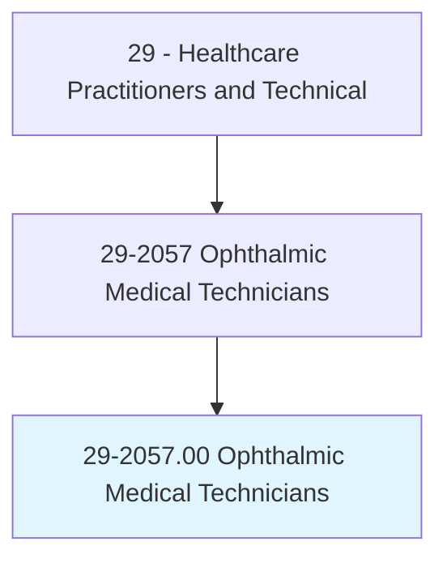
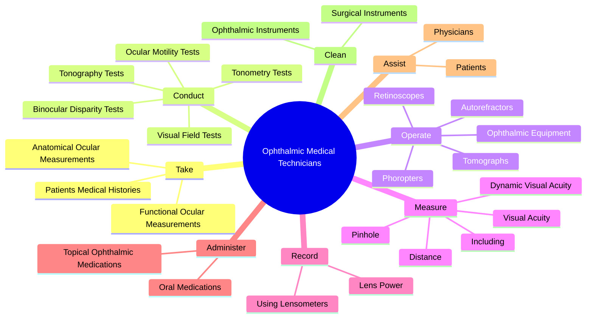
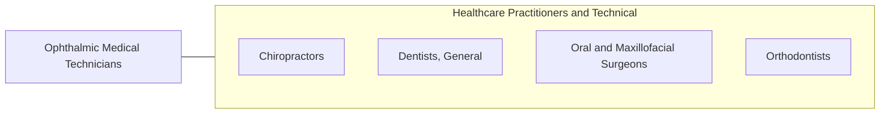

# Ophthalmic Medical Technicians

> Assist ophthalmologists by performing ophthalmic clinical functions. May administer eye exams, administer eye medications, and instruct the patient in care and use of corrective lenses.

## Overview

Ophthalmic Medical Technicians is an occupation within the Healthcare Practitioners and Technical category. Assist ophthalmologists by performing ophthalmic clinical functions. 

## Classification Hierarchy

## Key Statistics

| Metric | Value |
|--------|-------|
| SOC Code | 29-2057.00 |
| Category | [Healthcare Practitioners and Technical](/occupations/HealthcarePractitioners) |
| Task Count | 52 |
| Source | O*NET |

## Core Tasks

### take.PatientsMedicalHistories

Ophthalmic Medical Technicians take patients medical histories as part of their core responsibilities.

**Actions:**
- `take.PatientsMedicalHistories`
- `take.AnatomicalOcularMeasurements.of.EyeTissue`
- `take.AnatomicalOcularMeasurements.of.SurroundingTissue`
- `take.AnatomicalOcularMeasurements.of.AxialLengthMeasurements`

### conduct.TonometryTests

Ophthalmic Medical Technicians conduct tonometry tests as part of their core responsibilities.

**Actions:**
- `conduct.TonometryTests.to.measure.IntraocularPressure`
- `conduct.TonographyTests.to.measure.IntraocularPressure`
- `conduct.VisualFieldTests.to.measure.FieldOfVision`
- `conduct.OcularMotilityTests.to.measure.FunctionOfEyeMuscles`

### operate.OphthalmicEquipment

Ophthalmic Medical Technicians operate ophthalmic equipment as part of their core responsibilities.

**Actions:**
- `operate.OphthalmicEquipment`
- `operate.Autorefractors`
- `operate.Phoropters`
- `operate.Tomographs`

## Skills & Competencies

### Technical Skills
- **Clinical Skills** - Advanced
- **Diagnostic Procedures** - Advanced
- **Patient Care** - Advanced

### Soft Skills
- **Communication** - Essential
- **Problem Solving** - Essential
- **Critical Thinking** - Important
- **Teamwork** - Important
- **Adaptability** - Important

## Related Occupations

## Industries

This occupation is found across multiple industries. See [Industries](/industries) for sector-specific employment data.

## Career Progression

---

*Source: O*NET 29-2057.00 - ONETOccupation*
