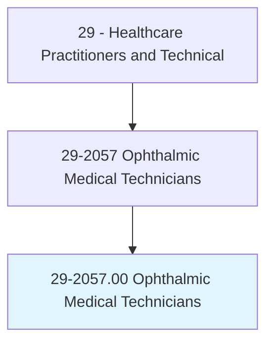
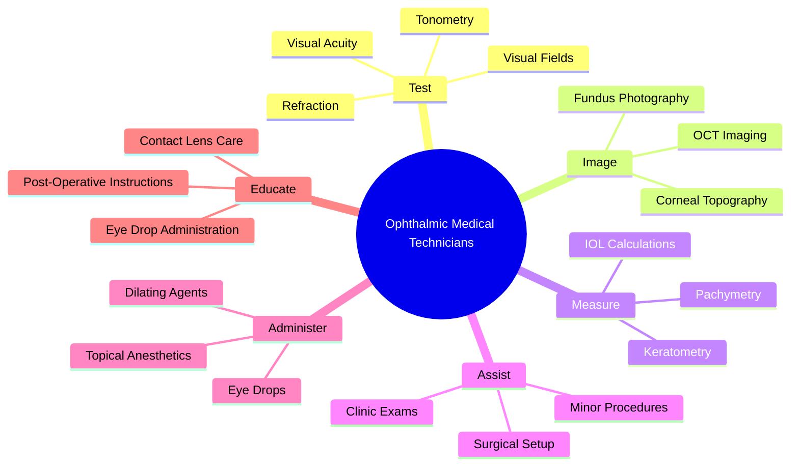
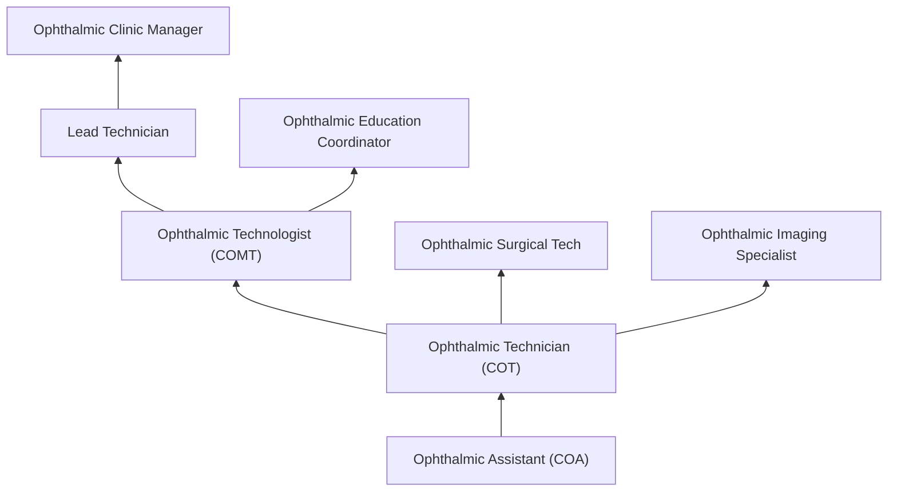
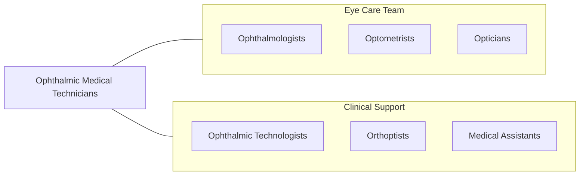

# Ophthalmic Medical Technicians

> Assist ophthalmologists by performing ophthalmic clinical functions. May administer eye exams, administer eye medications, and instruct the patient in care and use of corrective lenses.

## Overview

Ophthalmic Medical Technicians (OMTs) are allied health professionals who assist ophthalmologists by performing a range of ophthalmic diagnostic tests and clinical functions. They measure visual acuity, perform refractometry, conduct tonometry (eye pressure testing), administer visual field tests, take ocular measurements for surgical planning, photograph the eye using fundus cameras and OCT devices, and assist with ophthalmic procedures and surgeries.

The role requires knowledge of ocular anatomy, ophthalmic instruments, diagnostic techniques, and patient care. OMTs take patient histories, administer eye drops (including dilating agents), perform preliminary eye examinations, conduct specialized tests including pachymetry, keratometry, and biometry for IOL calculations, and maintain ophthalmic equipment. They serve as the primary clinical support for ophthalmologists in both clinic and surgical settings.

With advances in ophthalmic technology including OCT imaging, corneal topography, wavefront analysis, and surgical navigation systems, ophthalmic technicians operate increasingly sophisticated diagnostic and imaging equipment. The profession offers a structured career ladder from technician to technologist to assistant, with each level expanding scope and responsibility.

## Classification Hierarchy

## Key Statistics

| Metric | Value |
|--------|-------|
| SOC Code | 29-2057.00 |
| Median Annual Salary | $42,560 |
| Employment | ~62,000 |
| Projected Growth | 11% (2022-2032, faster than average) |
| Job Zone | 3 (Medium Preparation) |
| Category | [Healthcare Practitioners](/occupations/HealthcarePractitioners) |
| Core Tasks | 30+ |
| Source | O*NET |

## Core Tasks

### perform.OphthalmicTests

OMTs conduct diagnostic ophthalmic evaluations.

**Actions:**
- `measure.VisualAcuity.using.SnellenChart` - Acuity testing
- `perform.Refractometry.for.RefractiveMeasurement` - Refraction
- `perform.Tonometry.for.IntraocularPressure` - IOP measurement
- `perform.VisualFieldTesting.for.GlaucomaAssessment` - Perimetry

### image.OcularStructures

OMTs operate ophthalmic imaging equipment.

**Actions:**
- `perform.FundusPhotography.for.RetinalDocumentation` - Fundus imaging
- `perform.OCTImaging.for.RetinalLayerAnalysis` - OCT scanning
- `perform.CornealTopography.for.SurfaceMapping` - Topography
- `calculate.IOLPower.for.CataractSurgeryPlanning` - Biometry

## Practice Settings

| Setting | Description |
|---------|-------------|
| Ophthalmology Offices | Private practice eye care |
| Eye Hospitals/Centers | Specialty eye care facilities |
| Academic Ophthalmology | Teaching and research |
| Retina Clinics | Retinal disease specialty |
| Glaucoma Clinics | Glaucoma management |
| Ambulatory Surgery Centers | Ophthalmic surgery support |

## Skills & Competencies

### Technical Skills
- **Visual Acuity Testing** - Expert
- **Tonometry** - Expert
- **Ophthalmic Imaging (OCT, Fundus)** - Advanced
- **Refractometry** - Advanced
- **Visual Field Testing** - Advanced
- **IOL Biometry** - Advanced
- **Patient Preparation** - Expert

### Soft Skills
- **Patient Communication** - Essential
- **Attention to Detail** - Critical
- **Empathy** - Essential
- **Organization** - Essential
- **Adaptability** - Important

## Education & Training

| Requirement | Details |
|-------------|---------|
| Education | High school diploma plus ophthalmic technician program (1 year) |
| Clinical Training | On-the-job or formal program training |
| Certification | COT (Certified Ophthalmic Technician) through JCAHPO |
| Continuing Education | Per JCAHPO requirements |

## Certifications

| Certification | Description |
|---------------|-------------|
| COA | Certified Ophthalmic Assistant (entry-level) |
| COT | Certified Ophthalmic Technician |
| COMT | Certified Ophthalmic Medical Technologist (advanced) |
| OSC | Ophthalmic Scribe Certification |

## Career Progression

## Specializations

| Focus Area | Description |
|------------|-------------|
| Retinal Imaging | Fundus photography and OCT |
| Glaucoma Testing | Visual fields and IOP |
| Surgical Assisting | OR support for eye surgery |
| Contact Lens Fitting | Contact lens dispensing |
| Pediatric Ophthalmology | Children's eye exams |
| Refractive Surgery | LASIK/PRK support |

## Technology & Tools

| Technology | Purpose |
|------------|---------|
| OCT Systems (Zeiss, Heidelberg, Topcon) | Retinal imaging |
| Fundus Cameras | Retinal photography |
| Autorefractors/Phoropters | Refraction measurement |
| Tonometers (Goldmann, iCare) | IOP measurement |
| Visual Field Analyzers (Humphrey, Octopus) | Perimetry |
| Corneal Topographers | Surface mapping |
| IOL Biometry (IOLMaster, Lenstar) | Cataract surgery planning |

## Related Occupations

## Industries

- [Physician Offices](/industries/Healthcare/PhysicianOffices) - Ophthalmology Practice
- [Hospitals](/industries/Healthcare/Hospitals/index) - Hospital Eye Services
- [Ambulatory Surgery](/industries/Healthcare/AmbulatoryHealthCare) - Surgical Centers
- [Academic](/industries/Education) - Teaching Hospitals

## Departments

This occupation typically works in:
- Ophthalmology
- Eye Center
- Retina Clinic
- Ambulatory Surgery

---

*Source: O*NET 29-2057.00 - ONETOccupation*
