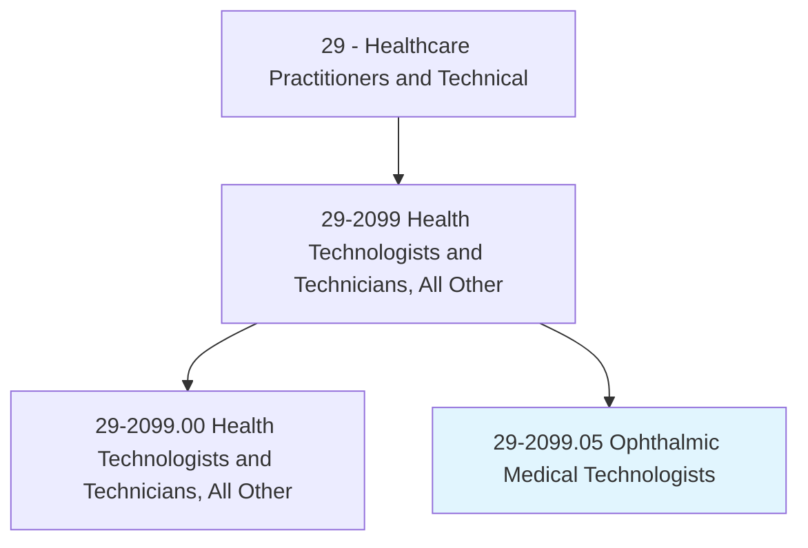
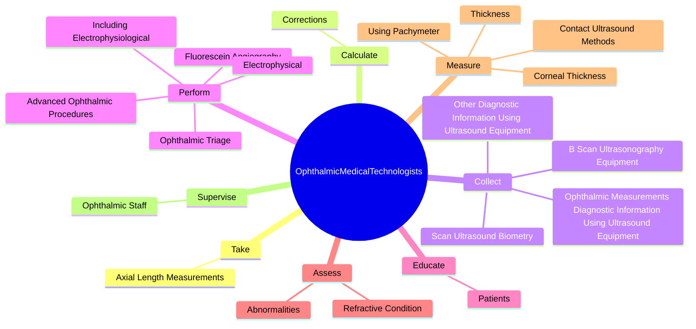
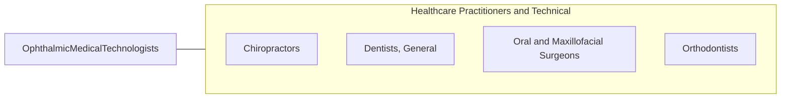

# Ophthalmic Medical Technologists

> Assist ophthalmologists by performing ophthalmic clinical functions and ophthalmic photography. Provide instruction and supervision to other ophthalmic personnel. Assist with minor surgical procedures, applying aseptic techniques and preparing instruments. May perform eye exams, administer eye medications, and instruct patients in care and use of corrective lenses.

## Overview

Ophthalmic Medical Technologists is a specialized variant within the Healthcare Practitioners and Technical category. Assist ophthalmologists by performing ophthalmic clinical functions and ophthalmic photography. Provide instruction and supervision to other ophthalmic personnel.

## Classification Hierarchy

## Key Statistics

| Metric | Value |
|--------|-------|
| SOC Code | 29-2099.05 |
| Category | [Healthcare Practitioners and Technical](/occupations/HealthcarePractitioners) |
| Task Count | 46 |
| Source | O*NET |

## Core Tasks

### take.AxialLengthMeasurements

Ophthalmic Medical Technologists take axial length measurements as part of their core responsibilities.

**Actions:**
- `take.AxialLengthMeasurements.of.EyeTissue`
- `take.AxialLengthMeasurements.of.SurroundingTissue`

### calculate.Corrections

Ophthalmic Medical Technologists calculate corrections as part of their core responsibilities.

**Actions:**
- `calculate.Corrections.for.RefractiveErrors`

### collect.OphthalmicMeasurementsDiagnosticInformationUsingUltrasoundEquipment

Ophthalmic Medical Technologists collect ophthalmic measurements diagnostic information using ultrasound equipment as part of their core responsibilities.

**Actions:**
- `collect.OphthalmicMeasurementsDiagnosticInformationUsingUltrasoundEquipment`
- `collect.OtherDiagnosticInformationUsingUltrasoundEquipment`
- `collect.ScanUltrasoundBiometry`
- `collect.BScanUltrasonographyEquipment`

## Skills & Competencies

### Technical Skills
- **Clinical Skills** - Advanced
- **Diagnostic Procedures** - Advanced
- **Patient Care** - Advanced

### Soft Skills
- **Communication** - Essential
- **Problem Solving** - Essential
- **Critical Thinking** - Important
- **Teamwork** - Important
- **Adaptability** - Important

## Related Occupations

## Industries

This occupation is found across multiple industries. See [Industries](/industries) for sector-specific employment data.

## Career Progression

---

*Source: O*NET 29-2099.05 - ONETOccupation*
