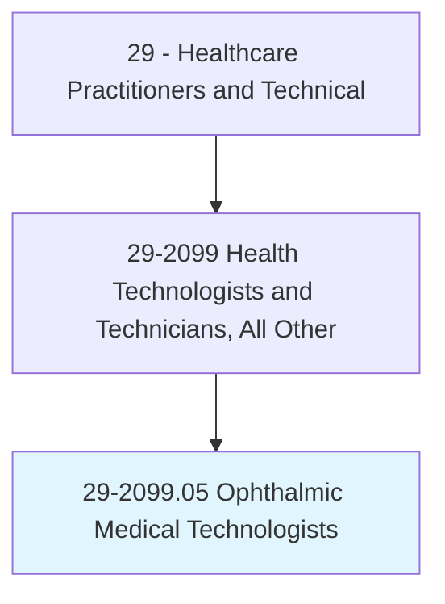
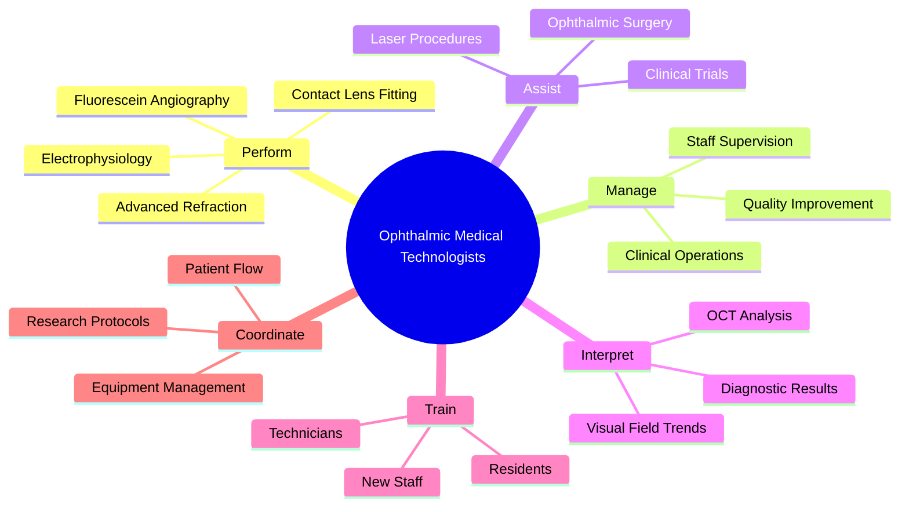
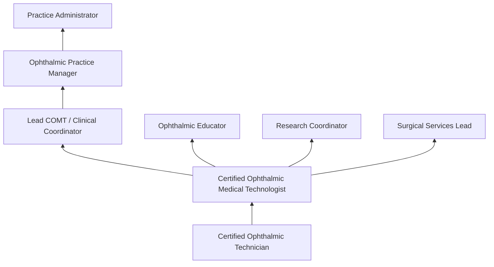
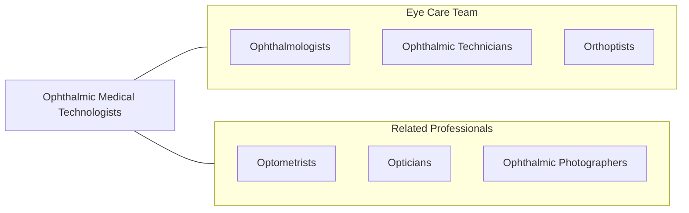

# Ophthalmic Medical Technologists

> Assist ophthalmologists by performing ophthalmic clinical functions and advanced diagnostic procedures. Perform comprehensive ophthalmic examinations and manage clinical operations.

## Overview

Ophthalmic Medical Technologists (COMTs) are advanced-level ophthalmic allied health professionals who perform comprehensive eye examinations, advanced diagnostic testing, surgical assisting, and clinical management functions in ophthalmology practices. They represent the highest level of ophthalmic technician certification and perform the full scope of ophthalmic clinical procedures including advanced refraction, contact lens fitting, ophthalmic imaging interpretation, and surgical assisting.

COMTs perform advanced procedures including fluorescein angiography, ultrasound biomicroscopy, electrophysiology (ERG, VEP), advanced OCT interpretation, ocular motility assessment, and low vision evaluation. They may manage clinical operations, supervise ophthalmic staff, coordinate research protocols, and train junior technicians. Their advanced skills and clinical judgment make them essential for high-volume and subspecialty ophthalmology practices.

The role has expanded with advanced imaging technologies, refractive surgery workups, ocular oncology imaging, and telemedicine eye screening programs. COMTs often serve as practice leaders coordinating clinical workflows, implementing quality improvement initiatives, and managing ophthalmic technology adoption.

## Classification Hierarchy

## Key Statistics

| Metric | Value |
|--------|-------|
| SOC Code | 29-2099.05 |
| Median Annual Salary | $55,400 |
| Employment | ~12,000 |
| Projected Growth | 8% (2022-2032) |
| Job Zone | 4 (Considerable Preparation) |
| Category | [Healthcare Practitioners](/occupations/HealthcarePractitioners) |
| Core Tasks | 35+ |
| Source | O*NET |

## Core Tasks

### perform.AdvancedDiagnostics

COMTs conduct complex ophthalmic procedures.

**Actions:**
- `perform.FluoresceinAngiography.for.RetinalVascularAssessment` - FA imaging
- `perform.Electrophysiology.for.RetinalFunctionTesting` - ERG/VEP
- `perform.AdvancedRefraction.for.ComplexRefractiveCases` - Refraction
- `perform.ContactLensFitting.for.SpecialtyLenses` - CL fitting

### manage.ClinicalOperations

COMTs oversee ophthalmic clinic functions.

**Actions:**
- `manage.ClinicalWorkflow.for.EfficientPatientCare` - Operations management
- `supervise.OphthalmicStaff.for.QualityAssurance` - Staff supervision
- `coordinate.ResearchProtocols.for.ClinicalTrials` - Research coordination
- `train.JuniorTechnicians.in.OphthalmicProcedures` - Staff training

## Practice Settings

| Setting | Description |
|---------|-------------|
| Academic Ophthalmology | Teaching hospital eye clinics |
| Subspecialty Practices | Retina, glaucoma, cornea |
| High-Volume Practices | Large ophthalmology groups |
| Research Institutions | Ophthalmic clinical trials |
| Eye Hospitals | Specialty eye care centers |

## Skills & Competencies

### Technical Skills
- **Comprehensive Eye Examination** - Expert
- **Advanced Ophthalmic Imaging** - Expert
- **Fluorescein Angiography** - Expert
- **Contact Lens Fitting** - Expert
- **Surgical Assisting** - Advanced
- **Clinical Management** - Advanced
- **Electrophysiology** - Advanced

### Soft Skills
- **Leadership** - Essential
- **Communication** - Critical
- **Problem Solving** - Essential
- **Organization** - Essential
- **Teaching** - Important

## Education & Training

| Requirement | Details |
|-------------|---------|
| Education | Associate or bachelor's degree plus advanced ophthalmic training |
| Experience | Progressive experience (COA to COT to COMT) |
| Certification | COMT through JCAHPO |
| Continuing Education | Per JCAHPO requirements |

## Certifications

| Certification | Description |
|---------------|-------------|
| COMT | Certified Ophthalmic Medical Technologist (JCAHPO) |
| COT | Certified Ophthalmic Technician (prerequisite) |
| OSA | Ophthalmic Surgical Assistant |
| RO | Registered Orthoptist (optional specialty) |

## Career Progression

## Technology & Tools

| Technology | Purpose |
|------------|---------|
| Advanced OCT Platforms | Retinal and anterior segment imaging |
| Fluorescein Angiography Systems | Retinal vascular imaging |
| Electrophysiology Equipment (ERG, VEP) | Retinal function testing |
| Ultrasound Biomicroscopy | Anterior segment imaging |
| Corneal Topography/Tomography | Corneal analysis |
| Wavefront Aberrometry | Refractive analysis |
| Ophthalmic Lasers | Laser procedure assistance |

## Related Occupations

## Industries

- [Physician Offices](/industries/Healthcare/PhysicianOffices) - Subspecialty Ophthalmology
- [Hospitals](/industries/Healthcare/Hospitals/index) - Academic Eye Centers
- [Research](/industries/ProfessionalServices/Research) - Clinical Trials
- [Ambulatory Surgery](/industries/Healthcare/AmbulatoryHealthCare) - Eye Surgery Centers

## Departments

This occupation typically works in:
- Ophthalmology
- Retina Center
- Ophthalmic Surgery
- Clinical Research

---

*Source: O*NET 29-2099.05 - ONETOccupation*
