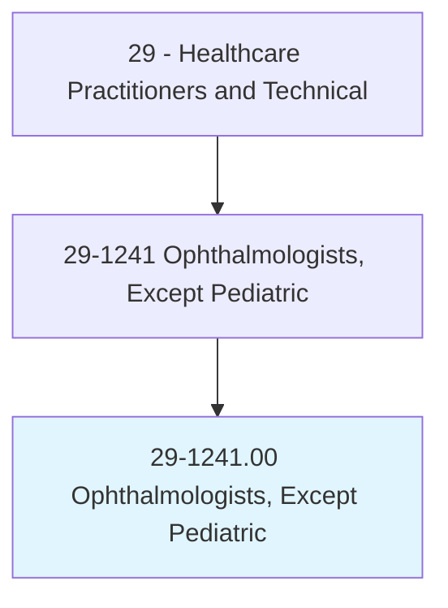
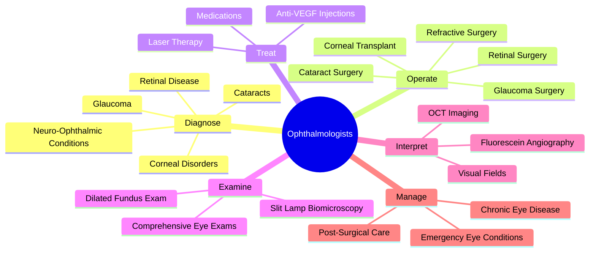
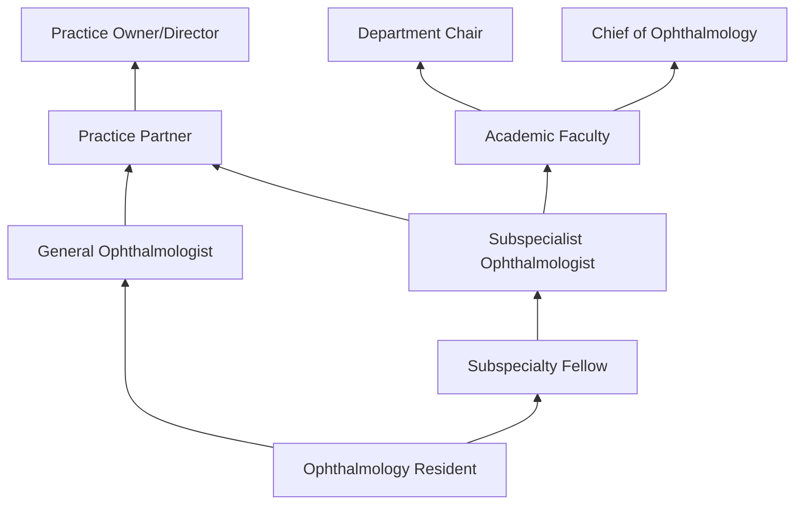
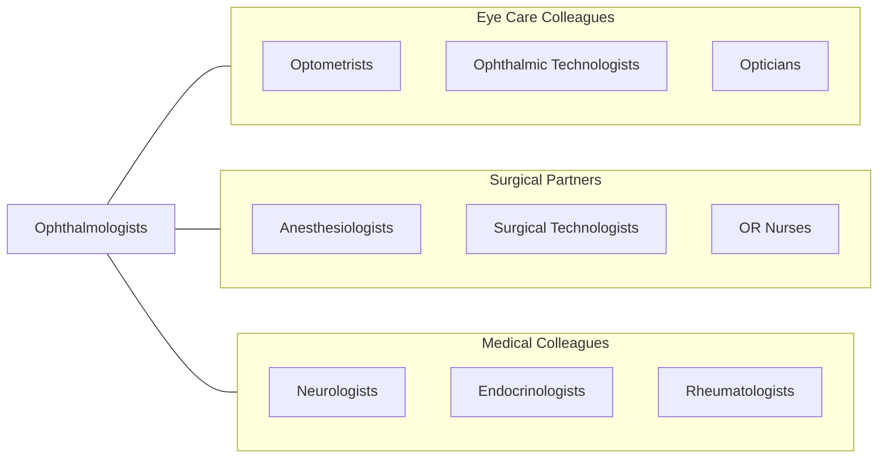

# Ophthalmologists, Except Pediatric

> Diagnose and perform surgery to treat and help prevent disorders and diseases of the eye. May also provide vision services for refraction, general eye examinations, and prescriptions.

## Overview

Ophthalmologists are medical doctors (MD or DO) who specialize in the medical and surgical treatment of eye diseases and disorders. They perform comprehensive eye examinations, diagnose ocular conditions, prescribe medications, perform laser procedures, and conduct intricate microsurgeries including cataract extraction, retinal detachment repair, glaucoma surgery, corneal transplantation, and oculoplastic reconstruction. Ophthalmologists manage the full spectrum of eye diseases from common refractive errors to sight-threatening conditions.

The scope encompasses anterior segment disease (cataracts, glaucoma, corneal disorders), posterior segment pathology (retinal detachment, diabetic retinopathy, macular degeneration), neuro-ophthalmology (optic nerve disease, cranial nerve palsies), oculoplastics (eyelid and orbital surgery), and ocular oncology. Ophthalmologists interpret advanced diagnostic imaging including OCT, fluorescein angiography, ultrasound, and visual electrophysiology to guide treatment decisions.

Modern ophthalmology has been transformed by femtosecond laser-assisted cataract surgery, anti-VEGF intravitreal injections for retinal diseases, minimally invasive glaucoma surgery (MIGS), corneal cross-linking, gene therapy for inherited retinal diseases, and artificial intelligence-assisted diabetic retinopathy screening. Ophthalmologists practice at the intersection of medicine, microsurgery, and advanced technology.

## Classification Hierarchy

## Key Statistics

| Metric | Value |
|--------|-------|
| SOC Code | 29-1241.00 |
| Median Annual Salary | $304,460 |
| Employment | ~13,000 |
| Projected Growth | 3% (2022-2032) |
| Job Zone | 5 (Extensive Preparation) |
| Category | [Healthcare Practitioners](/occupations/HealthcarePractitioners) |
| Core Tasks | 50+ |
| Source | O*NET |

## Core Tasks

### diagnose.EyeConditions

Ophthalmologists evaluate and diagnose ocular pathology.

**Actions:**
- `diagnose.Glaucoma.using.IOPAndVisualFieldAnalysis` - Glaucoma diagnosis
- `diagnose.RetinalDisease.using.OCTAndAngiography` - Retinal assessment
- `diagnose.Cataracts.using.SlitLampExamination` - Cataract evaluation
- `diagnose.CornealDisorders.using.TopographyAndPachymetry` - Corneal diagnosis

### operate.OcularSurgery

Ophthalmologists perform microsurgical procedures.

**Actions:**
- `perform.CataractSurgery.using.Phacoemulsification` - Cataract extraction
- `perform.RetinalSurgery.for.DetachmentRepair` - Vitreoretinal surgery
- `perform.GlaucomaSurgery.using.MIGSAndTrabeculectomy` - Glaucoma procedures
- `perform.CornealTransplant.for.CornealFailure` - Keratoplasty

## Practice Settings

| Setting | Description |
|---------|-------------|
| Private Ophthalmology Practice | Comprehensive and surgical eye care |
| Academic Medical Centers | Teaching and subspecialty care |
| Ambulatory Surgery Centers | Outpatient eye surgery |
| Hospitals | Emergency and inpatient eye care |
| Veterans Affairs | VA eye care services |
| Group Practices | Multi-subspecialty eye groups |

## Skills & Competencies

### Technical Skills
- **Microsurgery** - Expert
- **Slit Lamp Biomicroscopy** - Expert
- **Ophthalmic Imaging Interpretation** - Expert
- **Laser Surgery** - Expert
- **Intravitreal Injections** - Expert
- **Clinical Diagnosis** - Expert
- **Pharmacology** - Expert

### Soft Skills
- **Manual Dexterity** - Critical
- **Patient Communication** - Essential
- **Decision Making** - Critical
- **Empathy** - Essential
- **Leadership** - Important

## Education & Training

| Requirement | Details |
|-------------|---------|
| Undergraduate | Bachelor's degree (pre-medical) |
| Medical School | 4-year MD or DO program |
| Internship | 1-year transitional or preliminary year |
| Residency | 3-year ophthalmology residency |
| Fellowship | 1-2 years for subspecialization (optional) |
| Board Certification | American Board of Ophthalmology |
| Total Training | 12-14 years post-high school |

## Certifications

| Certification | Description |
|---------------|-------------|
| ABO | American Board of Ophthalmology certification |
| State Medical License | Required in all states |
| DEA Registration | Controlled substance prescribing |
| Laser Safety Certification | Surgical laser use |

## Career Progression

## Specializations

| Subspecialty | Focus Area |
|-------------|-------------|
| Retina/Vitreous | Macular degeneration, diabetic eye disease |
| Glaucoma | Elevated eye pressure and optic neuropathy |
| Cornea/External Disease | Corneal transplant and refractive surgery |
| Oculoplastics | Eyelid, orbital, and lacrimal surgery |
| Neuro-Ophthalmology | Optic nerve and visual pathway disorders |
| Ocular Oncology | Eye tumors |
| Uveitis | Inflammatory eye disease |
| Refractive Surgery | LASIK, PRK, and lens implants |

## Technology & Tools

| Technology | Purpose |
|------------|---------|
| Operating Microscopes (Zeiss, Leica) | Microsurgery |
| Phacoemulsification Systems (Alcon, J&J) | Cataract surgery |
| Femtosecond Lasers | Laser-assisted cataract and refractive surgery |
| Retinal Laser Systems | Photocoagulation therapy |
| OCT Systems (Zeiss, Heidelberg) | Retinal and anterior segment imaging |
| YAG Lasers | Posterior capsulotomy |
| Slit Lamp Biomicroscopes | Clinical examination |
| Visual Field Analyzers | Glaucoma monitoring |

## Related Occupations

## Industries

- [Physician Offices](/industries/Healthcare/PhysicianOffices) - Private Practice
- [Hospitals](/industries/Healthcare/Hospitals/index) - Academic and Community
- [Ambulatory Surgery](/industries/Healthcare/AmbulatoryHealthCare) - Eye Surgery Centers
- [Veterans Affairs](/industries/PublicAdministration) - VA Eye Care
- [Academic](/industries/Education) - Medical Schools

## Departments

This occupation typically works in:
- Ophthalmology
- Eye Surgery Center
- Retina Service
- Glaucoma Service

---

*Source: O*NET 29-1241.00 - ONETOccupation*
