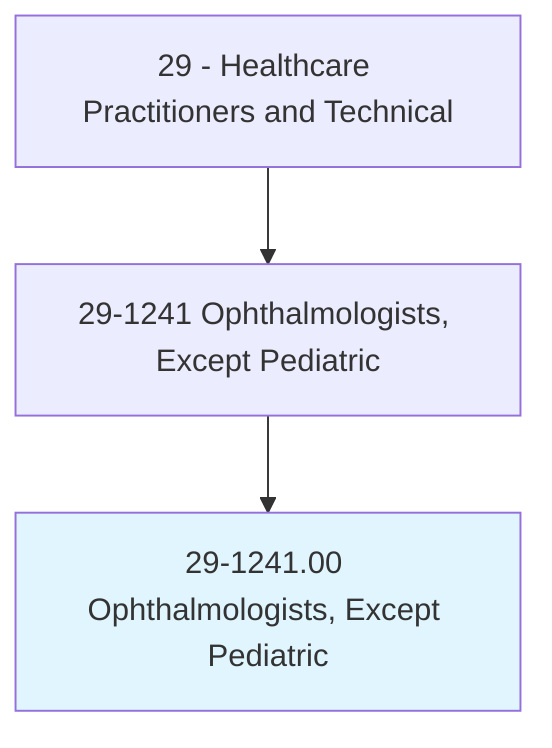
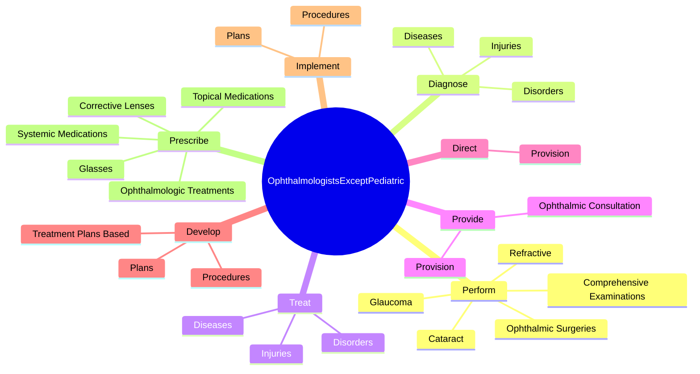
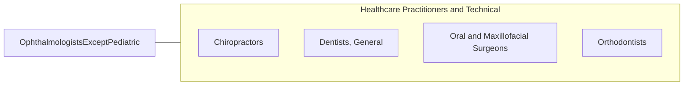

# Ophthalmologists, Except Pediatric

> Diagnose and perform surgery to treat and help prevent disorders and diseases of the eye. May also provide vision services for treatment including glasses and contacts.

## Overview

Ophthalmologists, Except Pediatric is an occupation within the Healthcare Practitioners and Technical category. Diagnose and perform surgery to treat and help prevent disorders and diseases of the eye. 

## Classification Hierarchy

## Key Statistics

| Metric | Value |
|--------|-------|
| SOC Code | 29-1241.00 |
| Category | [Healthcare Practitioners and Technical](/occupations/HealthcarePractitioners) |
| Task Count | 83 |
| Source | O*NET |

## Core Tasks

### perform.ComprehensiveExaminations

Ophthalmologists, Except Pediatric perform comprehensive examinations as part of their core responsibilities.

**Actions:**
- `perform.ComprehensiveExaminations.of.VisualSystem.to.determine.NatureOfOcularDisorders`
- `perform.ComprehensiveExaminations.of.Extent.of.OcularDisorders`
- `perform.OphthalmicSurgeries`
- `perform.Cataract`

### diagnose.Injuries

Ophthalmologists, Except Pediatric diagnose injuries as part of their core responsibilities.

**Actions:**
- `diagnose.Injuries.of.EyeStructuresIncludingCornea`
- `diagnose.Injuries.of.Sclera`
- `diagnose.Injuries.of.Conjunctiva`
- `diagnose.Injuries.of.Eyelids`

### treat.Injuries

Ophthalmologists, Except Pediatric treat injuries as part of their core responsibilities.

**Actions:**
- `treat.Injuries.of.EyeStructuresIncludingCornea`
- `treat.Injuries.of.Sclera`
- `treat.Injuries.of.Conjunctiva`
- `treat.Injuries.of.Eyelids`

## Skills & Competencies

### Technical Skills
- **Clinical Skills** - Advanced
- **Diagnostic Procedures** - Advanced
- **Patient Care** - Advanced

### Soft Skills
- **Communication** - Essential
- **Problem Solving** - Essential
- **Critical Thinking** - Important
- **Teamwork** - Important
- **Adaptability** - Important

## Related Occupations

## Industries

This occupation is found across multiple industries. See [Industries](/industries) for sector-specific employment data.

## Career Progression

---

*Source: O*NET 29-1241.00 - ONETOccupation*
