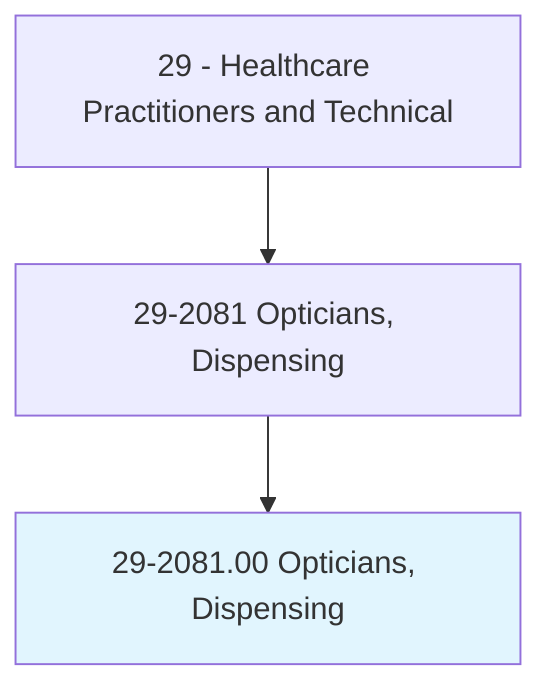
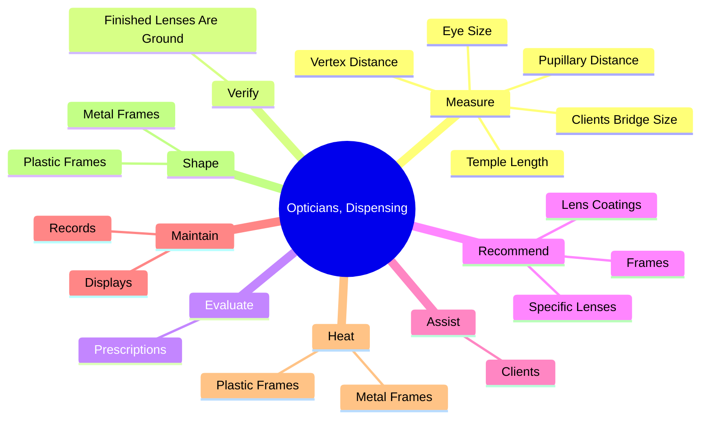
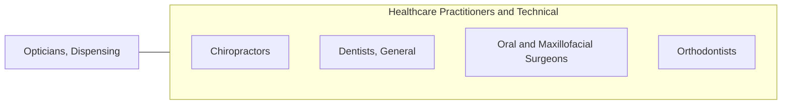

# Opticians, Dispensing

> Design, measure, fit, and adapt lenses and frames for client according to written optical prescription or specification. Assist client with inserting, removing, and caring for contact lenses. Assist client with selecting frames. Measure customer for size of eyeglasses and coordinate frames with facial and eye measurements and optical prescription. Prepare work order for optical laboratory containing instructions for grinding and mounting lenses in frames. Verify exactness of finished lens spectacles. Adjust frame and lens position to fit client. May shape or reshape frames. Includes contact lens opticians.

## Overview

Opticians, Dispensing is an occupation within the Healthcare Practitioners and Technical category. Design, measure, fit, and adapt lenses and frames for client according to written optical prescription or specification. Assist client with inserting, removing, and caring for contact lenses.

## Classification Hierarchy

## Key Statistics

| Metric | Value |
|--------|-------|
| SOC Code | 29-2081.00 |
| Category | [Healthcare Practitioners and Technical](/occupations/HealthcarePractitioners) |
| Task Count | 90 |
| Source | O*NET |

## Core Tasks

### measure.ClientsBridgeSize

Opticians, Dispensing measure clients bridge size as part of their core responsibilities.

**Actions:**
- `measure.ClientsBridgeSize.of.Eyes`
- `measure.ClientsBridgeSize.of.UsingMeasuringDevices`
- `measure.EyeSize.of.Eyes`
- `measure.EyeSize.of.UsingMeasuringDevices`

### verify.FinishedLensesAreGround

Opticians, Dispensing verify finished lenses are ground as part of their core responsibilities.

**Actions:**
- `verify.FinishedLensesAreGround.to.Specifications`

### evaluate.Prescriptions

Opticians, Dispensing evaluate prescriptions as part of their core responsibilities.

**Actions:**
- `evaluate.Prescriptions.in.Conjunction.with.ClientsVocationalVisualRequirements`
- `evaluate.Prescriptions.in.AvocationalVisualRequirements`

## Skills & Competencies

### Technical Skills
- **Clinical Skills** - Advanced
- **Diagnostic Procedures** - Advanced
- **Patient Care** - Advanced

### Soft Skills
- **Communication** - Essential
- **Problem Solving** - Essential
- **Critical Thinking** - Important
- **Teamwork** - Important
- **Adaptability** - Important

## Related Occupations

## Industries

This occupation is found across multiple industries. See [Industries](/industries) for sector-specific employment data.

## Career Progression

---

*Source: O*NET 29-2081.00 - ONETOccupation*
