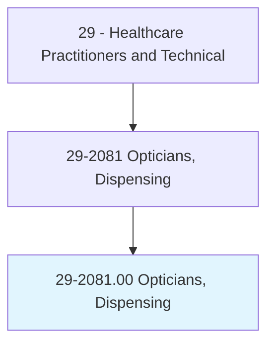
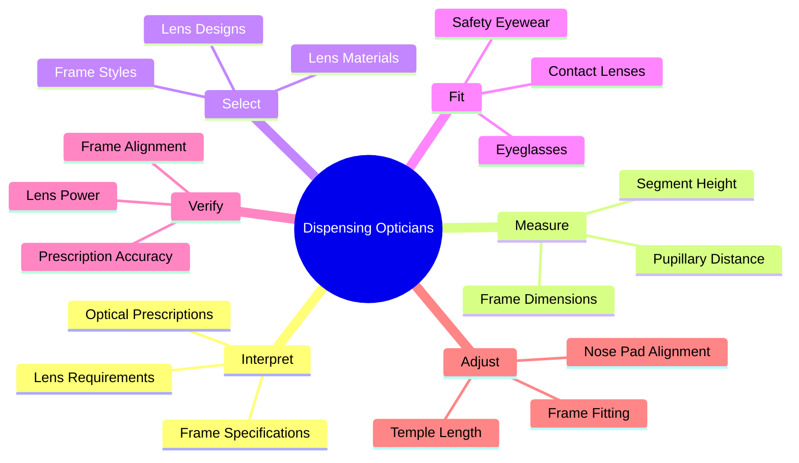
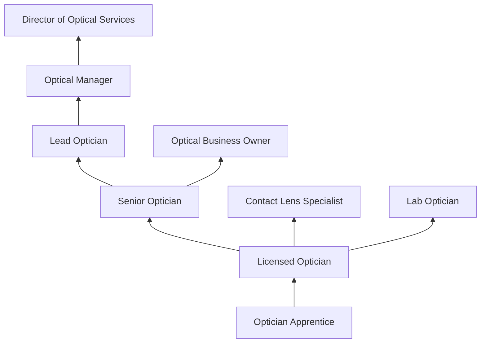
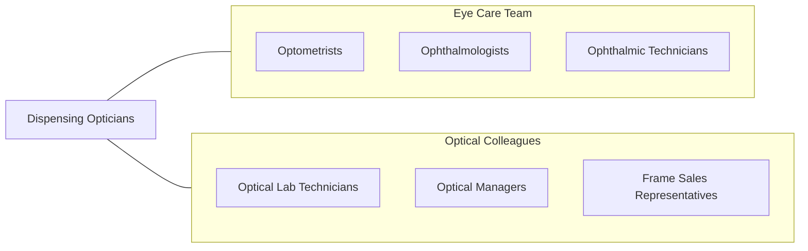

# Opticians, Dispensing

> Design, measure, fit, and adapt lenses and frames for client according to written optical prescription or specification. Assist client with inserting, removing, and caring for contact lenses. Assist client with selecting frames.

## Overview

Dispensing Opticians are eye care professionals who interpret optical prescriptions from ophthalmologists and optometrists, help patients select eyeglass frames and lens types, take precise facial and optical measurements, order lenses from optical laboratories, verify finished lenses against prescriptions, and adjust and fit eyeglasses for optimal comfort and visual performance. They also fit and dispense contact lenses, provide instruction on lens care, and perform eyeglass repairs and adjustments.

The role requires knowledge of optics, lens materials and designs, frame styles and materials, facial anatomy, and optical manufacturing processes. Dispensing opticians use lensometers to verify lens power, pupillometers to measure interpupillary distance, frame adjustment tools for fitting, and digital measurement systems for progressive lens positioning. They advise patients on lens options including single vision, bifocal, progressive, photochromic, and specialty lenses for specific visual needs.

Modern dispensing optics has evolved with digital lens surfacing, free-form progressive lenses, blue light filtering technology, 3D-printed frames, virtual try-on systems, and advanced lens coatings. Opticians increasingly serve as optical consultants helping patients navigate complex lens technology choices while ensuring accurate and comfortable vision correction.

## Classification Hierarchy

## Key Statistics

| Metric | Value |
|--------|-------|
| SOC Code | 29-2081.00 |
| Median Annual Salary | $41,690 |
| Employment | ~74,000 |
| Projected Growth | 8% (2022-2032) |
| Job Zone | 3 (Medium Preparation) |
| Category | [Healthcare Practitioners](/occupations/HealthcarePractitioners) |
| Core Tasks | 25+ |
| Source | O*NET |

## Core Tasks

### fit.EyewearPrescriptions

Dispensing Opticians prepare and fit corrective eyewear.

**Actions:**
- `interpret.OpticalPrescriptions.for.LensSelection` - Rx interpretation
- `measure.PupillaryDistance.for.LensCentering` - PD measurement
- `select.LensMaterials.for.OptimalVisualPerformance` - Lens selection
- `verify.FinishedLenses.using.Lensometer` - Lens verification

### adjust.Eyeglasses

Dispensing Opticians ensure proper fit and comfort.

**Actions:**
- `adjust.FrameFitting.for.PatientComfort` - Frame adjustment
- `repair.EyeglassFrames.for.ContinuedUse` - Frame repair
- `fit.ContactLenses.per.PrescriptionSpecifications` - CL fitting
- `educate.Patients.regarding.EyewearCareAndUse` - Patient education

## Practice Settings

| Setting | Description |
|---------|-------------|
| Optical Retail Stores | Eyewear dispensing |
| Ophthalmology/Optometry Offices | Medical practice optical |
| Department/Chain Stores | Retail optical departments |
| Optical Laboratories | Lens fabrication |
| Military/Government | VA and military optical |
| Online Optical | E-commerce eyewear support |

## Skills & Competencies

### Technical Skills
- **Optical Dispensing** - Expert
- **Frame Fitting and Adjustment** - Expert
- **Lensometry** - Expert
- **Contact Lens Dispensing** - Advanced
- **Optical Mathematics** - Advanced
- **Frame Repair** - Advanced
- **Digital Measurement Systems** - Advanced

### Soft Skills
- **Customer Service** - Critical
- **Communication** - Essential
- **Fashion/Style Sense** - Important
- **Sales Ability** - Essential
- **Patience** - Essential
- **Attention to Detail** - Critical

## Education & Training

| Requirement | Details |
|-------------|---------|
| Education | High school diploma plus opticianry program (1-2 years) or apprenticeship |
| State Licensure | Required in about half of states |
| Certification | ABO (American Board of Opticianry) recommended |
| Continuing Education | Per state and certification requirements |

## Certifications

| Certification | Description |
|---------------|-------------|
| ABO | American Board of Opticianry (eyeglasses) |
| NCLE | National Contact Lens Examiners (contact lenses) |
| State License | State-specific optician license |
| ABOM | Advanced Board of Opticianry Master |

## Career Progression

## Specializations

| Focus Area | Description |
|------------|-------------|
| Contact Lenses | Specialty CL fitting and dispensing |
| Low Vision | Low vision aids and devices |
| Sports Optics | Athletic eyewear |
| Pediatric Optics | Children's eyewear |
| Safety Eyewear | Industrial vision protection |
| Progressive Lenses | Advanced multifocal fitting |

## Technology & Tools

| Technology | Purpose |
|------------|---------|
| Lensometers/Vertometers | Lens power measurement |
| Pupillometers | PD measurement |
| Digital Measurement Systems (Zeiss, Essilor) | Advanced fitting measurements |
| Frame Adjustment Tools | Fitting and repair |
| Lens Edging Equipment | In-house lens finishing |
| Virtual Try-On Software | Digital frame selection |
| Optical Lab Management Software | Order tracking |

## Related Occupations

## Industries

- [Optical Retail](/industries/Healthcare/AmbulatoryHealthCare) - Eyewear Stores
- [Physician Offices](/industries/Healthcare/PhysicianOffices) - Medical Optical
- [Retail Stores](/industries/Retail) - Department Store Optical
- [Government](/industries/PublicAdministration) - VA and Military Optical

## Departments

This occupation typically works in:
- Optical Department
- Eye Care Center
- Retail Optical

---

*Source: O*NET 29-2081.00 - ONETOccupation*
