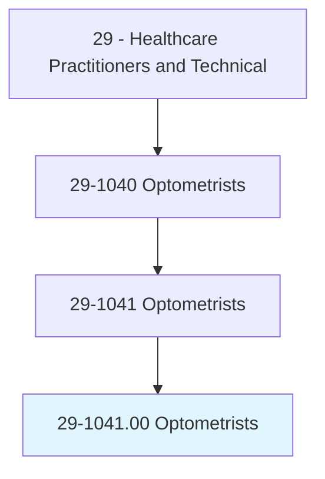
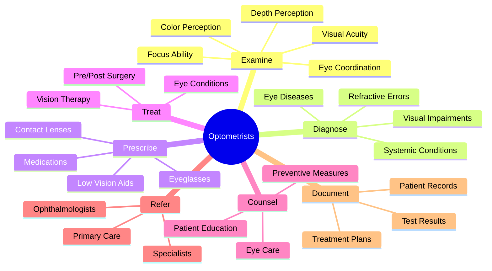
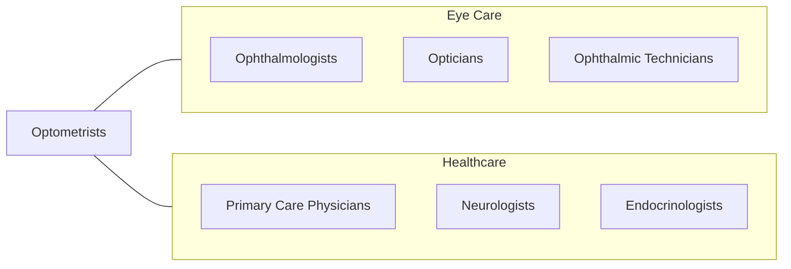
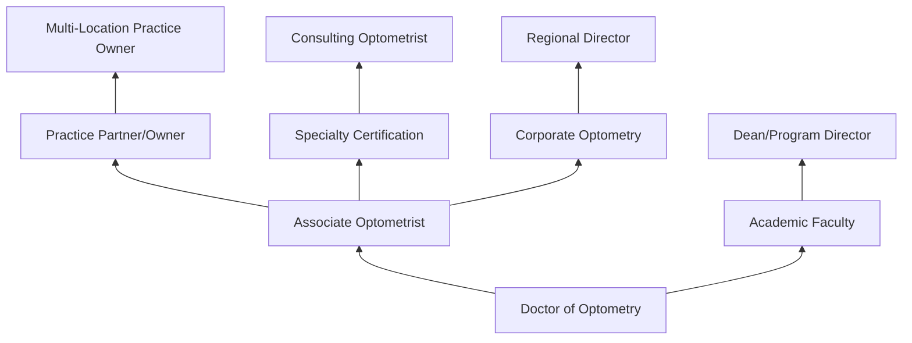

# Optometrists

> Diagnose, manage, and treat conditions and diseases of the human eye and visual system. Examine eyes and visual system, diagnose problems or impairments, prescribe corrective lenses, and provide treatment. May prescribe therapeutic drugs to treat specific eye conditions.

## Overview

Optometrists are primary eye care providers who examine, diagnose, and treat disorders of the visual system. They perform comprehensive eye examinations, prescribe eyeglasses and contact lenses, detect eye diseases such as glaucoma and macular degeneration, and may prescribe medications for certain conditions. Optometrists play a critical role in preserving vision and detecting systemic diseases that manifest in the eyes, such as diabetes and hypertension.

## Classification Hierarchy

## Key Statistics

| Metric | Value |
|--------|-------|
| SOC Code | 29-1041.00 |
| Job Zone | 5 (Extensive Preparation) |
| Category | [Healthcare Practitioners](/occupations/HealthcarePractitioners) |
| Core Tasks | 20+ |
| Source | O*NET |

## Core Tasks

### examine.Eyes

Optometrists perform comprehensive visual assessments.

**Actions:**
- `examine.Eyes.to.determine.VisualAcuity` - Test vision sharpness
- `examine.Eyes.to.determine.DepthPerception` - Assess 3D vision
- `examine.Eyes.to.determine.ColorPerception` - Evaluate color vision
- `examine.Eyes.to.determine.AbilityToFocus` - Test accommodation
- `examine.Eyes.to.determine.CoordinateEyes` - Check binocular function

### diagnose.EyeConditions

Optometrists identify diseases and disorders of the visual system.

**Actions:**
- `diagnose.EyeDiseasesConditions` - Identify pathology
- `diagnose.SystemicDiseases.through.EyeExamination` - Detect systemic issues
- `diagnose.RefractiveErrors` - Determine prescription needs

### prescribe.CorrectiveLenses

Optometrists determine and provide vision correction.

**Actions:**
- `prescribe.Eyeglasses.for.VisionCorrection` - Write lens prescriptions
- `prescribe.ContactLenses.for.VisionCorrection` - Fit contact lenses
- `prescribe.LowVisionAids` - Provide magnification devices
- `prescribe.TherapeuticDrugs` - Order medications when indicated

### treat.VisualConditions

Optometrists provide therapeutic interventions.

**Actions:**
- `treat.EyeConditions.with.Medications` - Manage disease
- `provide.VisionTherapy.for.BinocularDysfunction` - Train visual system
- `manage.PreOperative.PatientCare` - Prepare for surgery
- `manage.PostOperative.PatientCare` - Follow surgical recovery

## Specialty Areas

| Specialty | Focus Area |
|-----------|------------|
| Pediatric Optometry | Children's vision |
| Geriatric Optometry | Senior eye care |
| Low Vision | Visual rehabilitation |
| Sports Vision | Athletic performance |
| Neuro-Optometry | Brain-related vision issues |
| Ocular Disease | Disease management |
| Contact Lens | Specialty lens fitting |

## Skills & Competencies

### Technical Skills
- **Comprehensive Eye Examination** - Expert
- **Refraction** - Expert
- **Disease Diagnosis** - Expert
- **Contact Lens Fitting** - Expert
- **Diagnostic Equipment** - Expert
- **Pharmacology** - Advanced

### Soft Skills
- **Patient Communication** - Critical
- **Attention to Detail** - Critical
- **Clinical Decision Making** - Essential
- **Empathy** - Essential
- **Manual Dexterity** - Essential

## Related Occupations

## Industries

- [Optometry Offices](/industries/OptometryOffices) - Primary Employment
- [Optical Retail](/industries/OpticalRetail) - Retail Settings
- [Hospitals](/industries/Hospitals) - Hospital-based Care
- [Ophthalmology Practices](/industries/Ophthalmology) - Collaborative Care
- [Veterans Affairs](/industries/VA) - Government Healthcare
- [Academic Institutions](/industries/AcademicInstitutions) - Teaching

## Career Progression

## Education & Training

| Requirement | Details |
|-------------|---------|
| Typical Education | Doctor of Optometry (OD) degree - 4 years post-bachelor's |
| Prerequisites | Bachelor's degree with science prerequisites |
| Clinical Training | Extensive clinical rotations during OD program |
| Residency | Optional 1-year residency for specialization |
| Licensure | State license required; must pass NBEO examination |
| Continuing Education | Varies by state; typically 20-40 hours annually |

## Certifications

| Certification | Description |
|---------------|-------------|
| Board Certified | American Board of Optometry certification |
| Fellowship | American Academy of Optometry (FAAO) |
| Specialty Certification | Diplomate status in specialty areas |

## Equipment & Technology

| Technology | Purpose |
|------------|---------|
| Phoropter | Refractive testing |
| Slit Lamp | Anterior eye examination |
| Ophthalmoscope | Posterior eye examination |
| Tonometer | Intraocular pressure measurement |
| OCT | Retinal imaging |
| Visual Field Analyzer | Peripheral vision testing |
| Autorefractor | Automated refraction |
| Corneal Topographer | Corneal mapping |

## Departments

This occupation typically works in:
- [Optometry Services](/departments/Optometry)
- [Eye Care Center](/departments/EyeCare)
- [Vision Rehabilitation](/departments/VisionRehab)
- [Primary Eye Care](/departments/PrimaryEyeCare)

---

*Source: O*NET 29-1041.00 - ONETOccupation*
