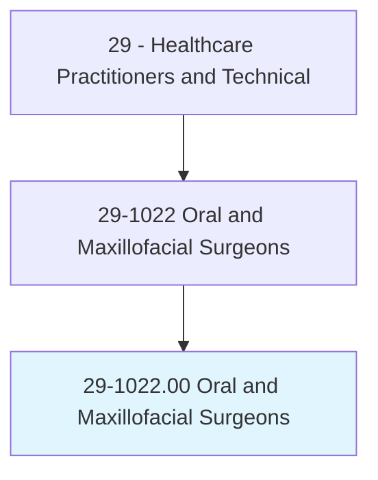
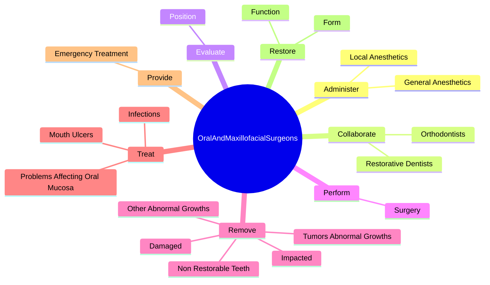
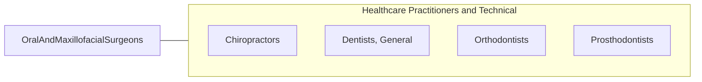

# Oral and Maxillofacial Surgeons

> Perform surgery and related procedures on the hard and soft tissues of the oral and maxillofacial regions to treat diseases, injuries, or defects. May diagnose problems of the oral and maxillofacial regions. May perform surgery to improve function or appearance.

## Overview

Oral and Maxillofacial Surgeons is an occupation within the Healthcare Practitioners and Technical category. Perform surgery and related procedures on the hard and soft tissues of the oral and maxillofacial regions to treat diseases, injuries, or defects. May diagnose problems of the oral and maxillofacial regions.

## Classification Hierarchy

## Key Statistics

| Metric | Value |
|--------|-------|
| SOC Code | 29-1022.00 |
| Category | [Healthcare Practitioners and Technical](/occupations/HealthcarePractitioners) |
| Task Count | 49 |
| Source | O*NET |

## Core Tasks

### administer.GeneralAnesthetics

Oral and Maxillofacial Surgeons administer general anesthetics as part of their core responsibilities.

**Actions:**
- `administer.GeneralAnesthetics`
- `administer.LocalAnesthetics`

### collaborate.RestorativeDentists

Oral and Maxillofacial Surgeons collaborate restorative dentists as part of their core responsibilities.

**Actions:**
- `collaborate.RestorativeDentists.to.plan.Treatment`
- `collaborate.Orthodontists.to.plan.Treatment`

### evaluate.Position

Oral and Maxillofacial Surgeons evaluate position as part of their core responsibilities.

**Actions:**
- `evaluate.Position.of.WisdomTeeth.to.determine.WhetherProblemsExistCurrentlyOccurInFuture`
- `evaluate.Position.of.MightOccur.in.Future`

## Skills & Competencies

### Technical Skills
- **Clinical Skills** - Advanced
- **Diagnostic Procedures** - Advanced
- **Patient Care** - Advanced

### Soft Skills
- **Communication** - Essential
- **Problem Solving** - Essential
- **Critical Thinking** - Important
- **Teamwork** - Important
- **Adaptability** - Important

## Related Occupations

## Industries

This occupation is found across multiple industries. See [Industries](/industries) for sector-specific employment data.

## Career Progression

---

*Source: O*NET 29-1022.00 - ONETOccupation*
