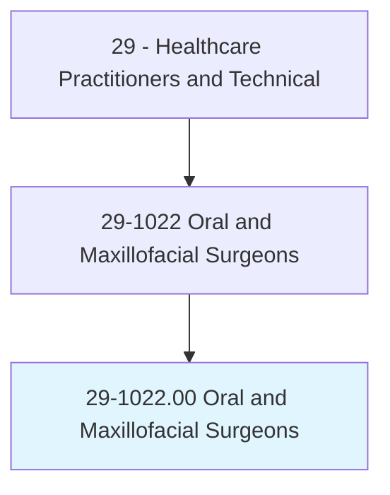
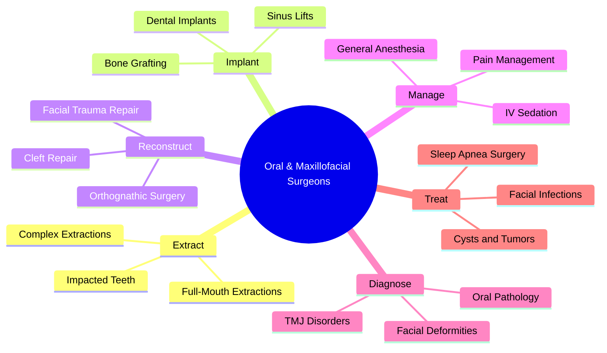
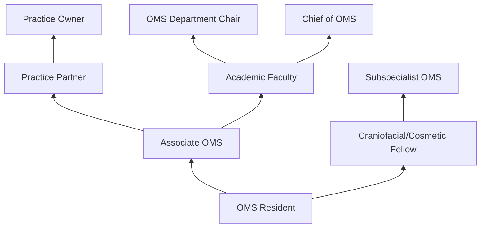
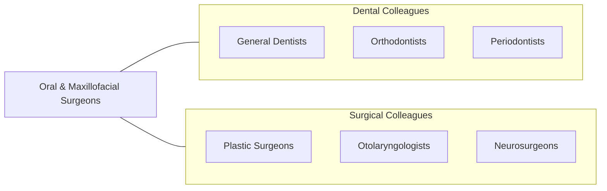

# Oral and Maxillofacial Surgeons

> Perform surgery and related procedures on the hard and soft tissues of the oral and maxillofacial regions to treat diseases, injuries, or defects. May diagnose problems of the oral and maxillofacial regions. May perform surgery to improve function or appearance.

## Overview

Oral and Maxillofacial Surgeons (OMS) are dental specialists who perform surgical procedures on the mouth, jaws, face, and related structures. Their scope includes tooth extraction (including impacted wisdom teeth), dental implant placement, corrective jaw surgery (orthognathic surgery), treatment of facial trauma (fractures), TMJ surgery, pathologic lesion removal, cleft lip/palate repair, and reconstructive and cosmetic facial surgery. OMS surgeons are uniquely trained in both dentistry and medicine.

The specialty requires mastery of general anesthesia and sedation administration, as OMS surgeons are one of the few specialties that both administer anesthesia and perform surgery. They manage complex dentoalveolar surgery, bone grafting for implant site preparation, surgical treatment of obstructive sleep apnea, and surgical correction of dentofacial deformities. In hospital settings, they manage facial trauma including mandibular, zygomatic, orbital, and Le Fort fractures.

Modern OMS practice has advanced with computer-guided implant placement, virtual surgical planning for orthognathic surgery, 3D-printed surgical guides and custom implants, piezoelectric bone surgery, and platelet-rich fibrin applications. The specialty continues to expand at the intersection of dentistry, medicine, and facial surgery.

## Classification Hierarchy

## Key Statistics

| Metric | Value |
|--------|-------|
| SOC Code | 29-1022.00 |
| Median Annual Salary | $311,460 |
| Employment | ~5,300 |
| Projected Growth | 2% (2022-2032) |
| Job Zone | 5 (Extensive Preparation) |
| Category | [Healthcare Practitioners](/occupations/HealthcarePractitioners) |
| Core Tasks | 40+ |
| Source | O*NET |

## Core Tasks

### perform.OralSurgery

OMS surgeons perform dental and facial surgical procedures.

**Actions:**
- `extract.ImpactedTeeth.using.SurgicalTechnique` - Third molar surgery
- `place.DentalImplants.using.ComputerGuidedPlanning` - Implantology
- `perform.OrthognathicSurgery.for.JawCorrection` - Jaw surgery
- `repair.FacialFractures.using.RigidFixation` - Trauma repair

### manage.SurgicalAnesthesia

OMS surgeons administer and manage anesthesia.

**Actions:**
- `administer.GeneralAnesthesia.in.OfficeSetting` - Office anesthesia
- `manage.IVSedation.for.SurgicalProcedures` - Sedation management
- `monitor.PatientVitals.during.SurgicalProcedures` - Intraoperative monitoring
- `manage.AirwayComplications.during.Anesthesia` - Airway management

## Practice Settings

| Setting | Description |
|---------|-------------|
| Private OMS Practice | Office-based surgery |
| Hospitals | Trauma and complex surgery |
| Academic Medical Centers | Teaching and research |
| Ambulatory Surgery Centers | Outpatient surgery |
| Cleft/Craniofacial Centers | Reconstructive care |

## Skills & Competencies

### Technical Skills
- **Dentoalveolar Surgery** - Expert
- **Dental Implantology** - Expert
- **Orthognathic Surgery** - Expert
- **Facial Trauma Surgery** - Expert
- **Anesthesia Administration** - Expert
- **TMJ Surgery** - Advanced
- **Pathology Management** - Expert

### Soft Skills
- **Manual Dexterity** - Critical
- **Decision Making** - Critical
- **Patient Communication** - Essential
- **Leadership** - Essential
- **Composure Under Pressure** - Essential

## Education & Training

| Requirement | Details |
|-------------|---------|
| Dental School | 4-year DDS or DMD program |
| OMS Residency | 4-6 years (4 years dental track; 6 years with MD) |
| Medical Degree | MD obtained during 6-year residency (optional) |
| Board Certification | ABOMS examination |
| State License | Dental and medical (if dual-degree) |
| Total Training | 12-14 years post-high school |

## Certifications

| Certification | Description |
|---------------|-------------|
| ABOMS | American Board of Oral and Maxillofacial Surgery |
| Dental License | State dental license |
| Medical License | State medical license (dual-degree) |
| ACLS/BLS | Life support certifications |
| Anesthesia Permit | Office-based anesthesia permit |

## Career Progression

## Specializations

| Focus Area | Description |
|------------|-------------|
| Dental Implantology | Complex implant reconstruction |
| Orthognathic Surgery | Jaw repositioning |
| Facial Trauma | Fracture management |
| Craniofacial Surgery | Congenital deformity repair |
| TMJ Surgery | Temporomandibular joint |
| Facial Cosmetic Surgery | Aesthetic procedures |
| Head & Neck Pathology | Tumor surgery |
| Sleep Surgery | Obstructive sleep apnea |

## Technology & Tools

| Technology | Purpose |
|------------|---------|
| CBCT (Cone Beam CT) | 3D dental/facial imaging |
| Virtual Surgical Planning (VSP) | Computer-guided surgery |
| 3D-Printed Surgical Guides | Precision implant and osteotomy |
| Piezoelectric Surgical Units | Bone cutting |
| Anesthesia Machines and Monitors | Office anesthesia |
| Rigid Fixation Systems (plates/screws) | Fracture repair |
| Dental Implant Systems (Nobel, Straumann) | Implant placement |

## Related Occupations

## Industries

- [Dental Offices](/industries/Healthcare/DentalOffices) - OMS Practice
- [Hospitals](/industries/Healthcare/Hospitals/index) - Trauma and Reconstructive
- [Ambulatory Surgery](/industries/Healthcare/AmbulatoryHealthCare) - Outpatient Surgery
- [Academic](/industries/Education) - Teaching Programs

## Departments

This occupation typically works in:
- [Oral and Maxillofacial Surgery](/departments/OralMaxillofacialSurgery)
- [Dental Services](/departments/DentalServices)
- [Trauma Surgery](/departments/TraumaSurgery)
- [Operating Room](/departments/OperatingRoom)

---

*Source: O*NET 29-1022.00 - ONETOccupation*
