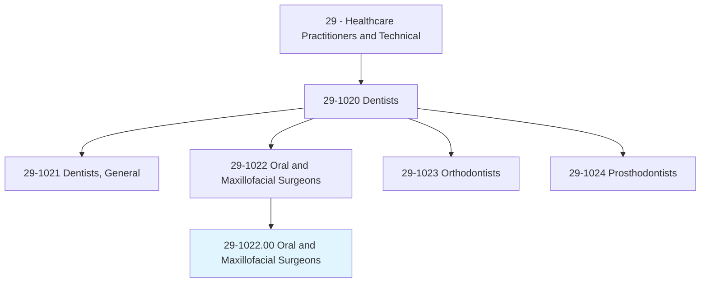
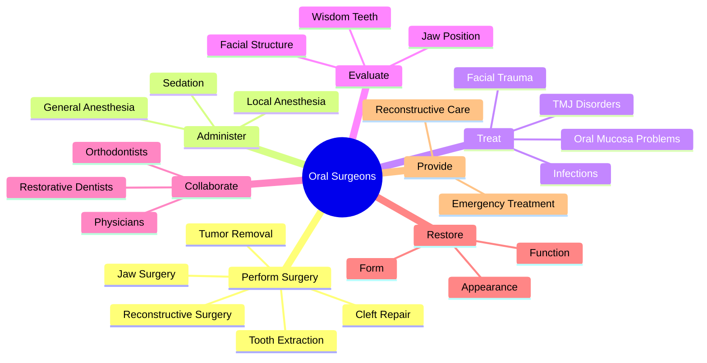
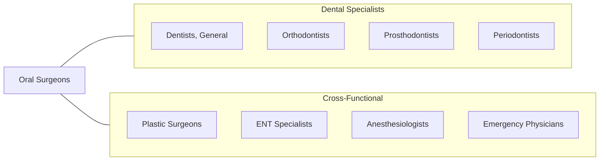
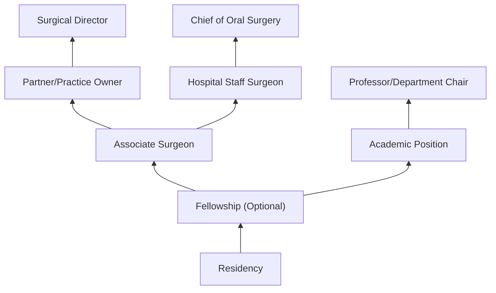

# Oral and Maxillofacial Surgeons

> Perform surgery and related procedures on the hard and soft tissues of the oral and maxillofacial regions to treat diseases, injuries, or defects. May diagnose problems of the oral and maxillofacial regions. May perform surgery to improve function or appearance.

## Overview

Oral and Maxillofacial Surgeons are dental specialists who perform surgical procedures on the mouth, jaws, face, and neck. They treat a wide range of conditions including impacted teeth, facial trauma, jaw misalignment, tumors, and congenital defects such as cleft lip and palate. These surgeons are uniquely qualified to administer all forms of anesthesia and often collaborate with other dental and medical specialists to provide comprehensive patient care.

## Classification Hierarchy

## Key Statistics

| Metric | Value |
|--------|-------|
| SOC Code | 29-1022.00 |
| Job Zone | 5 (Extensive Preparation) |
| Category | [Healthcare Practitioners](/occupations/HealthcarePractitioners) |
| Core Tasks | 20+ |
| Source | O*NET |

## Core Tasks

### perform.Surgery

Oral surgeons execute complex surgical procedures on the oral and maxillofacial regions.

**Actions:**
- `perform.Surgery.to.prepare.MouthForDentalImplantsAidInRegenerationOfDeficientBoneGumTissues` - Implant site preparation
- `perform.Surgery.on.Mouth.to.treat.Conditions` - Address oral pathology
- `perform.Surgery.on.Jaws.to.treat.Conditions` - Correct jaw abnormalities
- `perform.Surgery.on.CleftLip` - Repair congenital defects
- `perform.Surgery.on.CleftPalate` - Restore palate function
- `perform.Surgery.on.JawGrowthProblems` - Orthognathic surgery

### remove.Teeth

Oral surgeons extract problematic teeth including impacted wisdom teeth.

**Actions:**
- `remove.Impacted` - Extract impacted teeth
- `remove.Damaged` - Remove traumatized teeth
- `remove.NonRestorableTeeth` - Extract non-salvageable teeth
- `remove.TumorsAbnormalGrowths.of.OralRegionsUsingSurgicalInstruments` - Excise oral tumors
- `remove.TumorsAbnormalGrowths.of.FacialRegionsUsingSurgicalInstruments` - Remove facial growths

### administer.Anesthesia

Oral surgeons are trained to provide all levels of anesthesia.

**Actions:**
- `administer.GeneralAnesthetics` - Provide deep sedation
- `administer.LocalAnesthetics` - Apply local numbing agents

### treat.Infections

Oral surgeons manage infections of the oral and facial regions.

**Actions:**
- `treat.Infections.of.OralCavity` - Treat oral infections
- `treat.Infections.of.SalivaryGlands` - Address salivary gland pathology
- `treat.Infections.of.Jaws` - Manage jaw infections
- `treat.Infections.of.Neck` - Treat cervical infections
- `treat.ProblemsAffectingOralMucosa` - Address mucosal conditions
- `treat.MouthUlcers` - Manage oral ulceration

### provide.EmergencyTreatment

Oral surgeons respond to facial trauma emergencies.

**Actions:**
- `provide.EmergencyTreatment.of.FacialInjuriesIncludingFacialLacerations` - Treat facial cuts
- `provide.EmergencyTreatment.of.IntraOralLacerations` - Repair mouth injuries
- `provide.EmergencyTreatment.of.FracturedFacialBones` - Stabilize facial fractures

### restore.Form

Oral surgeons reconstruct facial structures.

**Actions:**
- `restore.Form.by.MovingSkin` - Perform skin grafts
- `restore.Form.by.Bone` - Bone reconstruction
- `restore.Form.by.Nerves` - Nerve repair
- `restore.Function.by.OtherTissuesFromOtherPartsOfBody.to.reconstruct.Jaws` - Jaw reconstruction

### collaborate.Specialists

Oral surgeons work with other healthcare providers for comprehensive care.

**Actions:**
- `collaborate.RestorativeDentists.to.plan.Treatment` - Coordinate with general dentists
- `collaborate.Orthodontists.to.plan.Treatment` - Plan combined orthodontic-surgical treatment

### evaluate.Position

Oral surgeons assess anatomical structures for treatment planning.

**Actions:**
- `evaluate.Position.of.WisdomTeeth.to.determine.WhetherProblemsExistCurrentlyOccurInFuture` - Assess third molars

## Skills & Competencies

### Technical Skills
- **Oral Surgery** - Expert
- **Anesthesia Administration** - Expert
- **Facial Reconstruction** - Expert
- **Trauma Management** - Expert
- **Implant Surgery** - Advanced
- **Diagnostic Imaging** - Advanced
- **Microsurgery** - Advanced

### Soft Skills
- **Decision Making Under Pressure** - Critical
- **Manual Dexterity** - Critical
- **Patient Communication** - Essential
- **Team Leadership** - Essential
- **Emotional Stability** - Critical
- **Attention to Detail** - Critical

## Related Occupations

## Industries

- [Dental Offices](/industries/Healthcare/AmbulatoryHealthCare/DentalOffices/index) - Specialty Practice
- [Hospitals](/industries/Healthcare/Hospitals/index) - Surgical Departments
- [Ambulatory Surgical Centers](/industries/AmbulatorySurgical) - Outpatient Surgery
- [Academic Medical Centers](/industries/AcademicMedical) - Teaching Hospitals
- [Government](/industries/Government) - Military and VA Healthcare

## Career Progression

## Education & Training

| Requirement | Details |
|-------------|---------|
| Typical Education | DDS/DMD plus 4-6 year Oral and Maxillofacial Surgery Residency |
| Work Experience | Extensive surgical training during residency |
| On-the-Job Training | Residency includes hospital rotations (general surgery, anesthesia, medicine) |
| Licensure | State dental license; may also have MD degree |
| Board Certification | American Board of Oral and Maxillofacial Surgery |

## Departments

This occupation typically works in:
- [Oral and Maxillofacial Surgery](/departments/OralMaxillofacialSurgery)
- [Surgical Services](/departments/SurgicalServices)
- [Emergency Department](/departments/EmergencyDepartment)
- [Trauma Services](/departments/TraumaServices)
- [Oncology](/departments/Oncology)

---

*Source: O*NET 29-1022.00 - ONETOccupation*
