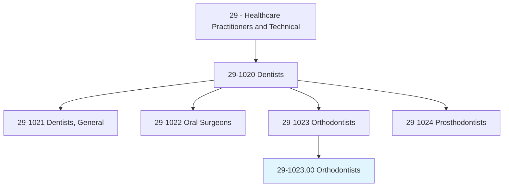
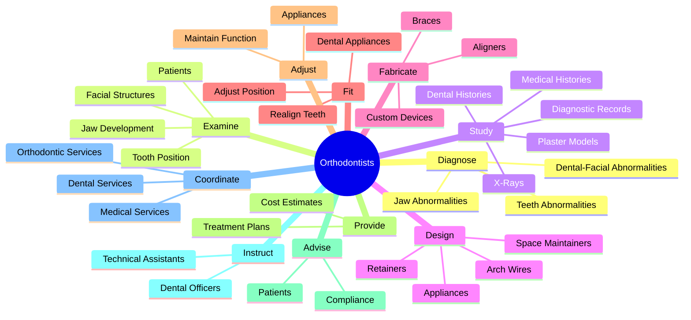
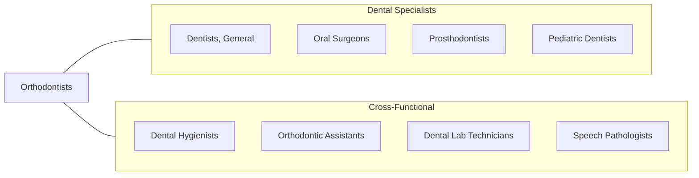
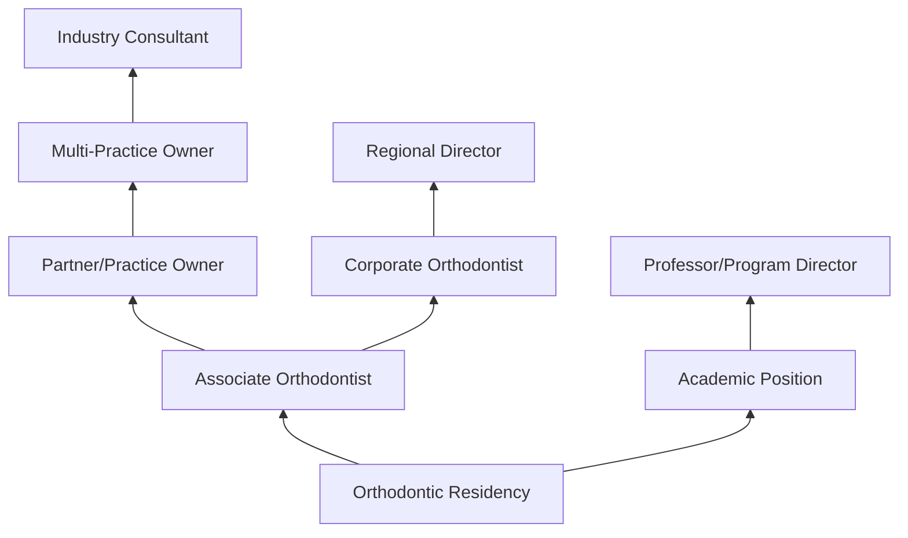

# Orthodontists

> Examine, diagnose, and treat dental malocclusions and oral cavity anomalies. Design and fabricate appliances to realign teeth and jaws to produce and maintain normal function and to improve appearance.

## Overview

Orthodontists are dental specialists who diagnose, prevent, and treat dental and facial irregularities. They specialize in correcting misaligned teeth and jaws using braces, aligners, retainers, and other appliances. Orthodontists assess patients of all ages, develop treatment plans to straighten teeth and correct bite problems, and monitor progress throughout treatment. Their work improves both oral function and aesthetic appearance, contributing to patients' overall health and self-confidence.

## Classification Hierarchy

## Key Statistics

| Metric | Value |
|--------|-------|
| SOC Code | 29-1023.00 |
| Job Zone | 5 (Extensive Preparation) |
| Category | [Healthcare Practitioners](/occupations/HealthcarePractitioners) |
| Core Tasks | 15+ |
| Source | O*NET |

## Core Tasks

### diagnose.Abnormalities

Orthodontists identify dental and facial irregularities requiring treatment.

**Actions:**
- `diagnose.TeethDentalFacialAbnormalities` - Identify tooth positioning issues
- `diagnose.JawDentalFacialAbnormalities` - Assess jaw alignment problems
- `diagnose.OtherDentalFacialAbnormalities` - Detect complex malocclusions

### examine.Patients

Orthodontists conduct thorough assessments of oral and facial structures.

**Actions:**
- `examine.Patients.to.assess.AbnormalitiesOfJawDevelopment` - Evaluate jaw growth
- `examine.Patients.to.ToothPosition` - Assess tooth alignment
- `examine.Patients.to.OtherDentalFacialStructures` - Review facial proportions

### study.DiagnosticRecords

Orthodontists analyze patient records to develop treatment plans.

**Actions:**
- `study.DiagnosticRecords.of.Teeth` - Review dental records
- `study.DiagnosticRecords.of.XRays` - Interpret radiographs
- `study.DiagnosticRecords.of.develop.PatientTreatmentPlans` - Create treatment protocols
- `study.PlasterModels.of.Teeth` - Analyze dental casts
- `study.Medical.of.Teeth` - Review medical history
- `study.DentalHistories.of.Teeth` - Assess dental history

### design.Appliances

Orthodontists create custom devices to correct dental problems.

**Actions:**
- `design.Appliances` - Develop orthodontic devices
- `design.SpaceMaintainers` - Create space-holding devices
- `design.Retainers` - Design retention appliances
- `design.Labial` - Plan labial arch wires
- `design.LingualArchWires` - Design lingual appliances

### fabricate.Appliances

Orthodontists construct orthodontic devices.

**Actions:**
- `fabricate.Appliances` - Build orthodontic devices
- `fabricate.SpaceMaintainers` - Construct space maintainers
- `fabricate.Retainers` - Create retainers
- `fabricate.LingualArchWires` - Manufacture arch wires

### fit.DentalAppliances

Orthodontists install and adjust orthodontic devices.

**Actions:**
- `fit.DentalAppliances.in.PatientsMouths.to.alter.PositionOfTeethJawsToRealignTeeth` - Install braces and aligners
- `fit.DentalAppliances.in.RelationshipOfTeethJaws.to.realign.Teeth` - Position corrective devices

### adjust.DentalAppliances

Orthodontists modify appliances throughout treatment.

**Actions:**
- `adjust.DentalAppliances.to.produce.NormalFunction` - Optimize appliance function
- `adjust.DentalAppliances.to.maintain.NormalFunction` - Maintain treatment progress

### provide.Patients

Orthodontists communicate treatment information to patients.

**Actions:**
- `provide.Patients.with.ProposedTreatmentPlansEstimates` - Present treatment options
- `provide.Patients.with.CostEstimates` - Discuss financial aspects

### advise.Patients

Orthodontists guide patients through treatment.

**Actions:**
- `advise.Patients.to.comply.WithTreatmentPlans` - Ensure patient compliance

### instruct.Staff

Orthodontists train dental team members.

**Actions:**
- `instruct.DentalOfficersAssistants.in.OrthodonticProcedures` - Train assistants
- `instruct.TechnicalAssistants.in.Techniques` - Teach technical skills

### coordinate.Services

Orthodontists collaborate with other healthcare providers.

**Actions:**
- `coordinate.OrthodonticServices.with.OtherDentalServices` - Integrate dental care
- `coordinate.OrthodonticServices.with.MedicalServices` - Coordinate medical treatment

## Skills & Competencies

### Technical Skills
- **Orthodontic Diagnosis** - Expert
- **Treatment Planning** - Expert
- **Appliance Design** - Expert
- **Digital Orthodontics** - Advanced
- **Cephalometric Analysis** - Expert
- **3D Imaging Interpretation** - Advanced
- **Biomechanics** - Advanced

### Soft Skills
- **Patient Communication** - Critical
- **Manual Dexterity** - Critical
- **Aesthetic Judgment** - Essential
- **Patience** - Essential
- **Attention to Detail** - Critical
- **Problem Solving** - Essential

## Related Occupations

## Industries

- [Dental Offices](/industries/DentalOffices) - Specialty Practice
- [Health and Personal Care](/industries/HealthPersonalCare) - Retail Orthodontics
- [Hospitals](/industries/Hospitals) - Institutional Settings
- [Academic Institutions](/industries/AcademicInstitutions) - Teaching Programs
- [Corporate Dental Groups](/industries/CorporateDental) - Multi-location Practices

## Career Progression

## Education & Training

| Requirement | Details |
|-------------|---------|
| Typical Education | DDS/DMD plus 2-3 year Orthodontic Residency |
| Work Experience | Clinical training during residency |
| On-the-Job Training | Residency includes comprehensive case management |
| Licensure | State dental license with orthodontic specialty permit |
| Board Certification | American Board of Orthodontics (optional but prestigious) |

## Departments

This occupation typically works in:
- [Orthodontic Services](/departments/OrthodonticServices)
- [Pediatric Dentistry](/departments/PediatricDentistry)
- [Craniofacial Services](/departments/CraniofacialServices)
- [Dental Specialties](/departments/DentalSpecialties)

---

*Source: O*NET 29-1023.00 - ONETOccupation*
