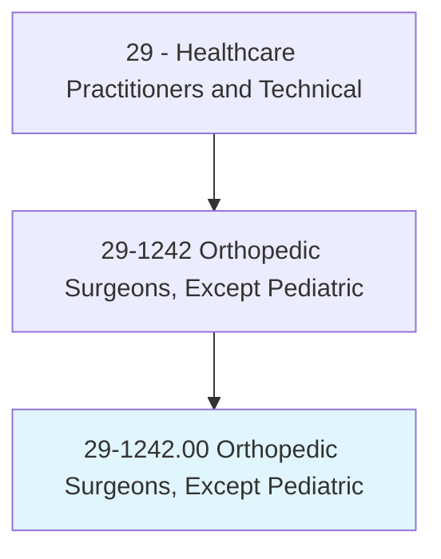
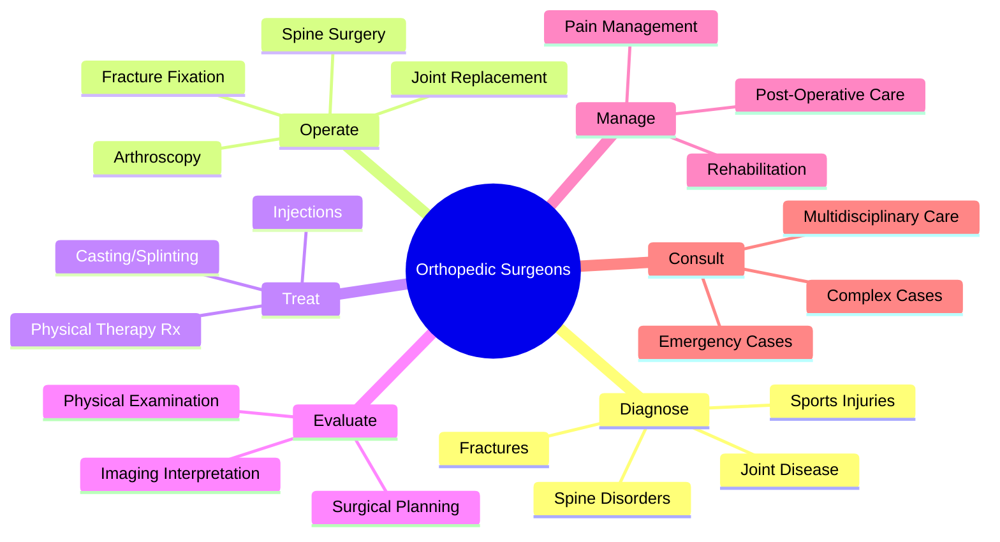
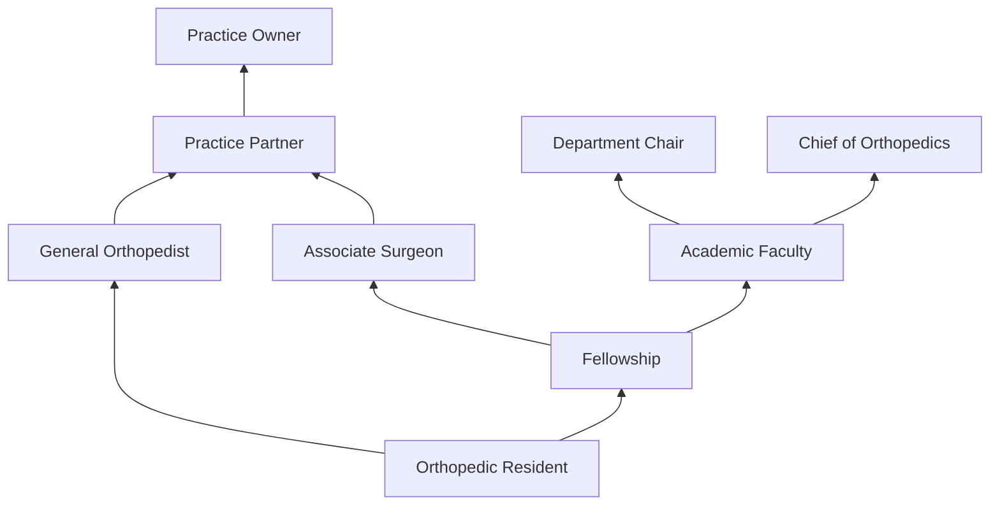
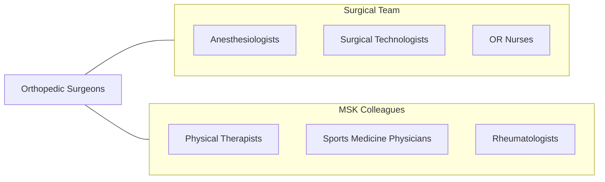

# Orthopedic Surgeons, Except Pediatric

> Diagnose and perform surgery to treat and prevent rheumatic and other diseases in the musculoskeletal system.

## Overview

Orthopedic Surgeons are physician specialists who diagnose and surgically treat conditions of the musculoskeletal system including bones, joints, ligaments, tendons, muscles, and nerves. They perform joint replacement surgery (hip, knee, shoulder), fracture repair, arthroscopic procedures, spine surgery, sports medicine surgery, hand surgery, and reconstructive procedures to restore function and reduce pain in patients with degenerative, traumatic, and congenital musculoskeletal conditions.

The scope encompasses both operative and non-operative management of musculoskeletal disorders. Orthopedic surgeons evaluate patients using physical examination, diagnostic imaging (X-ray, MRI, CT, ultrasound), and electrodiagnostic studies. They manage acute fractures and dislocations, chronic joint disease (osteoarthritis), sports injuries (ACL tears, rotator cuff tears), spinal disorders (herniated discs, stenosis), musculoskeletal tumors, and deformity correction.

Modern orthopedic surgery has been revolutionized by robotic-assisted joint replacement, computer-navigated spine surgery, minimally invasive arthroscopy, biologics (PRP, stem cells), 3D-printed custom implants, and patient-specific instrumentation. Orthopedic surgeons increasingly use evidence-based approaches to optimize outcomes through enhanced recovery protocols, multimodal pain management, and outpatient joint replacement programs.

## Classification Hierarchy

## Key Statistics

| Metric | Value |
|--------|-------|
| SOC Code | 29-1242.00 |
| Median Annual Salary | $371,400 |
| Employment | ~19,000 |
| Projected Growth | 3% (2022-2032) |
| Job Zone | 5 (Extensive Preparation) |
| Category | [Healthcare Practitioners](/occupations/HealthcarePractitioners) |
| Core Tasks | 50+ |
| Source | O*NET |

## Core Tasks

### perform.OrthopedicSurgery

Orthopedic Surgeons perform musculoskeletal procedures.

**Actions:**
- `perform.TotalJointReplacement.using.RoboticAssistance` - Joint replacement
- `perform.Arthroscopy.for.MinimallyInvasiveRepair` - Arthroscopic surgery
- `perform.FractureFixation.using.PlatesAndScrews` - Fracture repair
- `perform.SpineSurgery.for.DegenerativeDisease` - Spine procedures

### diagnose.MusculoskeletalConditions

Orthopedic Surgeons evaluate musculoskeletal problems.

**Actions:**
- `diagnose.FracturesAndDislocations.using.ImagingStudies` - Trauma evaluation
- `evaluate.JointDegeneration.for.SurgicalPlanning` - Arthroplasty assessment
- `assess.SportsInjuries.for.TreatmentDecisions` - Sports medicine evaluation
- `interpret.MRIAndCT.for.SurgicalPlanning` - Imaging interpretation

## Practice Settings

| Setting | Description |
|---------|-------------|
| Private Orthopedic Practice | Office and surgical practice |
| Hospitals | Trauma and inpatient surgery |
| Academic Medical Centers | Teaching and complex surgery |
| Ambulatory Surgery Centers | Outpatient procedures |
| Sports Medicine Clinics | Athletic injury care |
| VA Medical Centers | Veterans orthopedic care |

## Skills & Competencies

### Technical Skills
- **Joint Replacement Surgery** - Expert
- **Arthroscopic Surgery** - Expert
- **Fracture Management** - Expert
- **Spine Surgery** - Expert (if subspecialized)
- **Musculoskeletal Imaging** - Expert
- **Casting and Splinting** - Expert
- **Robotic Surgery** - Advanced

### Soft Skills
- **Manual Dexterity** - Critical
- **Decision Making** - Critical
- **Patient Communication** - Essential
- **Physical Stamina** - Essential
- **Leadership** - Important

## Education & Training

| Requirement | Details |
|-------------|---------|
| Undergraduate | Bachelor's degree (pre-medical) |
| Medical School | 4-year MD or DO program |
| Residency | 5-year orthopedic surgery residency |
| Fellowship | 1 year subspecialty (optional) |
| Board Certification | ABOS examination |
| Total Training | 13-14 years post-high school |

## Certifications

| Certification | Description |
|---------------|-------------|
| ABOS | American Board of Orthopaedic Surgery |
| CAQ Sports Medicine | Certificate of Added Qualification |
| CAQ Hand Surgery | Certificate of Added Qualification |
| State Medical License | Required in all states |

## Career Progression

## Specializations

| Subspecialty | Focus Area |
|-------------|-------------|
| Sports Medicine | Athletic injuries, arthroscopy |
| Joint Replacement | Hip, knee, shoulder arthroplasty |
| Spine Surgery | Disc, stenosis, deformity |
| Hand/Upper Extremity | Hand, wrist, elbow surgery |
| Foot & Ankle | Foot and ankle reconstruction |
| Trauma | Fracture care |
| Oncology | Musculoskeletal tumors |
| Shoulder & Elbow | Upper extremity reconstruction |

## Technology & Tools

| Technology | Purpose |
|------------|---------|
| Robotic Surgery Systems (MAKO, ROSA) | Joint replacement precision |
| Arthroscopy Systems | Minimally invasive surgery |
| Computer Navigation (Brainlab) | Surgical guidance |
| Fracture Fixation Implants (Synthes, Stryker) | Hardware for fracture repair |
| Joint Replacement Implants | Prosthetic joints |
| Fluoroscopy (C-arm) | Intraoperative imaging |
| 3D Printing | Custom implants and guides |

## Related Occupations

## Industries

- [Physician Offices](/industries/Healthcare/PhysicianOffices) - Orthopedic Practice
- [Hospitals](/industries/Healthcare/Hospitals/index) - Trauma and Inpatient Surgery
- [Ambulatory Surgery](/industries/Healthcare/AmbulatoryHealthCare) - Outpatient Surgery
- [Academic](/industries/Education) - Teaching Hospitals
- [Sports Organizations](/industries/ArtsEntertainment) - Team Physicians

## Departments

This occupation typically works in:
- [Orthopedic Surgery](/departments/OrthopedicSurgery)
- [Sports Medicine](/departments/SportsMedicine)
- [Trauma Surgery](/departments/TraumaSurgery)
- [Joint Replacement Center](/departments/JointReplacementCenter)
- [Operating Room](/departments/OperatingRoom)

---

*Source: O*NET 29-1242.00 - ONETOccupation*
