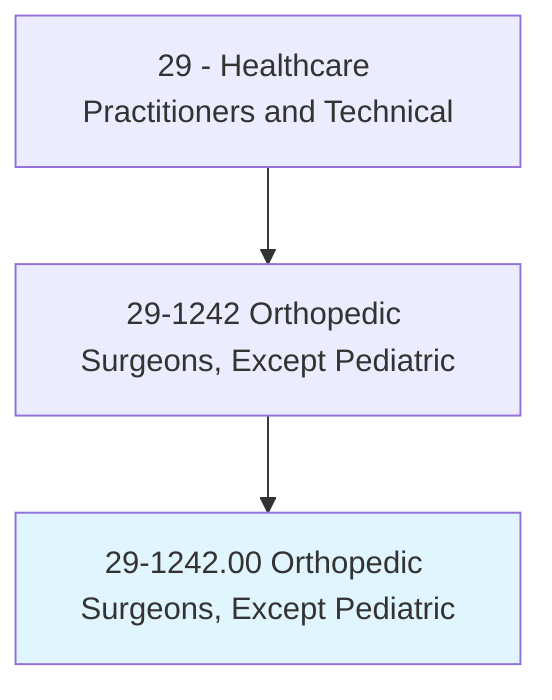
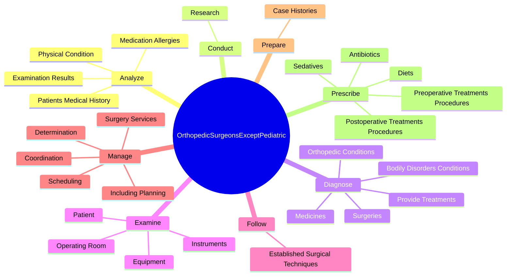

# Orthopedic Surgeons, Except Pediatric

> Diagnose and perform surgery to treat and prevent rheumatic and other diseases in the musculoskeletal system.

## Overview

Orthopedic Surgeons, Except Pediatric is classified under Healthcare Practitioners and Technical (SOC 29). Diagnose and perform surgery to treat and prevent rheumatic and other diseases in the musculoskeletal system.

## Classification Hierarchy

## Key Statistics

| Metric | Value |
|--------|-------|
| SOC Code | 29-1242.00 |
| Category | [Healthcare Practitioners and Technical](/occupations/HealthcarePractitioners) |
| Task Count | 62 |
| Source | O*NET |

## Core Tasks

### analyze.PatientsMedicalHistory

Orthopedic Surgeons, Except Pediatric analyze patients medical history as part of their core responsibilities.

**Actions:**
- `analyze.PatientsMedicalHistory.to.verify.OperationsNecessityDetermineBestProcedure`
- `analyze.PatientsMedicalHistory.to.ToDetermineBestProcedure`
- `analyze.MedicationAllergies.to.verify.OperationsNecessityDetermineBestProcedure`
- `analyze.MedicationAllergies.to.ToDetermineBestProcedure`

### conduct.Research

Orthopedic Surgeons, Except Pediatric conduct research as part of their core responsibilities.

**Actions:**
- `conduct.Research.to.develop.RelatedToMusculoskeletalInjuries`
- `conduct.Research.to.develop.RelatedToDiseases`
- `conduct.Research.to.test.SurgicalTechniquesCanImproveOperatingProceduresOutcomesRelatedToMusculoskeletalInjuries`
- `conduct.Research.to.test.SurgicalTechniquesCanImproveOperatingProceduresOutcomesRelatedToDiseases`

### diagnose.BodilyDisordersConditions

Orthopedic Surgeons, Except Pediatric diagnose bodily disorders conditions as part of their core responsibilities.

**Actions:**
- `diagnose.BodilyDisordersConditions.in.Clinics`
- `diagnose.BodilyDisordersConditions.in.HospitalWards`
- `diagnose.BodilyDisordersConditions.in.OperatingRooms`
- `diagnose.OrthopedicConditions.in.Clinics`

## Skills & Competencies

### Technical Skills
- **Clinical Skills** - Advanced
- **Diagnostic Procedures** - Advanced
- **Patient Care** - Advanced

### Soft Skills
- **Communication** - Essential
- **Problem Solving** - Essential
- **Critical Thinking** - Important
- **Teamwork** - Important
- **Adaptability** - Important

## Related Occupations

## Industries

This occupation is found across multiple industries. See [Industries](/industries) for sector-specific employment data.

## Career Progression

---

*Source: O*NET 29-1242.00 - ONETOccupation*
