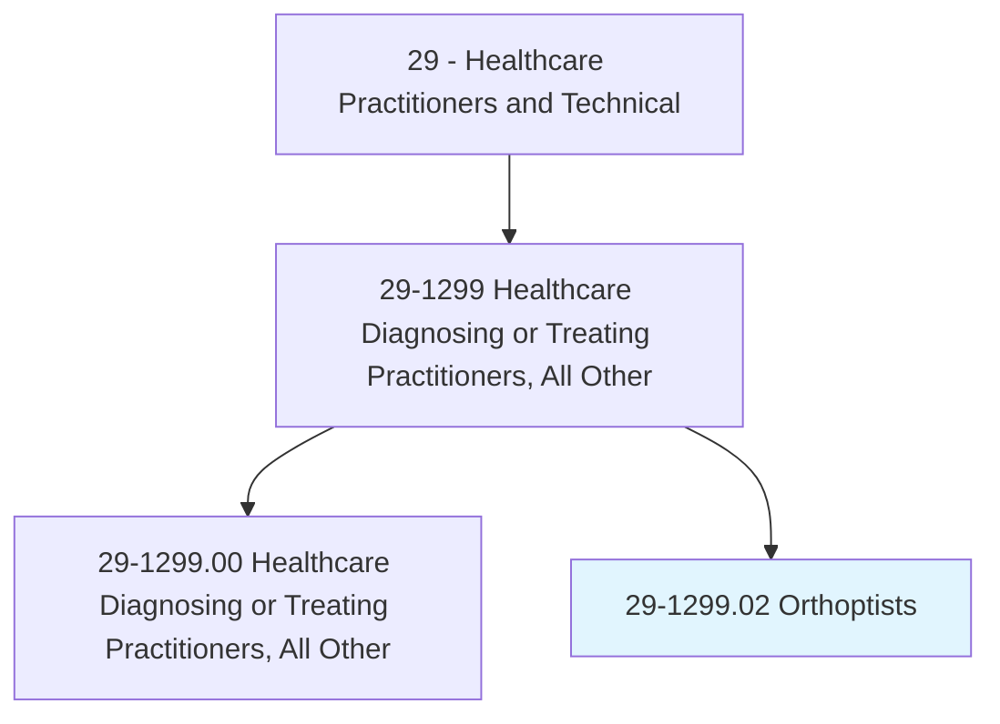
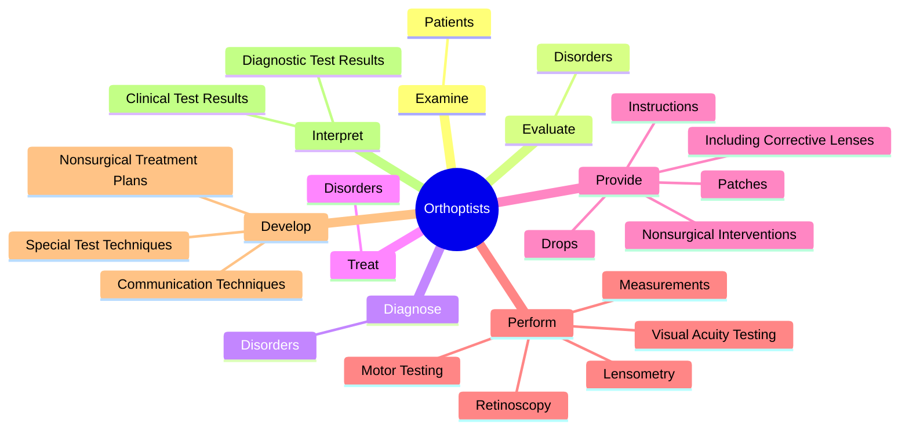
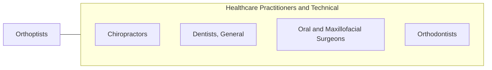

# Orthoptists

> Diagnose and treat visual system disorders such as binocular vision and eye movement impairments.

## Overview

Orthoptists is classified under Healthcare Practitioners and Technical (SOC 29). Diagnose and treat visual system disorders such as binocular vision and eye movement impairments.

## Classification Hierarchy

## Key Statistics

| Metric | Value |
|--------|-------|
| SOC Code | 29-1299.02 |
| Category | [Healthcare Practitioners and Technical](/occupations/HealthcarePractitioners) |
| Task Count | 86 |
| Source | O*NET |

## Core Tasks

### examine.Patients

Orthoptists examine patients as part of their core responsibilities.

**Actions:**
- `examine.Patients.with.ProblemsRelatedToOcularMotility`
- `examine.Patients.with.BinocularVision`
- `examine.Patients.with.Amblyopia`
- `examine.Patients.with.Strabismus`

### evaluate.Disorders

Orthoptists evaluate disorders as part of their core responsibilities.

**Actions:**
- `evaluate.Disorders.of.VisualSystem.with.EmphasisOnBinocularVisionEyeMovements`
- `evaluate.Disorders.of.AbnormalEyeMovements`

### diagnose.Disorders

Orthoptists diagnose disorders as part of their core responsibilities.

**Actions:**
- `diagnose.Disorders.of.VisualSystem.with.EmphasisOnBinocularVisionEyeMovements`
- `diagnose.Disorders.of.AbnormalEyeMovements`

## Skills & Competencies

### Technical Skills
- **Clinical Skills** - Advanced
- **Diagnostic Procedures** - Advanced
- **Patient Care** - Advanced

### Soft Skills
- **Communication** - Essential
- **Problem Solving** - Essential
- **Critical Thinking** - Important
- **Teamwork** - Important
- **Adaptability** - Important

## Related Occupations

## Industries

This occupation is found across multiple industries. See [Industries](/industries) for sector-specific employment data.

## Career Progression

---

*Source: O*NET 29-1299.02 - ONETOccupation*
