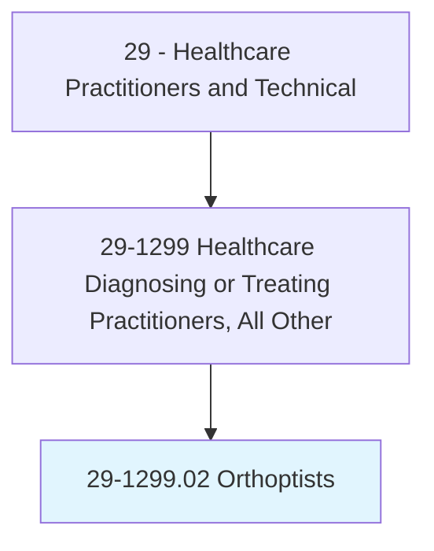
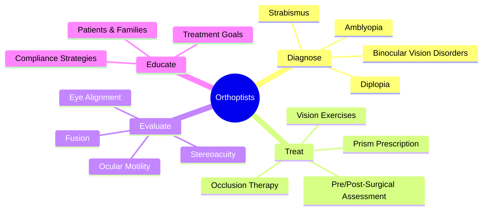
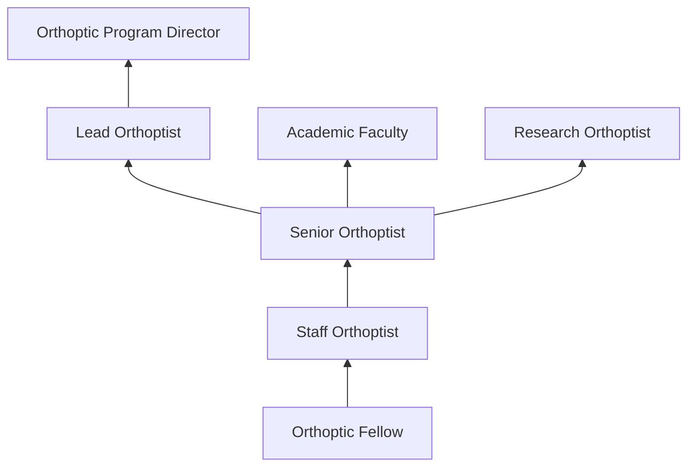
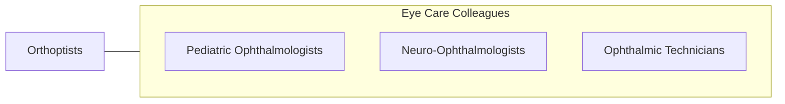

# Orthoptists

> Diagnose and treat disorders of eye movement and binocular vision, including strabismus and amblyopia.

## Overview

Orthoptists are specialized eye care professionals who diagnose and treat disorders of eye movement, binocular vision, and eye alignment. They evaluate and manage strabismus (eye misalignment), amblyopia (lazy eye), convergence insufficiency, diplopia (double vision), and other binocular vision disorders in patients of all ages. Orthoptists work under ophthalmologists to provide non-surgical treatment and pre/post-surgical assessment for eye muscle disorders.

The role requires expertise in ocular motility assessment, binocular vision evaluation, prism prescription, and vision therapy. Orthoptists perform comprehensive motility examinations using cover tests, prism measurements, Worth 4-dot testing, stereoacuity assessment, and Hess/Lancaster charting. They design and implement treatment programs including occlusion therapy for amblyopia, prism correction for diplopia, and exercises for convergence insufficiency.

Orthoptists serve important roles in pediatric ophthalmology clinics, neuro-ophthalmology services, and strabismus surgery planning. The profession has evolved with quantitative eye movement recording, computer-based vision therapy, and evidence-based approaches to amblyopia and strabismus management.

## Classification Hierarchy

## Key Statistics

| Metric | Value |
|--------|-------|
| SOC Code | 29-1299.02 |
| Median Annual Salary | $62,000 |
| Employment | ~2,000 |
| Projected Growth | 8% (2022-2032) |
| Job Zone | 5 (Extensive Preparation) |
| Category | [Healthcare Practitioners](/occupations/HealthcarePractitioners) |
| Core Tasks | 20+ |
| Source | O*NET |

## Core Tasks

### diagnose.BinocularVisionDisorders

Orthoptists evaluate eye alignment and binocular function.

**Actions:**
- `evaluate.EyeAlignment.using.CoverAndPrismTests` - Strabismus assessment
- `assess.BinocularVision.using.StereoacuityTests` - Binocular evaluation
- `measure.OcularMotility.for.ExtraocularMuscleFunction` - Motility testing
- `diagnose.Amblyopia.using.VisualAcuityAndFusion` - Amblyopia detection

### treat.EyeMovementDisorders

Orthoptists provide non-surgical management.

**Actions:**
- `prescribe.OcclusionTherapy.for.AmblyopiaTreatment` - Patching therapy
- `prescribe.PrismCorrection.for.DiplopiaMagement` - Prism treatment
- `implement.ConvergenceExercises.for.InsufficiencyTreatment` - Vision therapy
- `assess.SurgicalOutcomes.for.StrabismusSurgery` - Post-op evaluation

## Practice Settings

| Setting | Description |
|---------|-------------|
| Pediatric Ophthalmology Clinics | Children's eye alignment |
| Academic Medical Centers | Teaching and complex cases |
| Neuro-Ophthalmology Clinics | Neurologic eye movement disorders |
| Children's Hospitals | Pediatric eye care |
| Private Ophthalmology Practices | Strabismus management |

## Skills & Competencies

### Technical Skills
- **Ocular Motility Assessment** - Expert
- **Binocular Vision Testing** - Expert
- **Prism Measurement** - Expert
- **Amblyopia Management** - Expert
- **Sensory Testing** - Expert
- **Vision Therapy** - Advanced

### Soft Skills
- **Patient Communication (Pediatric)** - Critical
- **Patience** - Essential
- **Observation** - Essential
- **Empathy** - Essential

## Education & Training

| Requirement | Details |
|-------------|---------|
| Education | Bachelor's degree plus 2-year orthoptic fellowship |
| Fellowship | Accredited orthoptic program |
| Certification | CO (Certified Orthoptist) through AAO&A |
| Continuing Education | Per certification requirements |

## Certifications

| Certification | Description |
|---------------|-------------|
| CO | Certified Orthoptist (American Orthoptic Council) |
| Fellow of AAO | American Association of Certified Orthoptists |

## Career Progression

## Technology & Tools

| Technology | Purpose |
|------------|---------|
| Prism Bars and Loose Prisms | Deviation measurement |
| Synoptophore/Major Amblyoscope | Binocular vision assessment |
| Worth 4-Dot/Bagolini Lenses | Fusion testing |
| Stereoacuity Tests (Titmus, Randot) | Depth perception |
| Hess/Lancaster Charts | Motility mapping |
| Computer-Based Vision Therapy | Digital therapy tools |

## Related Occupations

## Industries

- [Hospitals](/industries/Healthcare/Hospitals/index) - Academic Eye Centers
- [Physician Offices](/industries/Healthcare/PhysicianOffices) - Ophthalmology Practice
- [Children's Hospitals](/industries/Healthcare/Hospitals/index) - Pediatric Eye Care

## Departments

This occupation typically works in:
- Ophthalmology
- Pediatric Ophthalmology
- Neuro-Ophthalmology

---

*Source: O*NET 29-1299.02 - ONETOccupation*
