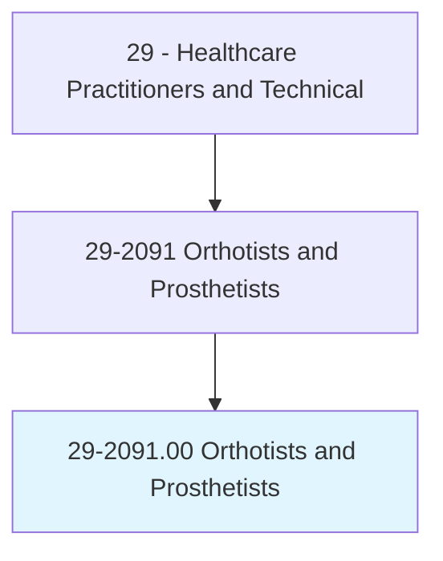
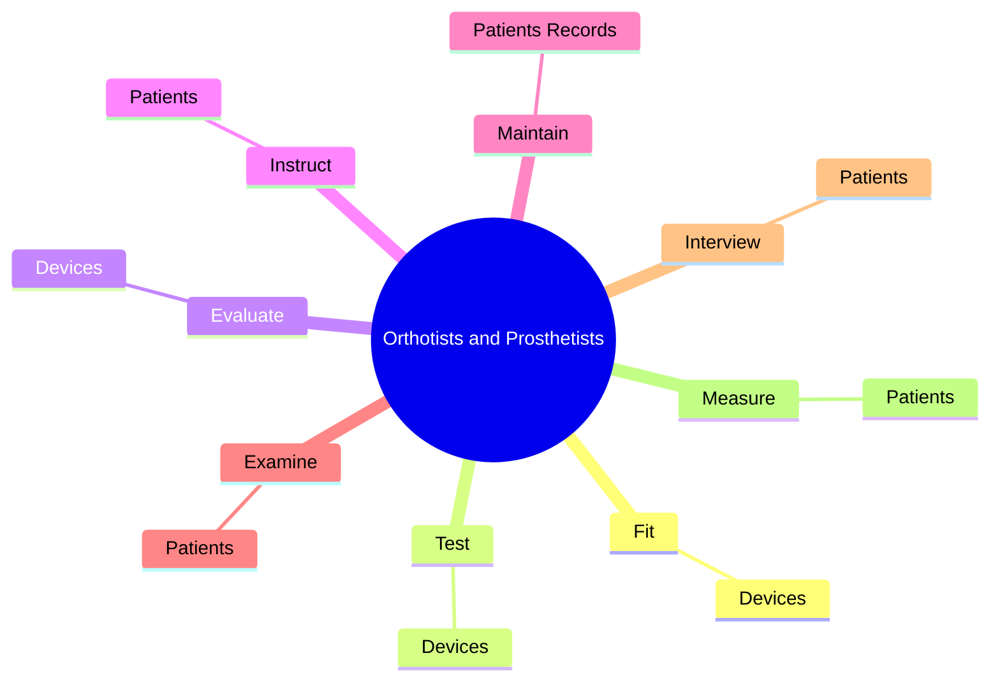
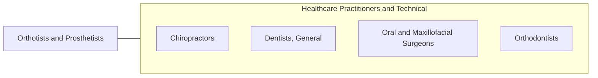

# Orthotists and Prosthetists

> Design, measure, fit, and adapt orthopedic braces, appliances or prostheses, such as limbs or facial parts for patients with disabling conditions.

## Overview

Orthotists and Prosthetists is classified under Healthcare Practitioners and Technical (SOC 29). Design, measure, fit, and adapt orthopedic braces, appliances or prostheses, such as limbs or facial parts for patients with disabling conditions.

## Classification Hierarchy

## Key Statistics

| Metric | Value |
|--------|-------|
| SOC Code | 29-2091.00 |
| Category | [Healthcare Practitioners and Technical](/occupations/HealthcarePractitioners) |
| Task Count | 66 |
| Source | O*NET |

## Core Tasks

### fit.Devices

Orthotists and Prosthetists fit devices as part of their core responsibilities.

**Actions:**
- `fit.Devices.on.Patients`
- `fit.Devices.on.MakeAdjustmentsF`
- `fit.Devices.on.ProperFit`
- `fit.Devices.on.Function`

### test.Devices

Orthotists and Prosthetists test devices as part of their core responsibilities.

**Actions:**
- `test.Devices.on.Patients`
- `test.Devices.on.MakeAdjustmentsF`
- `test.Devices.on.ProperFit`
- `test.Devices.on.Function`

### evaluate.Devices

Orthotists and Prosthetists evaluate devices as part of their core responsibilities.

**Actions:**
- `evaluate.Devices.on.Patients`
- `evaluate.Devices.on.MakeAdjustmentsF`
- `evaluate.Devices.on.ProperFit`
- `evaluate.Devices.on.Function`

## Skills & Competencies

### Technical Skills
- **Clinical Skills** - Advanced
- **Diagnostic Procedures** - Advanced
- **Patient Care** - Advanced

### Soft Skills
- **Communication** - Essential
- **Problem Solving** - Essential
- **Critical Thinking** - Important
- **Teamwork** - Important
- **Adaptability** - Important

## Related Occupations

## Industries

This occupation is found across multiple industries. See [Industries](/industries) for sector-specific employment data.

## Career Progression

---

*Source: O*NET 29-2091.00 - ONETOccupation*
