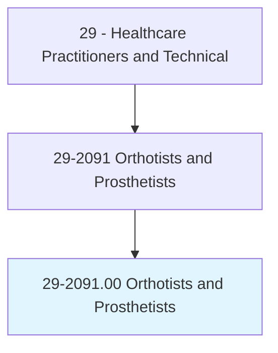
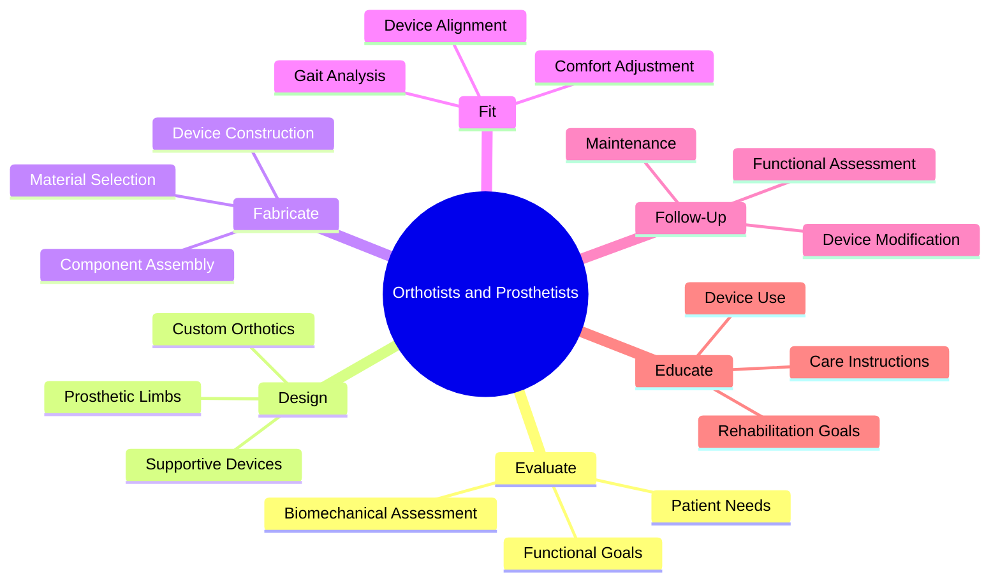
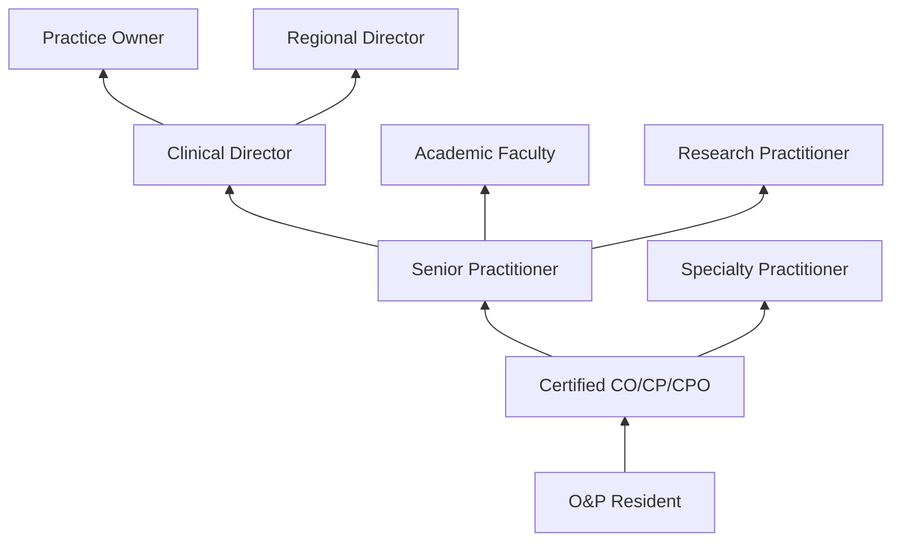
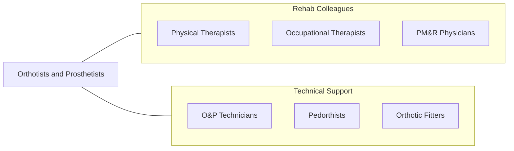

# Orthotists and Prosthetists

> Design, measure, fit, and adapt orthopedic braces, prostheses, or supportive devices, as prescribed by physicians.

## Overview

Orthotists and Prosthetists are healthcare professionals who design, fabricate, fit, and adjust orthotic devices (braces, supports, splints) and prosthetic limbs for patients with musculoskeletal conditions, limb loss, or neurological impairments. They evaluate patients' functional needs, take measurements and casts, design custom devices, oversee fabrication, perform fitting and alignment, and provide ongoing follow-up care to optimize device function and patient comfort.

Orthotists specialize in external braces and supports for the spine, upper extremities, and lower extremities, managing conditions such as scoliosis, stroke-related foot drop, knee instability, and spinal injury. Prosthetists specialize in artificial limbs for patients who have undergone amputation due to trauma, diabetes, vascular disease, or congenital limb deficiency. Both disciplines require integration of biomechanics, materials science, anatomy, pathology, and patient-centered care.

The field has been transformed by microprocessor-controlled prosthetic joints, powered myoelectric upper limb prostheses, 3D scanning and printing, carbon fiber materials, computer-aided design/manufacturing (CAD/CAM), and osseointegrated implant prostheses. Orthotists and prosthetists help patients achieve maximum functional independence and quality of life through expertly designed assistive technology.

## Classification Hierarchy

## Key Statistics

| Metric | Value |
|--------|-------|
| SOC Code | 29-2091.00 |
| Median Annual Salary | $75,440 |
| Employment | ~10,000 |
| Projected Growth | 10% (2022-2032, faster than average) |
| Job Zone | 5 (Extensive Preparation) |
| Category | [Healthcare Practitioners](/occupations/HealthcarePractitioners) |
| Core Tasks | 30+ |
| Source | O*NET |

## Core Tasks

### design.OrthopedicDevices

O&P professionals create custom assistive devices.

**Actions:**
- `evaluate.PatientNeeds.for.DevicePrescription` - Patient assessment
- `design.CustomOrthoses.using.CADSoftware` - Orthotic design
- `design.ProstheticLimbs.for.FunctionalRestoration` - Prosthetic design
- `select.ComponentsAndMaterials.for.OptimalFunction` - Component selection

### fit.AssistiveDevices

O&P professionals ensure optimal device function.

**Actions:**
- `fit.ProstheticLimbs.for.ComfortAndAlignment` - Prosthetic fitting
- `align.LowerExtremityProstheses.using.GaitAnalysis` - Dynamic alignment
- `adjust.OrthoticDevices.for.PatientComfort` - Orthotic adjustment
- `evaluate.FunctionalOutcomes.for.DeviceOptimization` - Outcome assessment

## Practice Settings

| Setting | Description |
|---------|-------------|
| O&P Clinics | Dedicated orthotic/prosthetic facilities |
| Hospitals | Inpatient and outpatient O&P |
| Rehabilitation Centers | Comprehensive rehabilitation |
| VA Medical Centers | Veterans prosthetic services |
| Private Practice | Independent O&P practice |
| Pediatric Centers | Children's orthotic/prosthetic care |

## Skills & Competencies

### Technical Skills
- **Biomechanical Assessment** - Expert
- **Device Design (CAD/CAM)** - Expert
- **Prosthetic Fitting and Alignment** - Expert
- **Orthotic Fabrication** - Expert
- **Gait Analysis** - Advanced
- **Materials Science** - Advanced
- **3D Scanning/Printing** - Advanced

### Soft Skills
- **Patient Communication** - Critical
- **Empathy** - Essential
- **Problem Solving** - Essential
- **Manual Dexterity** - Essential
- **Creativity** - Important
- **Patience** - Essential

## Education & Training

| Requirement | Details |
|-------------|---------|
| Education | Master's degree in orthotics and prosthetics |
| Clinical Residency | 1-year supervised residency |
| Certification | ABC or BOC certification |
| State License | Required in some states |
| Continuing Education | Per certification requirements |

## Certifications

| Certification | Description |
|---------------|-------------|
| CO | Certified Orthotist (ABC) |
| CP | Certified Prosthetist (ABC) |
| CPO | Certified Prosthetist-Orthotist (ABC) |
| BOC Orthotist | Board of Certification orthotist |
| BOC Prosthetist | Board of Certification prosthetist |

## Career Progression

## Specializations

| Focus Area | Description |
|------------|-------------|
| Lower Limb Prosthetics | Transtibial/transfemoral prostheses |
| Upper Limb Prosthetics | Myoelectric and body-powered arms |
| Spinal Orthotics | Scoliosis and spinal injury bracing |
| Pediatric O&P | Children's devices |
| Cranial Orthotics | Plagiocephaly helmets |
| Athletic/Sports O&P | Performance and protective devices |
| Microprocessor Prosthetics | Advanced electronic limbs |

## Technology & Tools

| Technology | Purpose |
|------------|---------|
| CAD/CAM Systems (Canfit, Omega) | Digital device design |
| 3D Scanners (Artec, Structure) | Digital shape capture |
| 3D Printers | Device and socket fabrication |
| Microprocessor Knees (C-Leg, Genium) | Advanced prosthetic joints |
| Myoelectric Components (Ottobock, Ossur) | Powered upper limb |
| Gait Analysis Systems | Biomechanical assessment |
| Vacuum Forming Equipment | Thermoplastic fabrication |
| Carbon Fiber Materials | High-performance construction |

## Related Occupations

## Industries

- [O&P Companies](/industries/Healthcare/AmbulatoryHealthCare) - O&P Practice
- [Hospitals](/industries/Healthcare/Hospitals/index) - Hospital O&P
- [VA Medical Centers](/industries/PublicAdministration) - Veterans Prosthetics
- [Rehabilitation Centers](/industries/Healthcare/AmbulatoryHealthCare) - Rehab O&P
- [Device Manufacturers](/industries/Manufacturing/MedicalEquipment) - Product Development

## Departments

This occupation typically works in:
- Orthotics and Prosthetics
- Rehabilitation Services
- Physical Medicine
- Prosthetics Laboratory

---

*Source: O*NET 29-2091.00 - ONETOccupation*
