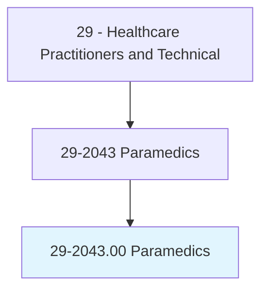
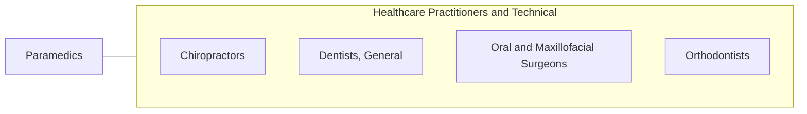

# Paramedics

> Administer basic or advanced emergency medical care and assess injuries and illnesses. May administer medication intravenously, use equipment such as EKGs, or administer advanced life support to sick or injured individuals.

## Overview

Paramedics is an occupation within the Healthcare Practitioners and Technical category. Administer basic or advanced emergency medical care and assess injuries and illnesses. 

## Classification Hierarchy

## Key Statistics

| Metric | Value |
|--------|-------|
| SOC Code | 29-2043.00 |
| Category | [Healthcare Practitioners and Technical](/occupations/HealthcarePractitioners) |
| Task Count | 12 |
| Source | O*NET |

## Core Tasks

```mermaid
mindmap
    root(("Paramedics"))
        Administer
            Drugs Orally
        Instruct
            Emergency Medical Response Team
        Operate
            Equipment
            Electrocardiograms Ekgs
            External Defibrillators
            Bag Valve Mask Resuscitators
        Perform
            Emergency Cardiac Care
            Cardioversion
            Manual Defibrillation
            Emergency Invasive Intervention
            Emergency Pharmacological Interventions
```

### administer.DrugsOrally

Paramedics administer drugs orally as part of their core responsibilities.

**Actions:**
- `administer.DrugsOrally.by.Injection`
- `administer.DrugsOrally.by.PerformIntravenousProcedures`

### instruct.EmergencyMedicalResponseTeam

Paramedics instruct emergency medical response team as part of their core responsibilities.

**Actions:**
- `instruct.EmergencyMedicalResponseTeam.about.EmergencyInterventions.to.ensure.CorrectApplicationOfProcedures`

### operate.Equipment

Paramedics operate equipment as part of their core responsibilities.

**Actions:**
- `operate.Equipment.in.AdvancedLifeSupportEnvironments`
- `operate.ElectrocardiogramsEkgs`
- `operate.ExternalDefibrillators.in.AdvancedLifeSupportEnvironments`
- `operate.BagValveMaskResuscitators.in.AdvancedLifeSupportEnvironments`

## Skills & Competencies

### Technical Skills
- **Clinical Skills** - Advanced
- **Diagnostic Procedures** - Advanced
- **Patient Care** - Advanced

### Soft Skills
- **Communication** - Essential
- **Problem Solving** - Essential
- **Critical Thinking** - Important
- **Teamwork** - Important
- **Adaptability** - Important

## Related Occupations

## Industries

This occupation is found across multiple industries. See [Industries](/industries) for sector-specific employment data.

## Career Progression

---

*Source: O*NET 29-2043.00 - ONETOccupation*
