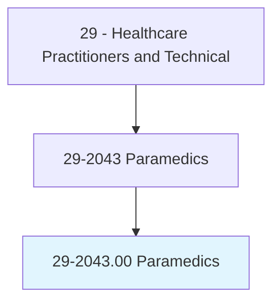
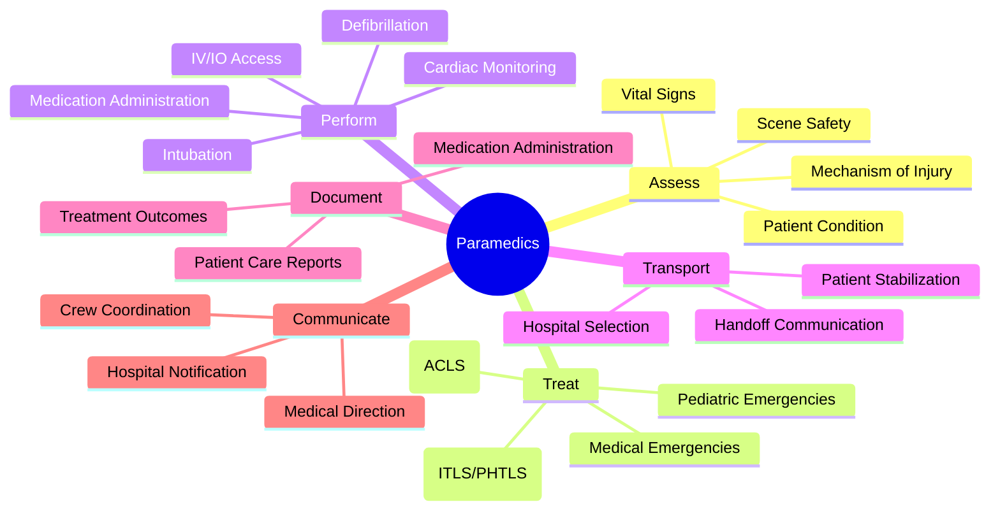
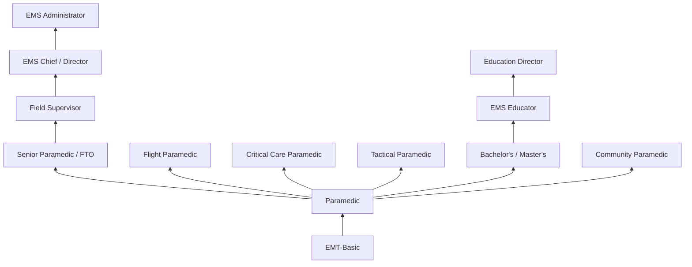
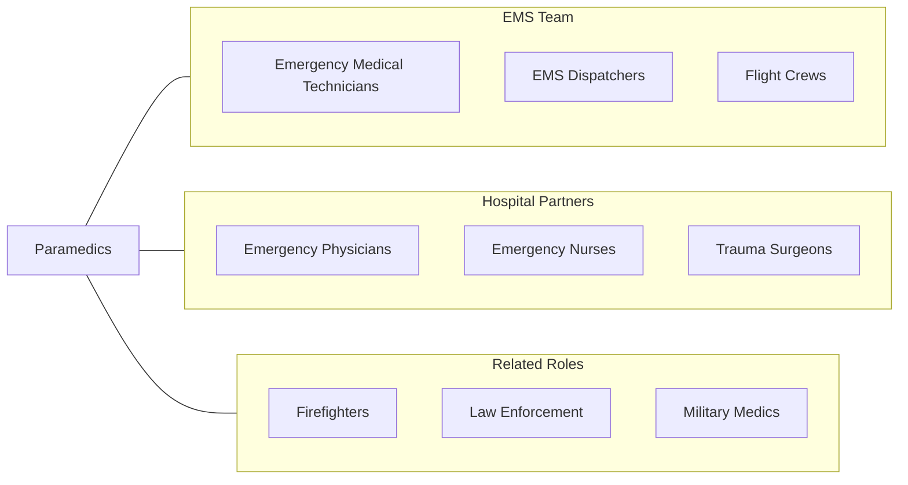

# Paramedics

> Administer basic or advanced emergency medical care and assess injuries and illnesses. May administer medication intravenously, use advanced airway management, and use monitoring and assessment equipment.

## Overview

Paramedics are the highest level of prehospital emergency medical care providers, trained to deliver advanced life support (ALS) in emergency situations. They respond to 911 calls, assess patients at the scene, provide stabilizing treatment, and transport patients to appropriate medical facilities. Paramedics perform advanced procedures including endotracheal intubation, intravenous and intraosseous access, cardiac monitoring and defibrillation, medication administration, needle decompression, and surgical cricothyrotomy.

Operating in uncontrolled, high-stress environments, paramedics must rapidly evaluate patients with unknown conditions and make critical treatment decisions with limited resources. They manage medical emergencies including cardiac arrest, stroke, trauma, respiratory distress, anaphylaxis, overdose, and obstetric emergencies. Paramedics also serve on specialty teams for tactical medicine (SWAT), search and rescue, air medical transport, and community paramedicine programs.

The paramedic profession has evolved significantly from a transport-focused role to a recognized healthcare profession. Community paramedicine and mobile integrated healthcare programs now utilize paramedics for chronic disease management, post-discharge follow-up, and preventive care in underserved communities. Advances in telemedicine, point-of-care diagnostics, and evidence-based protocols continue to expand the paramedic scope of practice.

## Classification Hierarchy

## Key Statistics

| Metric | Value |
|--------|-------|
| SOC Code | 29-2043.00 |
| Median Annual Salary | $49,090 |
| Employment | ~160,000 |
| Projected Growth | 5% (2022-2032) |
| Job Zone | 3 (Medium Preparation) |
| Category | [Healthcare Practitioners](/occupations/HealthcarePractitioners) |
| Core Tasks | 40+ |
| Source | O*NET |

## Core Tasks

### assess.EmergencyPatients

Paramedics rapidly evaluate patients in prehospital settings.

**Actions:**
- `assess.SceneSafety.before.PatientContact` - Scene size-up
- `assess.PatientCondition.using.PrimarySecondary.Survey` - Systematic assessment
- `assess.MechanismOfInjury.for.TraumaPatients` - Trauma evaluation
- `assess.VitalSigns.using.PortableMonitoring` - Vital sign assessment

### treat.EmergencyConditions

Paramedics deliver advanced life support interventions.

**Actions:**
- `treat.CardiacArrest.using.ACLSProtocols` - Cardiac resuscitation
- `treat.TraumaPatients.using.PHLTSProtocols` - Trauma stabilization
- `perform.EndotrachealIntubation.for.AirwayManagement` - Advanced airway
- `administer.Medications.per.StandingOrders` - Pharmacotherapy

### transport.PatientsToHospital

Paramedics ensure safe and efficient patient transport.

**Actions:**
- `transport.Patients.to.AppropriateReceivingFacility` - Destination decision
- `communicate.PatientStatus.to.ReceivingHospital` - Hospital notification
- `maintain.PatientStabilization.during.Transport` - En route care
- `document.PatientCareReport.for.MedicalRecords` - PCR documentation

## Practice Settings

| Setting | Description |
|---------|-------------|
| Fire Departments | Fire-based EMS |
| Municipal EMS Agencies | Third-service ambulance |
| Private Ambulance Services | Private EMS companies |
| Hospital-Based EMS | Hospital ambulance services |
| Air Medical (HEMS) | Helicopter EMS |
| Critical Care Transport | ICU-level transport |
| Community Paramedicine | Mobile integrated healthcare |
| Tactical/SWAT | Law enforcement medical support |

## Skills & Competencies

### Technical Skills
- **Advanced Life Support (ALS)** - Expert
- **Airway Management** - Expert
- **Cardiac Monitoring/Defibrillation** - Expert
- **IV/IO Access** - Expert
- **Trauma Assessment & Management** - Expert
- **Pharmacology** - Advanced
- **12-Lead ECG Interpretation** - Advanced
- **Patient Assessment** - Expert

### Soft Skills
- **Rapid Decision Making** - Critical
- **Stress Tolerance** - Critical
- **Communication** - Essential
- **Teamwork** - Essential
- **Adaptability** - Essential
- **Compassion** - Essential
- **Physical Fitness** - Essential

## Education & Training

| Requirement | Details |
|-------------|---------|
| Prerequisite | EMT-Basic certification |
| Paramedic Program | 1,200-1,800 hours (certificate or associate degree) |
| Clinical Hours | 250+ hospital clinical hours |
| Field Internship | 250+ field hours under preceptor |
| Certification | NREMT-Paramedic exam |
| State License | Required in all states |
| Continuing Education | Typically 48-72 hours per recertification cycle |

## Certifications

| Certification | Description |
|---------------|-------------|
| NRP (NREMT-P) | National Registry Paramedic |
| ACLS | Advanced Cardiovascular Life Support |
| PALS | Pediatric Advanced Life Support |
| PHTLS/ITLS | Prehospital Trauma Life Support |
| AMLS | Advanced Medical Life Support |
| NRP (Neonatal) | Neonatal Resuscitation Program |
| CCEMTP | Critical Care Emergency Medical Transport |
| FP-C | Flight Paramedic Certified |

## Career Progression

## Specializations

| Focus Area | Description |
|------------|-------------|
| Critical Care Transport | ICU-level interfacility transport |
| Flight Paramedicine | HEMS/air medical |
| Tactical/SWAT Medicine | Law enforcement medical support |
| Community Paramedicine | Chronic disease and preventive care |
| Pediatric Paramedicine | Specialized pediatric prehospital care |
| Wilderness EMS | Austere environment care |
| Disaster Response | Mass casualty and disaster medicine |
| EMS Education | Paramedic program instruction |

## Technology & Tools

| Technology | Purpose |
|------------|---------|
| Cardiac Monitor/Defibrillator (LIFEPAK, Zoll) | ECG monitoring and defibrillation |
| Portable Ventilators | Prehospital mechanical ventilation |
| Video Laryngoscopes | Advanced airway placement |
| IV/IO Devices (EZ-IO) | Vascular access |
| Point-of-Care Testing (i-STAT) | Prehospital lab analysis |
| Electronic PCR (ESO, ImageTrend) | Digital documentation |
| GPS/CAD Systems | Dispatch and navigation |
| Telemedicine Systems | Remote physician consultation |

## Related Occupations

## Industries

- [Fire Departments](/industries/Government/LocalGov) - Fire-Based EMS
- [Ambulance Services](/industries/Healthcare/AmbulatoryHealthCare) - Private EMS
- [Hospitals](/industries/Healthcare/Hospitals/index) - Hospital-Based EMS
- [Government](/industries/PublicAdministration) - Municipal EMS
- [Air Medical](/industries/Transportation/AirAmbulance) - HEMS Programs
- [Military](/industries/Government/Military) - Combat Medics

## Departments

This occupation typically works in:
- Emergency Medical Services
- Fire-Based EMS
- Critical Care Transport
- Community Paramedicine
- Air Medical Services

---

*Source: O*NET 29-2043.00 - ONETOccupation*
