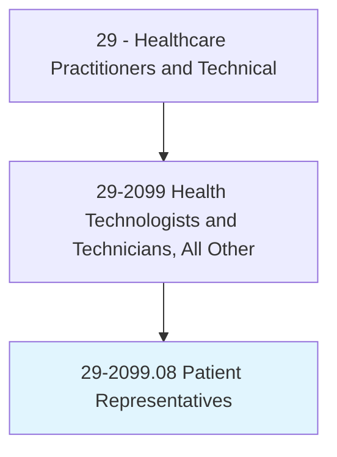
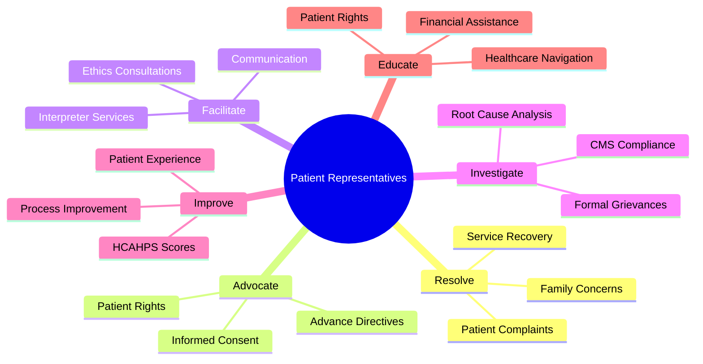
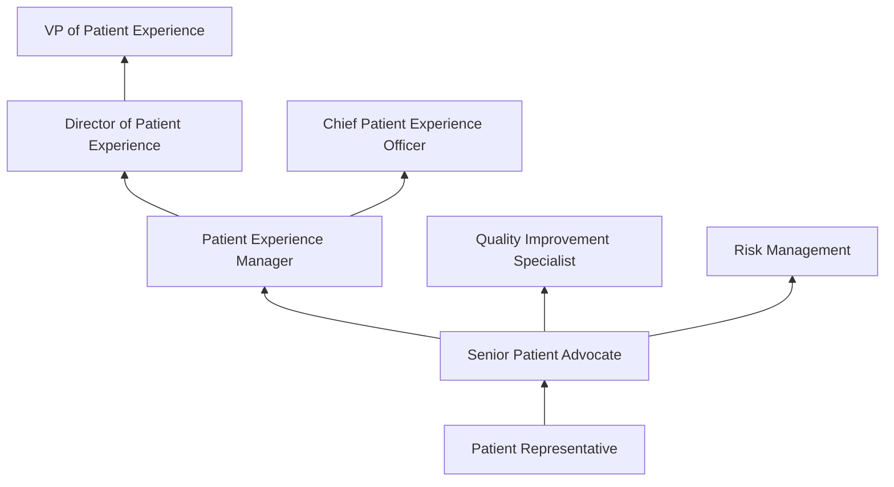
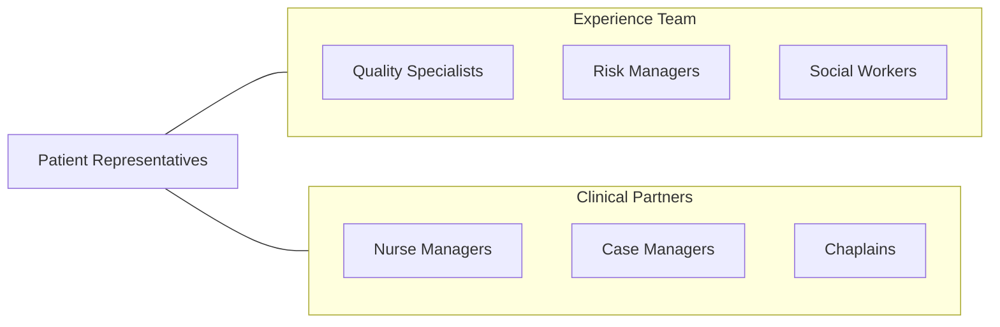

# Patient Representatives

> Assist patients in navigating the healthcare system. Serve as liaisons between patients and healthcare organizations to address concerns, resolve complaints, and ensure patient satisfaction.

## Overview

Patient Representatives (also known as Patient Advocates or Patient Experience Specialists) serve as liaisons between patients, families, and healthcare organizations. They address patient concerns and complaints, facilitate communication between patients and clinical staff, assist with navigating the healthcare system, ensure patients understand their rights and responsibilities, and work to resolve issues that affect patient satisfaction and quality of care.

The role encompasses complaint investigation and resolution, patient rights education, advance directive assistance, ethics consultation facilitation, cultural and language interpretation coordination, and regulatory compliance related to patient grievance processes. Patient representatives investigate formal complaints per CMS Conditions of Participation, track grievance trends, recommend process improvements, and serve as advocates ensuring patients receive respectful, responsive care.

Healthcare's increasing focus on patient experience, HCAHPS scores, and value-based purchasing has elevated the importance of patient representatives. Modern patient advocacy has expanded to include real-time rounding, service recovery programs, patient and family advisory councils, health literacy initiatives, and integration with quality improvement and risk management teams.

## Classification Hierarchy

## Key Statistics

| Metric | Value |
|--------|-------|
| SOC Code | 29-2099.08 |
| Median Annual Salary | $48,820 |
| Employment | ~25,000 |
| Projected Growth | 10% (2022-2032) |
| Job Zone | 3 (Medium Preparation) |
| Category | [Healthcare Practitioners](/occupations/HealthcarePractitioners) |
| Core Tasks | 25+ |
| Source | O*NET |

## Core Tasks

### resolve.PatientConcerns

Patient Representatives address complaints and grievances.

**Actions:**
- `investigate.PatientComplaints.for.ResolutionAndImprovement` - Complaint investigation
- `facilitate.CommunicationBetween.PatientsAndClinicalStaff` - Mediation
- `implement.ServiceRecovery.for.PatientSatisfaction` - Service recovery
- `document.GrievanceResolutions.per.CMSRequirements` - Regulatory documentation

### advocate.ForPatientRights

Patient Representatives ensure patient-centered care.

**Actions:**
- `educate.Patients.regarding.RightsAndResponsibilities` - Rights education
- `assist.Patients.with.AdvanceDirectiveCompletion` - Advance directives
- `coordinate.InterpreterServices.for.LanguageAccess` - Language access
- `facilitate.EthicsConsultations.for.ComplexCases` - Ethics support

## Practice Settings

| Setting | Description |
|---------|-------------|
| Hospitals | Inpatient patient advocacy |
| Health Systems | System-wide patient experience |
| Physician Practices | Outpatient patient relations |
| Insurance Companies | Member advocacy |
| Long-Term Care | Resident advocacy |
| Government | Ombudsman programs |

## Skills & Competencies

### Technical Skills
- **Complaint Investigation** - Expert
- **CMS Grievance Regulations** - Advanced
- **Patient Rights Knowledge** - Expert
- **HCAHPS/Patient Experience** - Advanced
- **Conflict Resolution** - Expert
- **Documentation** - Advanced
- **Data Analysis** - Advanced

### Soft Skills
- **Empathy** - Critical
- **Communication** - Critical
- **Active Listening** - Essential
- **Diplomacy** - Essential
- **Cultural Sensitivity** - Essential
- **Problem Solving** - Essential

## Education & Training

| Requirement | Details |
|-------------|---------|
| Education | Bachelor's degree in healthcare administration, social work, or related field |
| Experience | Healthcare customer service experience preferred |
| Certification | CPXP (optional) |
| Training | Patient rights, CMS regulations, conflict resolution |

## Certifications

| Certification | Description |
|---------------|-------------|
| CPXP | Certified Patient Experience Professional |
| BCPA | Board Certified Patient Advocate |
| CPHQ | Certified Professional in Healthcare Quality |

## Career Progression

## Technology & Tools

| Technology | Purpose |
|------------|---------|
| Grievance Tracking Systems (RL Solutions, Quantros) | Complaint management |
| Patient Experience Platforms (Press Ganey, NRC Health) | Survey and analytics |
| EHR Systems | Patient record access |
| Interpreter Services (Martti, InDemand) | Language access technology |
| Rounding Software | Real-time patient rounding |

## Related Occupations

## Industries

- [Hospitals](/industries/Healthcare/Hospitals/index) - Patient Advocacy
- [Health Systems](/industries/Healthcare/Hospitals/index) - System Patient Experience
- [Insurance](/industries/Insurance) - Member Advocacy
- [Long-Term Care](/industries/Healthcare/NursingCare) - Resident Advocacy

## Departments

This occupation typically works in:
- Patient Experience
- Patient Relations
- Quality Improvement
- Guest Services

---

*Source: O*NET 29-2099.08 - ONETOccupation*
