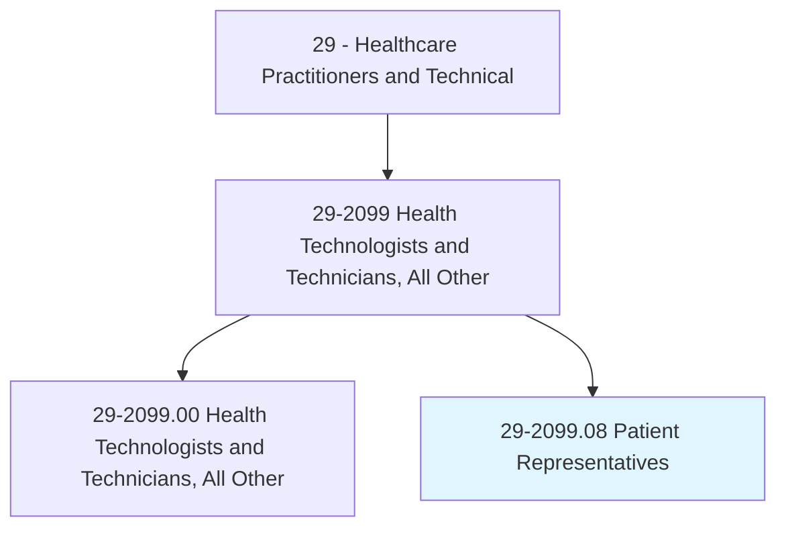
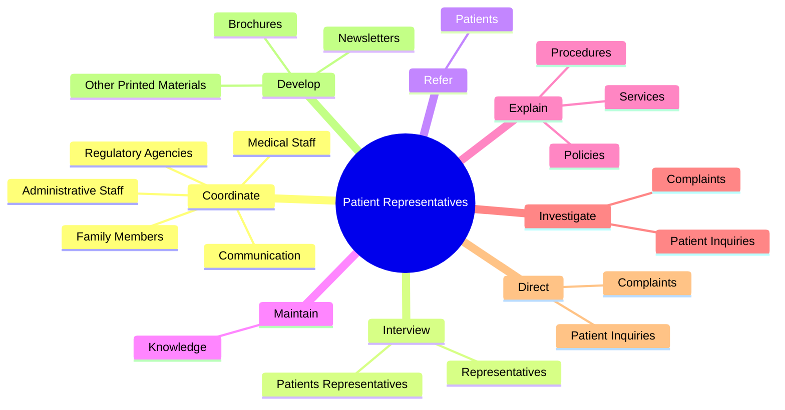
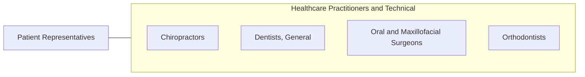

# Patient Representatives

> Assist patients in obtaining services, understanding policies and making health care decisions.

## Overview

Patient Representatives is classified under Healthcare Practitioners and Technical (SOC 29). Assist patients in obtaining services, understanding policies and making health care decisions.

## Classification Hierarchy

## Key Statistics

| Metric | Value |
|--------|-------|
| SOC Code | 29-2099.08 |
| Category | [Healthcare Practitioners and Technical](/occupations/HealthcarePractitioners) |
| Task Count | 67 |
| Source | O*NET |

## Core Tasks

### coordinate.Communication

Patient Representatives coordinate communication as part of their core responsibilities.

**Actions:**
- `coordinate.Communication.between.Patients`
- `coordinate.FamilyMembers`
- `coordinate.MedicalStaff`
- `coordinate.AdministrativeStaff`

### interview.PatientsRepresentatives

Patient Representatives interview patients representatives as part of their core responsibilities.

**Actions:**
- `interview.PatientsRepresentatives.to.identify.ProblemsRelatingToCare`
- `interview.Representatives.to.identify.ProblemsRelatingToCare`

### refer.Patients

Patient Representatives refer patients as part of their core responsibilities.

**Actions:**
- `refer.Patients.to.appropriate.HealthCareServices`
- `refer.Patients.to.resources`

## Skills & Competencies

### Technical Skills
- **Clinical Skills** - Advanced
- **Diagnostic Procedures** - Advanced
- **Patient Care** - Advanced

### Soft Skills
- **Communication** - Essential
- **Problem Solving** - Essential
- **Critical Thinking** - Important
- **Teamwork** - Important
- **Adaptability** - Important

## Related Occupations

## Industries

This occupation is found across multiple industries. See [Industries](/industries) for sector-specific employment data.

## Career Progression

---

*Source: O*NET 29-2099.08 - ONETOccupation*
