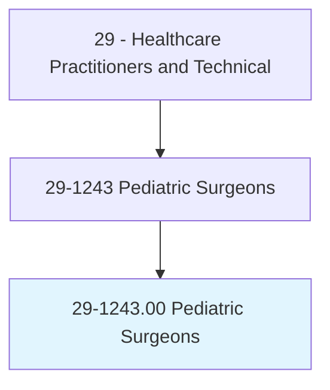
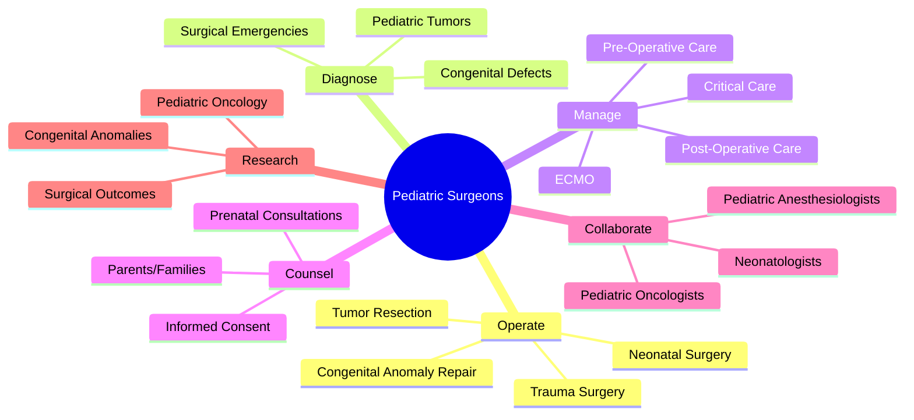
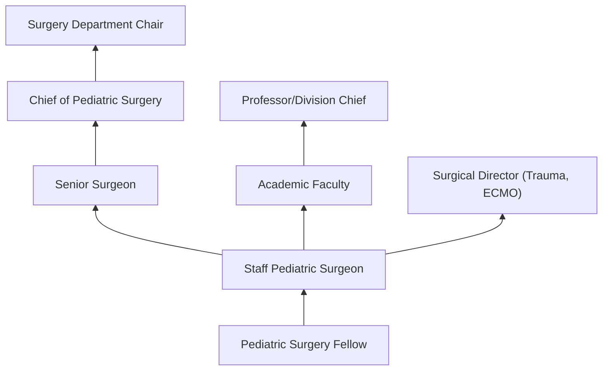
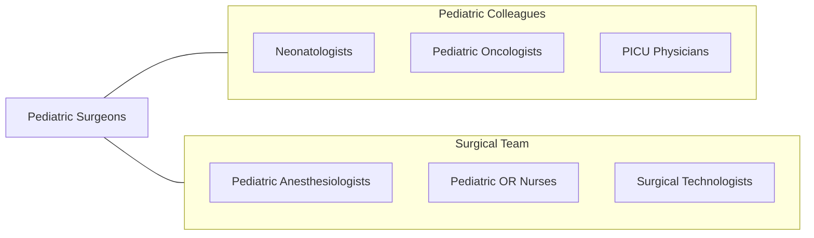

# Pediatric Surgeons

> Diagnose and perform surgery to treat fetal abnormalities and birth defects, diseases, and injuries in fetuses, premature and newborn infants, children, and adolescents.

## Overview

Pediatric Surgeons are physician specialists who diagnose and perform surgical procedures on infants, children, and adolescents for congenital anomalies, acquired diseases, and traumatic injuries. They manage conditions unique to the pediatric population including congenital diaphragmatic hernia, esophageal atresia, intestinal atresia, Hirschsprung disease, biliary atresia, abdominal wall defects, childhood cancers, and pediatric trauma.

The specialty requires expertise in the unique anatomy, physiology, and pathology of growing children. Pediatric surgeons perform neonatal surgery on premature and critically ill infants weighing as little as 500 grams, manage complex congenital anomalies requiring staged reconstruction, operate on pediatric solid organ tumors (neuroblastoma, Wilms tumor, hepatoblastoma), and serve as pediatric trauma surgeons. They work closely with neonatologists, pediatric intensivists, pediatric anesthesiologists, and families.

Modern pediatric surgery has advanced with minimally invasive (laparoscopic and thoracoscopic) approaches for children, fetal surgery for select prenatal conditions, ECMO management for neonatal respiratory failure, and multidisciplinary tumor boards for pediatric oncology. Pediatric surgeons manage the complete surgical care of children from the prenatal period through adolescence.

## Classification Hierarchy

## Key Statistics

| Metric | Value |
|--------|-------|
| SOC Code | 29-1243.00 |
| Median Annual Salary | $362,400 |
| Employment | ~3,500 |
| Projected Growth | 3% (2022-2032) |
| Job Zone | 5 (Extensive Preparation) |
| Category | [Healthcare Practitioners](/occupations/HealthcarePractitioners) |
| Core Tasks | 40+ |
| Source | O*NET |

## Core Tasks

### operate.PediatricSurgicalConditions

Pediatric Surgeons perform procedures on children.

**Actions:**
- `perform.NeonatalSurgery.for.CongenitalAnomalies` - Neonatal repair
- `resect.PediatricTumors.for.OncologicCure` - Cancer surgery
- `repair.AbdominalWallDefects.in.Newborns` - Wall defect repair
- `perform.MinimallyInvasiveSurgery.for.PediatricConditions` - Laparoscopic surgery

### manage.PediatricSurgicalCare

Pediatric Surgeons oversee perioperative management.

**Actions:**
- `manage.CriticallyIllNeonates.in.NICU` - Neonatal critical care
- `counsel.Families.regarding.SurgicalOptions` - Family counseling
- `coordinate.MultidisciplinaryCare.for.ComplexCases` - Team coordination
- `consult.Prenatally.for.FetalAnomalies` - Prenatal consultation

## Practice Settings

| Setting | Description |
|---------|-------------|
| Children's Hospitals | Comprehensive pediatric surgery |
| Academic Medical Centers | Teaching and complex cases |
| NICUs | Neonatal surgical care |
| Pediatric Trauma Centers | Childhood injury management |
| Fetal Treatment Centers | Prenatal intervention |

## Skills & Competencies

### Technical Skills
- **Neonatal Surgery** - Expert
- **Pediatric Oncologic Surgery** - Expert
- **Minimally Invasive Surgery** - Expert
- **Pediatric Trauma Surgery** - Expert
- **Congenital Anomaly Repair** - Expert
- **ECMO Management** - Advanced
- **Pediatric Critical Care** - Advanced

### Soft Skills
- **Family Communication** - Critical
- **Empathy** - Critical
- **Composure Under Pressure** - Essential
- **Teamwork** - Essential
- **Decision Making** - Critical

## Education & Training

| Requirement | Details |
|-------------|---------|
| Medical School | 4-year MD or DO |
| General Surgery Residency | 5 years |
| Pediatric Surgery Fellowship | 2 years |
| Board Certification | American Board of Surgery - Pediatric Surgery |
| Total Training | 15 years post-high school |

## Certifications

| Certification | Description |
|---------------|-------------|
| ABS - Pediatric Surgery | Board certification in pediatric surgery |
| ABS - General Surgery | Base surgical certification |
| ATLS | Advanced Trauma Life Support |
| PALS | Pediatric Advanced Life Support |

## Career Progression

## Specializations

| Focus Area | Description |
|------------|-------------|
| Neonatal Surgery | Newborn surgical conditions |
| Pediatric Oncologic Surgery | Childhood cancer surgery |
| Pediatric Trauma | Childhood injury management |
| Fetal Surgery | Prenatal surgical intervention |
| Pediatric Transplant | Organ transplantation |
| Pediatric Thoracic | Chest surgery in children |
| Pediatric Colorectal | Anorectal and colorectal conditions |

## Technology & Tools

| Technology | Purpose |
|------------|---------|
| Pediatric Laparoscopic Instruments | Minimally invasive surgery |
| ECMO Circuits | Extracorporeal life support |
| Pediatric Surgical Instruments | Size-appropriate tools |
| Intraoperative Ultrasound | Real-time imaging |
| Fetal MRI | Prenatal diagnosis |
| Surgical Navigation Systems | Precision guidance |

## Related Occupations

## Industries

- [Children's Hospitals](/industries/Healthcare/Hospitals/index) - Pediatric Surgery
- [Academic Medical Centers](/industries/Education) - Teaching and Research
- [Trauma Centers](/industries/Healthcare/Hospitals/index) - Pediatric Trauma

## Departments

This occupation typically works in:
- [Pediatric Surgery](/departments/PediatricSurgery)
- [Neonatal Surgery](/departments/NeonatalSurgery)
- [Pediatric Trauma](/departments/PediatricTrauma)
- [Operating Room](/departments/OperatingRoom)

---

*Source: O*NET 29-1243.00 - ONETOccupation*
