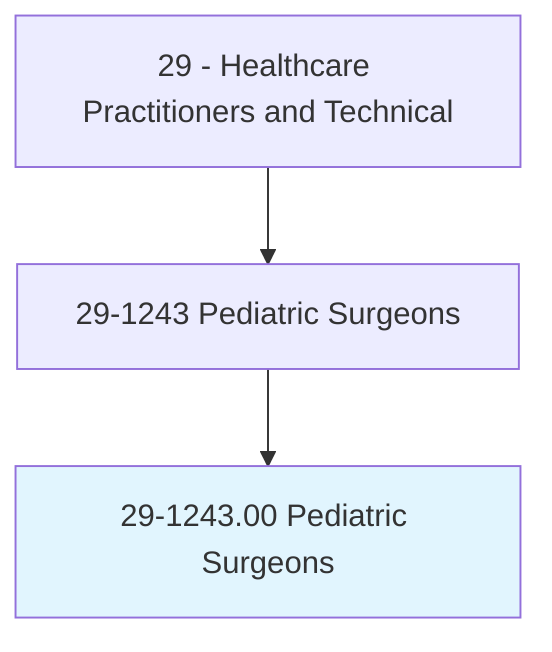
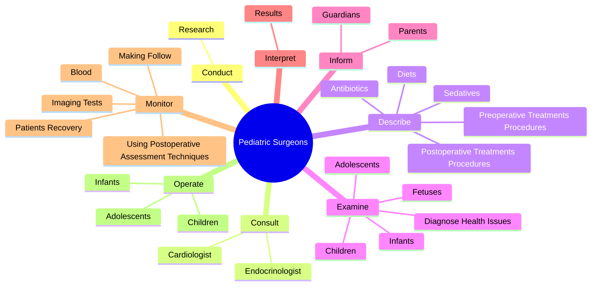

# Pediatric Surgeons

> Diagnose and perform surgery to treat fetal abnormalities and birth defects, diseases, and injuries in fetuses, premature and newborn infants, children, and adolescents. Includes all pediatric surgical specialties and subspecialties.

## Overview

Pediatric Surgeons is an occupation within the Healthcare Practitioners and Technical category. Diagnose and perform surgery to treat fetal abnormalities and birth defects, diseases, and injuries in fetuses, premature and newborn infants, children, and adolescents. 

## Classification Hierarchy

## Key Statistics

| Metric | Value |
|--------|-------|
| SOC Code | 29-1243.00 |
| Category | [Healthcare Practitioners and Technical](/occupations/HealthcarePractitioners) |
| Task Count | 76 |
| Source | O*NET |

## Core Tasks

### conduct.Research

Pediatric Surgeons conduct research as part of their core responsibilities.

**Actions:**
- `conduct.Research.to.develop.SurgicalTechniquesCanImproveOperatingProceduresOutcomes`
- `conduct.Research.to.test.SurgicalTechniquesCanImproveOperatingProceduresOutcomes`

### consult.Cardiologist

Pediatric Surgeons consult cardiologist as part of their core responsibilities.

**Actions:**
- `consult.Cardiologist.to.determine.IfSurgeryIsNecessary`
- `consult.Endocrinologist.to.determine.IfSurgeryIsNecessary`

### describe.PreoperativeTreatmentsProcedures

Pediatric Surgeons describe preoperative treatments procedures as part of their core responsibilities.

**Actions:**
- `describe.PreoperativeTreatmentsProcedures.of.PatientsOperativeArea`
- `describe.PreoperativeTreatmentsProcedures.of.ToParents`
- `describe.PreoperativeTreatmentsProcedures.of.Guardians.of.Patient`
- `describe.PostoperativeTreatmentsProcedures.of.PatientsOperativeArea`

## Skills & Competencies

### Technical Skills
- **Clinical Skills** - Advanced
- **Diagnostic Procedures** - Advanced
- **Patient Care** - Advanced

### Soft Skills
- **Communication** - Essential
- **Problem Solving** - Essential
- **Critical Thinking** - Important
- **Teamwork** - Important
- **Adaptability** - Important

## Related Occupations

## Industries

This occupation is found across multiple industries. See [Industries](/industries) for sector-specific employment data.

## Career Progression

---

*Source: O*NET 29-1243.00 - ONETOccupation*
