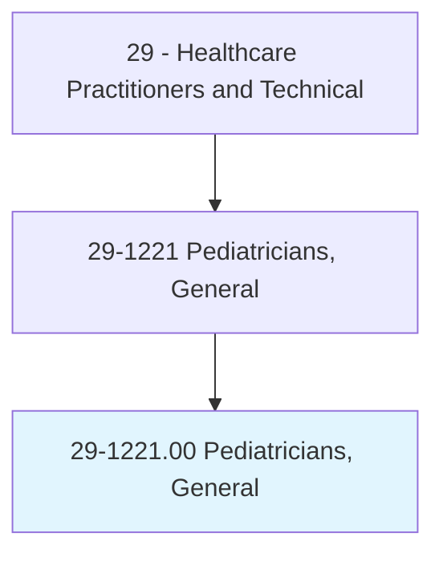
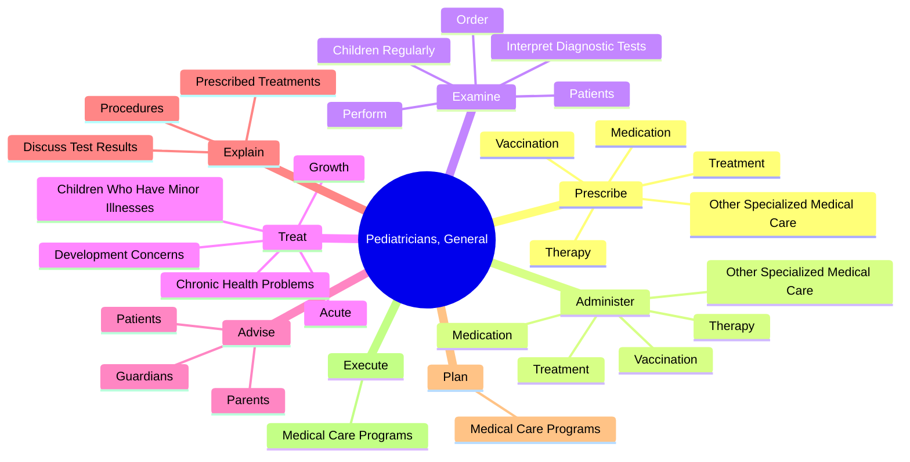
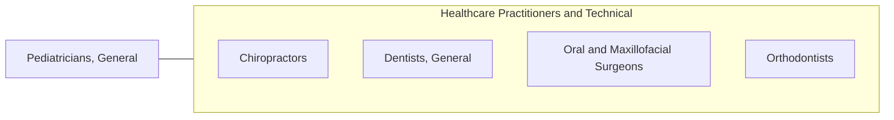

# Pediatricians, General

> Diagnose, treat, and help prevent diseases and injuries in children. May refer patients to specialists for further diagnosis or treatment, as needed.

## Overview

Pediatricians, General is an occupation within the Healthcare Practitioners and Technical category. Diagnose, treat, and help prevent diseases and injuries in children. 

## Classification Hierarchy

## Key Statistics

| Metric | Value |
|--------|-------|
| SOC Code | 29-1221.00 |
| Category | [Healthcare Practitioners and Technical](/occupations/HealthcarePractitioners) |
| Task Count | 62 |
| Source | O*NET |

## Core Tasks

### prescribe.Treatment

Pediatricians, General prescribe treatment as part of their core responsibilities.

**Actions:**
- `prescribe.Treatment.to.InjuryInInfants`
- `prescribe.Treatment.to.Children`
- `prescribe.Therapy.to.InjuryInInfants`
- `prescribe.Therapy.to.Children`

### administer.Treatment

Pediatricians, General administer treatment as part of their core responsibilities.

**Actions:**
- `administer.Treatment.to.InjuryInInfants`
- `administer.Treatment.to.Children`
- `administer.Therapy.to.InjuryInInfants`
- `administer.Therapy.to.Children`

### examine.ChildrenRegularly

Pediatricians, General examine children regularly as part of their core responsibilities.

**Actions:**
- `examine.ChildrenRegularly.to.assess.Growth`
- `examine.ChildrenRegularly.to.Development`
- `examine.Patients.to.obtain.InformationOnMedicalCondition`
- `examine.Patients.to.determine.Diagnosis`

## Skills & Competencies

### Technical Skills
- **Clinical Skills** - Advanced
- **Diagnostic Procedures** - Advanced
- **Patient Care** - Advanced

### Soft Skills
- **Communication** - Essential
- **Problem Solving** - Essential
- **Critical Thinking** - Important
- **Teamwork** - Important
- **Adaptability** - Important

## Related Occupations

## Industries

This occupation is found across multiple industries. See [Industries](/industries) for sector-specific employment data.

## Career Progression

---

*Source: O*NET 29-1221.00 - ONETOccupation*
