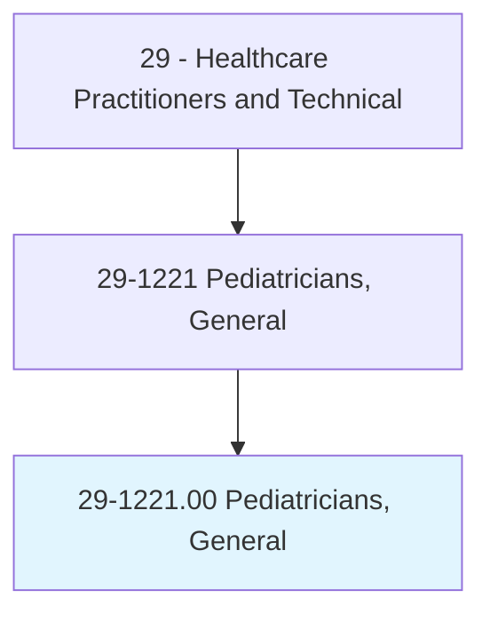
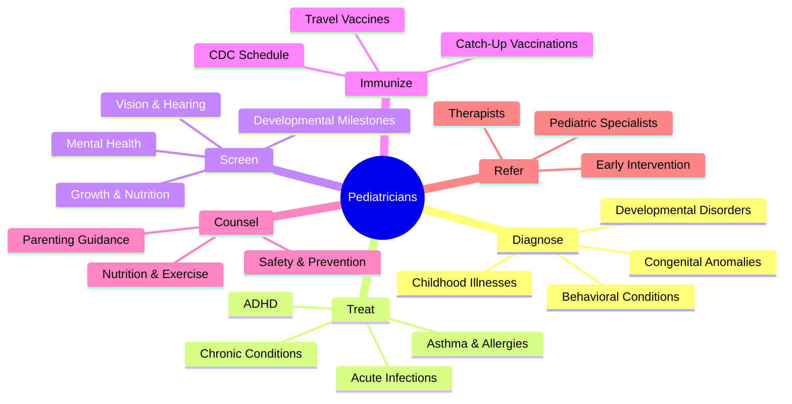
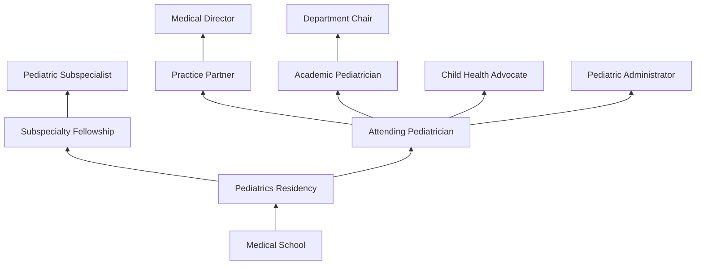
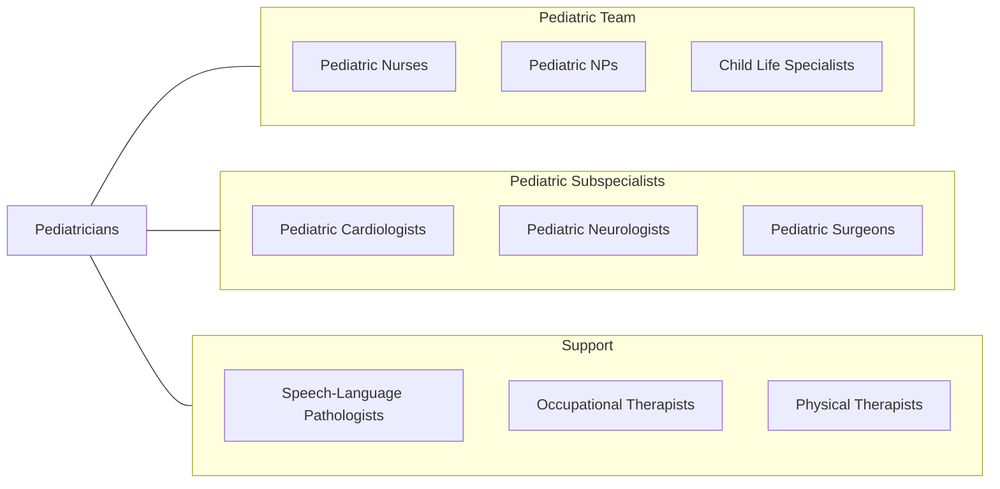

# Pediatricians, General

> Diagnose, treat, and help prevent diseases and injuries in children. May refer patients to specialists for further diagnosis or treatment.

## Overview

Pediatricians are physician specialists who provide comprehensive healthcare for infants, children, adolescents, and young adults from birth through age 21. They manage the full spectrum of childhood health concerns including acute illnesses, chronic conditions, developmental disorders, behavioral issues, and preventive care. Pediatricians are uniquely trained to understand the developmental, physiological, and psychological differences between children and adults.

General pediatricians serve as primary care providers for their patients, delivering well-child care, immunizations, developmental screenings, growth monitoring, and anticipatory guidance for families. They diagnose and treat common childhood conditions such as ear infections, asthma, allergies, ADHD, and gastrointestinal disorders. Pediatricians also address psychosocial concerns including bullying, mental health, substance use, and adverse childhood experiences.

The specialty has evolved to address emerging challenges including childhood obesity, screen time impacts, adolescent mental health crises, and social determinants of health. Pediatricians increasingly incorporate developmental screening tools, mental health screening, and telehealth into their practices to improve access and early intervention.

## Classification Hierarchy

## Key Statistics

| Metric | Value |
|--------|-------|
| SOC Code | 29-1221.00 |
| Median Annual Salary | $190,350 |
| Employment | ~32,000 |
| Projected Growth | 3% (2022-2032) |
| Job Zone | 5 (Extensive Preparation) |
| Category | [Healthcare Practitioners](/occupations/HealthcarePractitioners) |
| Core Tasks | 65+ |
| Source | O*NET |

## Core Tasks

### diagnose.ChildhoodConditions

Pediatricians evaluate children across the developmental spectrum.

**Actions:**
- `diagnose.ChildhoodIllnesses.using.AgeAppropriateAssessment` - Pediatric evaluation
- `diagnose.DevelopmentalDisorders.using.ScreeningTools` - Developmental assessment
- `diagnose.BehavioralConditions.using.StandardizedCriteria` - ADHD/behavioral screening
- `screen.DevelopmentalMilestones.at.WellChildVisits` - Milestone tracking

### treat.PediatricConditions

Pediatricians manage the full range of childhood health issues.

**Actions:**
- `treat.AcuteInfections.using.PediatricDosing` - Acute illness management
- `treat.Asthma.using.StepwiseTherapy` - Asthma action plans
- `treat.ADHD.using.BehavioralAndPharmacologic.Therapy` - ADHD management
- `administer.Immunizations.per.CDCChildhoodSchedule` - Vaccination delivery

### counsel.FamiliesOnChildHealth

Pediatricians provide anticipatory guidance to families.

**Actions:**
- `counsel.Parents.regarding.DevelopmentalExpectations` - Anticipatory guidance
- `counsel.Families.regarding.NutritionAndExercise` - Healthy lifestyle
- `counsel.Adolescents.regarding.RiskBehaviors` - Teen health counseling
- `refer.Children.to.EarlyIntervention.Services` - Early intervention referral

## Practice Settings

| Setting | Description |
|---------|-------------|
| Private/Group Practice | Traditional pediatric office |
| Hospital-Based Pediatrics | Inpatient pediatric care |
| Community Health Centers | Safety-net pediatric care |
| Academic Medical Centers | Teaching and subspecialty |
| School-Based Health | Student health services |
| Urgent Care | Pediatric walk-in clinics |
| Telehealth | Virtual pediatric visits |
| Neonatology Units | Newborn care |

## Skills & Competencies

### Technical Skills
- **Pediatric Assessment** - Expert
- **Developmental Screening** - Expert
- **Immunization Administration** - Expert
- **Pediatric Pharmacology** - Expert
- **Growth Monitoring** - Expert
- **Newborn Care** - Advanced
- **Behavioral Health Screening** - Advanced
- **Pediatric Procedures** - Advanced

### Soft Skills
- **Child Communication** - Critical
- **Family-Centered Care** - Critical
- **Empathy** - Essential
- **Patience** - Essential
- **Cultural Competency** - Essential
- **Advocacy** - Essential
- **Teaching** - Essential

## Education & Training

| Requirement | Details |
|-------------|---------|
| Undergraduate | 4-year bachelor's degree (pre-med) |
| Medical School | 4-year MD or DO program |
| Pediatrics Residency | 3 years |
| Fellowship | 2-3 years for subspecialization |
| Total Training | 11-14 years post-high school |
| Licensure | State medical license |
| Board Certification | ABP (American Board of Pediatrics) |

## Certifications

| Certification | Description |
|---------------|-------------|
| ABP General Pediatrics | Primary pediatric certification |
| ABP subspecialties | Cardiology, GI, Pulm, Endo, etc. |
| PALS | Pediatric Advanced Life Support |
| NRP | Neonatal Resuscitation |
| FAAP | Fellow of the AAP |

## Career Progression

## Specializations

| Subspecialty | Focus Area |
|-------------|------------|
| Neonatology | Premature and critically ill newborns |
| Pediatric Cardiology | Congenital heart disease |
| Pediatric Gastroenterology | GI disorders in children |
| Developmental-Behavioral Pediatrics | ADHD, autism, learning |
| Pediatric Pulmonology | Asthma and lung disease |
| Pediatric Endocrinology | Diabetes and growth disorders |
| Pediatric Neurology | Seizures and neurological conditions |
| Adolescent Medicine | Teen health and development |

## Technology & Tools

| Technology | Purpose |
|------------|---------|
| Electronic Health Records | Pediatric-specific documentation |
| Growth Chart Software (WHO/CDC) | Growth monitoring |
| Developmental Screening Tools (ASQ, M-CHAT) | Milestone assessment |
| Immunization Information Systems | Vaccine tracking |
| Telehealth Platforms | Virtual pediatric visits |
| Patient Education Resources | Family education tools |

## Related Occupations

## Industries

- [Physician Offices](/industries/Healthcare/PhysicianOffices) - Pediatric Practice
- [Hospitals](/industries/Healthcare/Hospitals/index) - Inpatient Pediatrics
- [Community Health Centers](/industries/Healthcare/CommunityHealthCenters) - FQHCs
- [Schools](/industries/Education/ElementarySecondary) - School Health
- [Government](/industries/Government) - Public Health, VA

## Departments

This occupation typically works in:
- [Pediatrics](/departments/Pediatrics)
- [Newborn Nursery](/departments/NewbornNursery)
- [Adolescent Medicine](/departments/AdolescentMedicine)
- [Child Development Center](/departments/ChildDevelopment)
- [Pediatric Primary Care](/departments/PediatricPrimaryCare)

---

*Source: O*NET 29-1221.00 - ONETOccupation*
