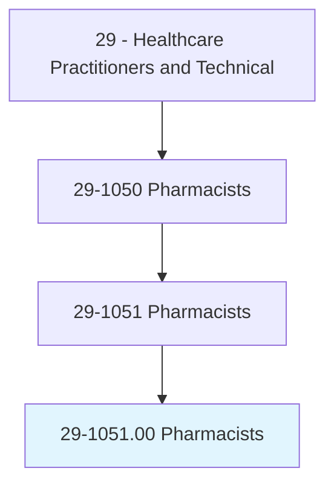
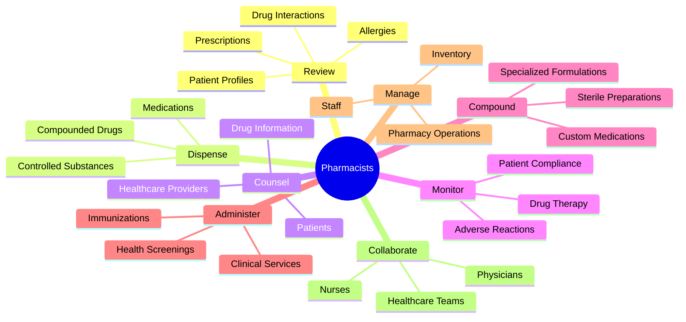
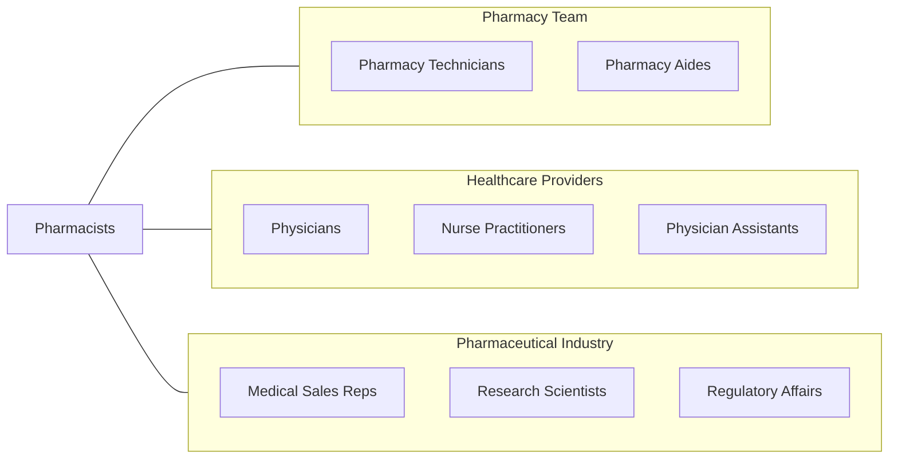
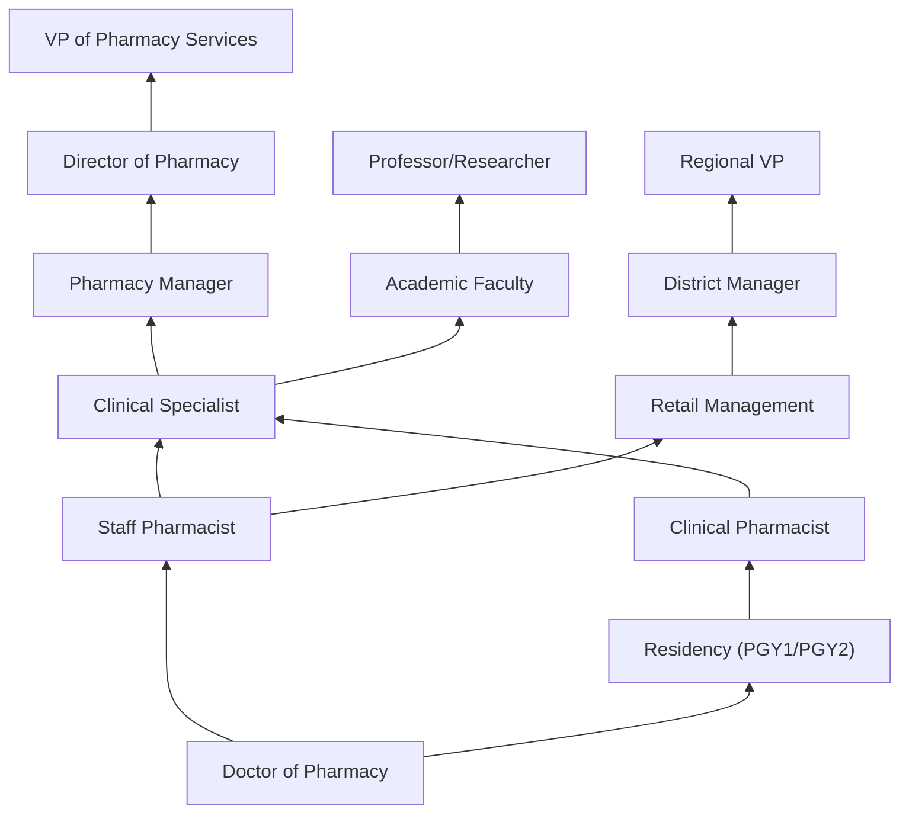

# Pharmacists

> Dispense drugs prescribed by physicians and other health practitioners and provide information to patients about medications and their use. May advise physicians and other health practitioners on the selection, dosage, interactions, and side effects of medications.

## Overview

Pharmacists are medication experts who ensure the safe and effective use of pharmaceutical drugs. They review prescriptions for accuracy and appropriateness, dispense medications, counsel patients on proper use and potential side effects, and collaborate with healthcare providers to optimize drug therapy. Modern pharmacists play an expanded clinical role, providing immunizations, health screenings, and chronic disease management services.

## Classification Hierarchy

## Key Statistics

| Metric | Value |
|--------|-------|
| SOC Code | 29-1051.00 |
| Job Zone | 5 (Extensive Preparation) |
| Category | [Healthcare Practitioners](/occupations/HealthcarePractitioners) |
| Core Tasks | 25+ |
| Source | O*NET |

## Core Tasks

### review.Prescriptions

Pharmacists evaluate medication orders for safety and accuracy.

**Actions:**
- `review.Prescriptions.to.assure.Accuracy` - Verify prescription details
- `review.Prescriptions.to.ToAscertainNeededIngredients` - Check formulation
- `review.Prescriptions.to.ToEvaluateSuitability` - Assess appropriateness

### assess.Medications

Pharmacists ensure medication quality and safety.

**Actions:**
- `assess.Identity.of.Medications` - Verify drug identity
- `assess.Strength.of.Medications` - Confirm dosage strength
- `assess.Purity.of.Medications` - Ensure quality standards

### provide.DrugInformation

Pharmacists educate on medication use.

**Actions:**
- `provide.Information.regarding.DrugInteractions` - Explain interactions
- `provide.Information.regarding.SideEffects` - Describe adverse effects
- `provide.Information.regarding.Dosage` - Clarify dosing instructions
- `provide.Information.regarding.ProperMedicationStorage` - Guide storage

### analyze.PrescribingTrends

Pharmacists monitor medication patterns.

**Actions:**
- `analyze.PrescribingTrends.to.monitor.PatientCompliance` - Track adherence
- `analyze.PrescribingTrends.to.ToPreventExcessiveUsage` - Prevent overuse
- `analyze.PrescribingTrends.to.PreventHarmfulInteractions` - Identify risks

### maintain.Records

Pharmacists manage documentation and regulatory compliance.

**Actions:**
- `maintain.Records.for.ControlledDrugs` - Track controlled substances
- `maintain.Records.for.Narcotics` - Document narcotics
- `maintain.PatientProfiles` - Update patient records
- `maintain.PharmacyFiles` - Manage pharmacy documentation

## Practice Settings

| Setting | Description |
|---------|-------------|
| Community/Retail | Patient-facing dispensing and counseling |
| Hospital/Health System | Inpatient medication management |
| Clinical | Direct patient care and medication management |
| Long-Term Care | Nursing home and assisted living consultation |
| Specialty | Oncology, infusion, HIV, transplant |
| Nuclear | Radioactive pharmaceuticals |
| Compounding | Custom medication preparation |
| Industry | Pharmaceutical manufacturing and research |
| Mail Order | High-volume prescription fulfillment |

## Skills & Competencies

### Technical Skills
- **Pharmacology** - Expert
- **Drug Interaction Analysis** - Expert
- **Prescription Verification** - Expert
- **Compounding** - Advanced
- **Clinical Assessment** - Advanced
- **Pharmacy Informatics** - Advanced
- **Sterile Technique** - Advanced

### Soft Skills
- **Patient Communication** - Critical
- **Attention to Detail** - Critical
- **Critical Thinking** - Essential
- **Collaboration** - Essential
- **Time Management** - Essential
- **Leadership** - Important

## Related Occupations

## Industries

- [Pharmacies and Drug Stores](/industries/Pharmacies) - Primary Employment
- [Hospitals](/industries/Healthcare/Hospitals/index) - Hospital Pharmacy
- [Grocery Stores](/industries/GroceryStores) - In-store Pharmacies
- [Department Stores](/industries/Retail/GeneralMerchandiseRetailers/DepartmentStores) - Retail Pharmacy
- Mail Order Pharmacies - Remote Dispensing
- [Pharmaceutical Industry](/industries/Manufacturing/ChemicalManufacturing/Pharmaceutical) - Drug Manufacturing
- Long-Term Care - Consultant Pharmacy

## Career Progression

## Education & Training

| Requirement | Details |
|-------------|---------|
| Typical Education | Doctor of Pharmacy (PharmD) - 4 years |
| Prerequisites | Minimum 2 years pre-pharmacy coursework |
| Total Education | Typically 6-8 years post-high school |
| Residency | Optional PGY1 (1 year) and PGY2 (1 year) for clinical specialization |
| Licensure | Must pass NAPLEX and state jurisprudence exam |
| Continuing Education | Varies by state; typically 15-30 hours annually |

## Certifications

| Certification | Description |
|---------------|-------------|
| BPS Board Certification | Specialty certifications in various areas |
| BCPS | Board Certified Pharmacotherapy Specialist |
| BCOP | Board Certified Oncology Pharmacist |
| BCCCP | Board Certified Critical Care Pharmacist |
| BCGP | Board Certified Geriatric Pharmacist |
| BCACP | Board Certified Ambulatory Care Pharmacist |
| BCPPS | Board Certified Pediatric Pharmacy Specialist |
| Immunization Certified | Authorized to administer vaccines |

## Technology & Systems

| Technology | Purpose |
|------------|---------|
| Pharmacy Dispensing Systems | Automated prescription filling |
| Clinical Decision Support | Drug interaction checking |
| Electronic Health Records | Patient information access |
| Inventory Management | Stock control |
| Compounding Software | Formulation documentation |
| MTM Platforms | Medication therapy management |

## Departments

This occupation typically works in:
- Pharmacy Services
- Clinical Pharmacy
- Medication Management
- Pharmaceutical Care
- Ambulatory Care Pharmacy

---

*Source: O*NET 29-1051.00 - ONETOccupation*
