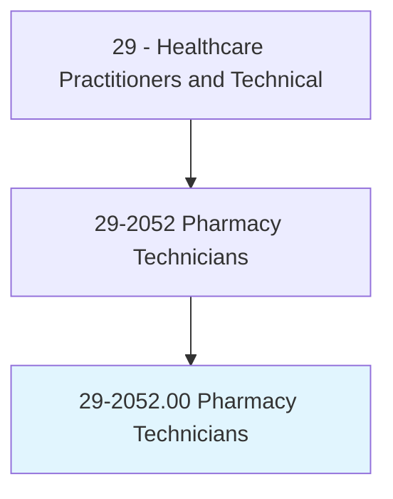
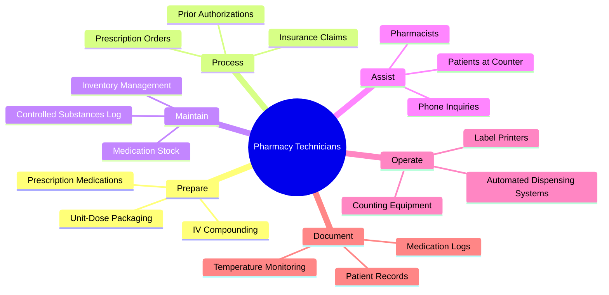
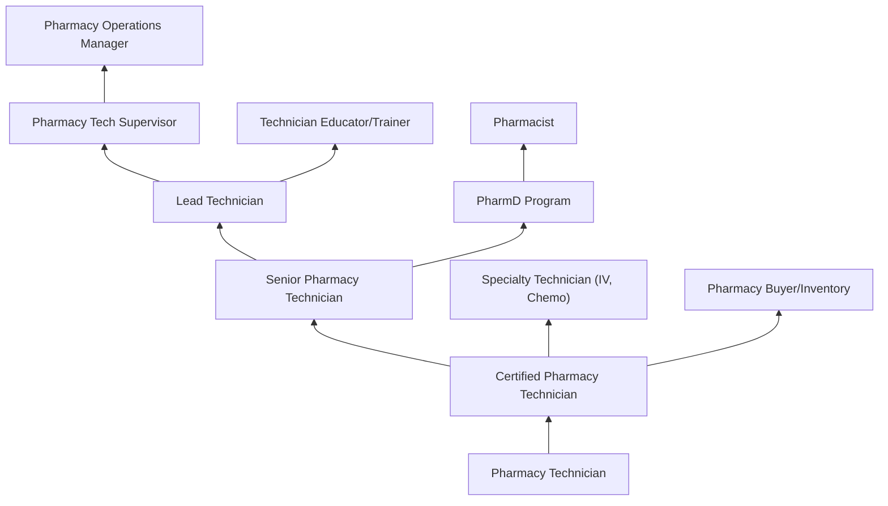
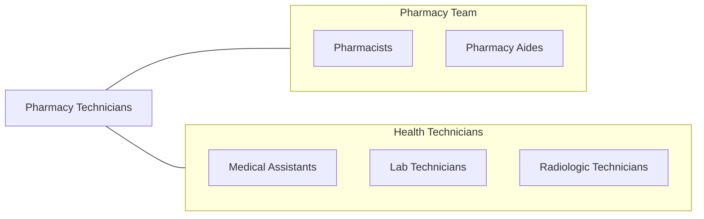

# Pharmacy Technicians

> Prepare medications under the direction of a pharmacist. May measure, mix, count out, label, and record amounts and dosages of medications according to prescription orders.

## Overview

Pharmacy Technicians are essential members of the pharmacy team who assist pharmacists in preparing and dispensing medications to patients. They perform technical tasks including receiving prescription orders, counting and measuring medications, packaging prescriptions, managing inventory, processing insurance claims, and maintaining patient records. Working under pharmacist supervision, they ensure the accurate and efficient flow of prescription medications through retail, hospital, and specialty pharmacy settings.

The role has expanded significantly with the advancement of pharmacy automation, sterile compounding requirements, and the pharmacist's growing clinical responsibilities. Pharmacy technicians now operate automated dispensing systems, prepare intravenous medications using aseptic technique, manage medication inventory systems, and process prior authorizations. In hospitals, they may prepare chemotherapy agents, perform medication reconciliation, and participate in quality improvement initiatives.

With increasing pharmacist involvement in clinical services such as immunization, medication therapy management, and chronic disease management, pharmacy technicians have assumed a broader scope of traditional dispensing functions. Advanced technician roles include tech-check-tech programs, immunization support, and specialty pharmacy coordination. The profession is moving toward requiring national certification and standardized education.

## Classification Hierarchy

## Key Statistics

| Metric | Value |
|--------|-------|
| SOC Code | 29-2052.00 |
| Median Annual Salary | $37,790 |
| Employment | ~461,000 |
| Projected Growth | 5% (2022-2032) |
| Job Zone | 2 (Some Preparation) |
| Category | [Healthcare Practitioners](/occupations/HealthcarePractitioners) |
| Core Tasks | 35+ |
| Source | O*NET |

## Core Tasks

### prepare.Medications

Pharmacy Technicians prepare prescriptions for pharmacist verification.

**Actions:**
- `prepare.PrescriptionMedications.by.CountingAndLabeling` - Dispensing
- `prepare.IVCompounds.using.AsepticTechnique` - Sterile compounding
- `prepare.UnitDosePackaging.for.InpatientDistribution` - Hospital dispensing
- `operate.AutomatedDispensingEquipment.for.Efficiency` - Automation

### process.PrescriptionOrders

Pharmacy Technicians manage prescription workflow.

**Actions:**
- `process.PrescriptionOrders.from.PhysicianOffices` - Order entry
- `process.InsuranceClaims.for.MedicationCoverage` - Insurance billing
- `process.PriorAuthorizations.for.RestrictedMedications` - PA processing
- `verify.PatientInformation.for.SafeDispensing` - Safety verification

### maintain.PharmacyOperations

Pharmacy Technicians support daily pharmacy functions.

**Actions:**
- `maintain.InventoryManagement.using.OrderingSystems` - Stock management
- `maintain.ControlledSubstancesLog.per.DEARegulations` - Controlled inventory
- `maintain.EquipmentCalibration.for.AccurateDispensing` - Equipment maintenance
- `assist.Patients.with.PrescriptionPickupAndQuestions` - Patient service

## Practice Settings

| Setting | Description |
|---------|-------------|
| Retail/Community Pharmacy | Prescription dispensing |
| Hospital Pharmacy | Inpatient medication services |
| Mail-Order Pharmacy | High-volume prescription fulfillment |
| Long-Term Care Pharmacy | Nursing home medication services |
| Specialty Pharmacy | Complex/expensive medication management |
| Compounding Pharmacy | Custom medication preparation |
| Nuclear Pharmacy | Radioactive pharmaceutical preparation |
| Ambulatory Care Pharmacy | Outpatient clinic pharmacy |

## Skills & Competencies

### Technical Skills
- **Prescription Processing** - Expert
- **Medication Counting & Measuring** - Expert
- **Aseptic/Sterile Technique** - Advanced
- **Pharmacy Software Systems** - Advanced
- **Insurance Processing** - Advanced
- **Inventory Management** - Advanced
- **Controlled Substance Handling** - Advanced
- **Automated Dispensing Technology** - Advanced

### Soft Skills
- **Attention to Detail** - Critical
- **Customer Service** - Essential
- **Communication** - Essential
- **Teamwork** - Essential
- **Organization** - Essential
- **Math Skills** - Essential
- **Reliability** - Critical

## Education & Training

| Requirement | Details |
|-------------|---------|
| Education | High school diploma (minimum); certificate or associate degree preferred |
| Formal Training | Pharmacy technician program (6 months - 2 years) |
| Certification | PTCB (CPhT) or ExCPT recommended/required by state |
| State Registration | Required in most states |
| On-the-Job Training | Varies by employer |
| Continuing Education | 20 hours per 2-year cycle (PTCB) |

## Certifications

| Certification | Description |
|---------------|-------------|
| CPhT (PTCB) | Certified Pharmacy Technician |
| ExCPT (NHA) | National Healthcareer Association certification |
| CSPT | Certified Sterile Product Technician (PTCB) |
| CPhT-Adv | Advanced Certified Pharmacy Technician |
| IV Certification | Intravenous compounding certification |
| Immunization Support | Vaccine preparation and administration support |

## Career Progression

## Specializations

| Focus Area | Description |
|------------|-------------|
| Sterile Compounding (IV) | Aseptic IV preparation |
| Chemotherapy Preparation | Hazardous drug handling |
| Nuclear Pharmacy | Radiopharmaceutical preparation |
| Specialty Pharmacy | Complex medication coordination |
| Automation Specialist | Robotic dispensing management |
| Insurance/Billing | Prior authorization specialist |
| Inventory Management | Procurement and supply chain |
| Medication Reconciliation | Inpatient medication review |

## Technology & Tools

| Technology | Purpose |
|------------|---------|
| Automated Dispensing Systems (Parata, ScriptPro) | Robotic prescription filling |
| Pharmacy Management Software (QS/1, Rx30) | Workflow management |
| Automated Dispensing Cabinets (Pyxis, Omnicell) | Hospital unit-based dispensing |
| Counting Equipment (Kirby Lester) | Tablet/capsule counting |
| Laminar Flow Hoods | Sterile compounding environment |
| Barcode Scanning Systems | Medication verification |
| Insurance Processing Software | Claims adjudication |
| Temperature Monitoring Systems | Medication storage compliance |

## Related Occupations

## Industries

- [Pharmacies & Drug Stores](/industries/Pharmacies) - Retail Pharmacy
- [Hospitals](/industries/Healthcare/Hospitals/index) - Hospital Pharmacy
- [Grocery Stores](/industries/GroceryStores) - In-Store Pharmacy
- Mail-Order Pharmacy - Remote Dispensing
- [Long-Term Care](/industries/Healthcare/NursingCare) - LTC Pharmacy

## Departments

This occupation typically works in:
- Pharmacy Services
- Inpatient Pharmacy
- Outpatient Pharmacy
- Sterile Compounding
- Pharmacy Operations

---

*Source: O*NET 29-2052.00 - ONETOccupation*
