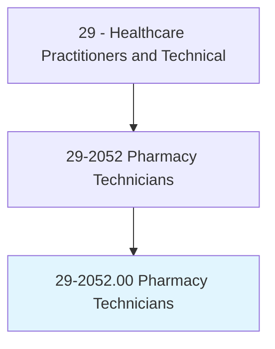
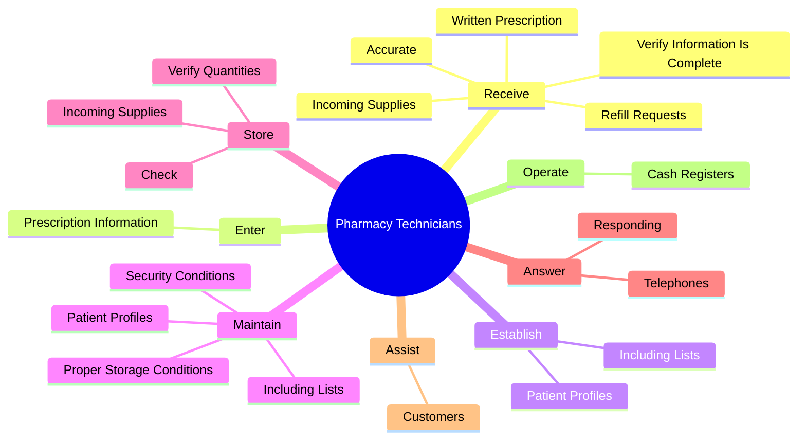
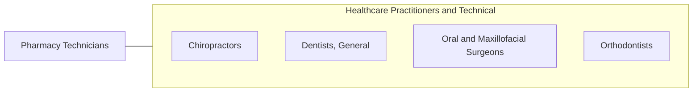

# Pharmacy Technicians

> Prepare medications under the direction of a pharmacist. May measure, mix, count out, label, and record amounts and dosages of medications according to prescription orders.

## Overview

Pharmacy Technicians is an occupation within the Healthcare Practitioners and Technical category. Prepare medications under the direction of a pharmacist. 

## Classification Hierarchy

## Key Statistics

| Metric | Value |
|--------|-------|
| SOC Code | 29-2052.00 |
| Category | [Healthcare Practitioners and Technical](/occupations/HealthcarePractitioners) |
| Task Count | 85 |
| Source | O*NET |

## Core Tasks

### receive.WrittenPrescription

Pharmacy Technicians receive written prescription as part of their core responsibilities.

**Actions:**
- `receive.WrittenPrescription`
- `receive.RefillRequests`
- `receive.VerifyInformationIsComplete`
- `receive.Accurate`

### enter.PrescriptionInformation

Pharmacy Technicians enter prescription information as part of their core responsibilities.

**Actions:**
- `enter.PrescriptionInformation.into.ComputerDatabases`

### establish.PatientProfiles

Pharmacy Technicians establish patient profiles as part of their core responsibilities.

**Actions:**
- `establish.PatientProfiles.of.MedicationsTaken.by.IndividualPatients`
- `establish.IncludingLists.of.MedicationsTaken.by.IndividualPatients`

## Skills & Competencies

### Technical Skills
- **Clinical Skills** - Advanced
- **Diagnostic Procedures** - Advanced
- **Patient Care** - Advanced

### Soft Skills
- **Communication** - Essential
- **Problem Solving** - Essential
- **Critical Thinking** - Important
- **Teamwork** - Important
- **Adaptability** - Important

## Related Occupations

## Industries

This occupation is found across multiple industries. See [Industries](/industries) for sector-specific employment data.

## Career Progression

---

*Source: O*NET 29-2052.00 - ONETOccupation*
