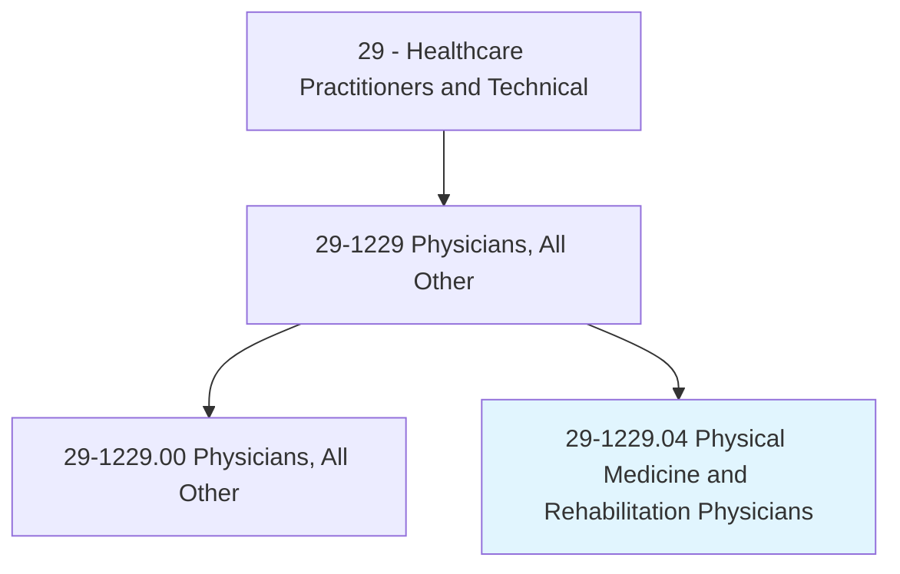
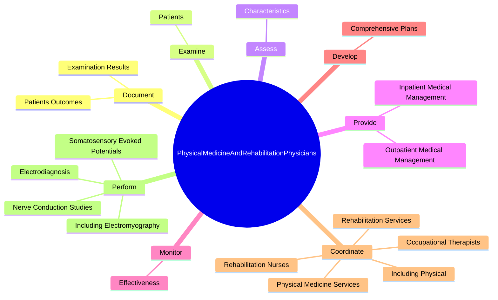
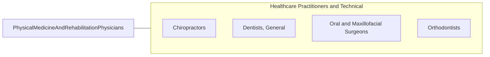

# Physical Medicine and Rehabilitation Physicians

> Diagnose and treat disorders requiring physiotherapy to provide physical, mental, and occupational rehabilitation.

## Overview

Physical Medicine and Rehabilitation Physicians is classified under Healthcare Practitioners and Technical (SOC 29). Diagnose and treat disorders requiring physiotherapy to provide physical, mental, and occupational rehabilitation.

## Classification Hierarchy

## Key Statistics

| Metric | Value |
|--------|-------|
| SOC Code | 29-1229.04 |
| Category | [Healthcare Practitioners and Technical](/occupations/HealthcarePractitioners) |
| Task Count | 104 |
| Source | O*NET |

## Core Tasks

### document.ExaminationResults

Physical Medicine and Rehabilitation Physicians document examination results as part of their core responsibilities.

**Actions:**
- `document.ExaminationResults`
- `document.PatientsOutcomes`

### examine.Patients

Physical Medicine and Rehabilitation Physicians examine patients as part of their core responsibilities.

**Actions:**
- `examine.Patients.to.assess.Mobility`
- `examine.Patients.to.Strength`
- `examine.Patients.to.Communication`
- `examine.Patients.to.Cognition`

### assess.Characteristics

Physical Medicine and Rehabilitation Physicians assess characteristics as part of their core responsibilities.

**Actions:**
- `assess.Characteristics.of.PatientsPain`
- `assess.Characteristics.of.Intensity`
- `assess.Characteristics.of.Location`
- `assess.Characteristics.of.Duration`

## Skills & Competencies

### Technical Skills
- **Clinical Skills** - Advanced
- **Diagnostic Procedures** - Advanced
- **Patient Care** - Advanced

### Soft Skills
- **Communication** - Essential
- **Problem Solving** - Essential
- **Critical Thinking** - Important
- **Teamwork** - Important
- **Adaptability** - Important

## Related Occupations

## Industries

This occupation is found across multiple industries. See [Industries](/industries) for sector-specific employment data.

## Career Progression

---

*Source: O*NET 29-1229.04 - ONETOccupation*
