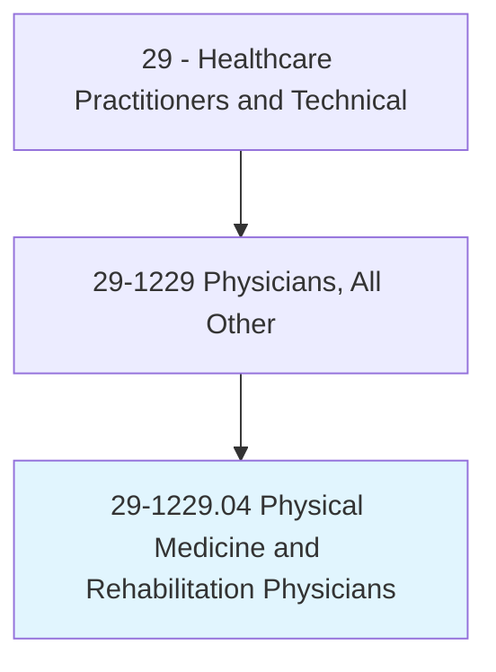
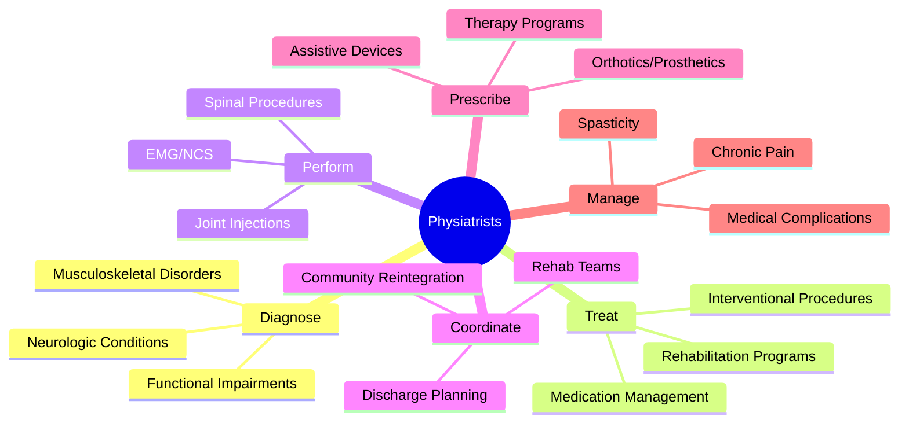
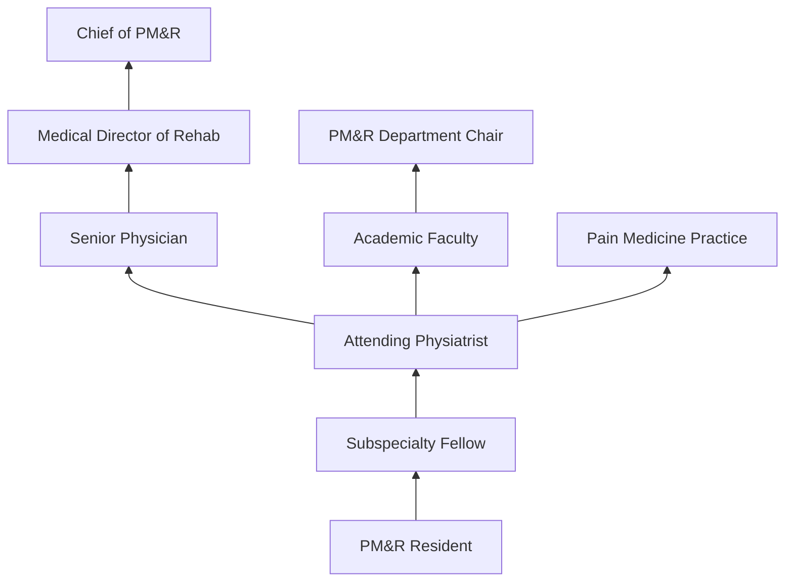
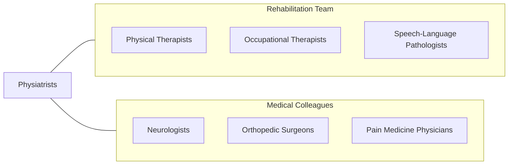

# Physical Medicine and Rehabilitation Physicians

> Diagnose and treat disorders of the musculoskeletal, neurological, and cardiovascular systems to restore or improve function. Also known as physiatrists.

## Overview

Physical Medicine and Rehabilitation (PM&R) Physicians, known as physiatrists, diagnose and treat conditions that affect the brain, spinal cord, nerves, bones, joints, ligaments, muscles, and tendons with the goal of restoring maximum function and quality of life. They manage rehabilitation for stroke, spinal cord injury, traumatic brain injury, amputation, musculoskeletal pain, sports injuries, and other disabling conditions without surgery.

Physiatrists serve as rehabilitation team leaders, coordinating care among physical therapists, occupational therapists, speech-language pathologists, rehabilitation nurses, psychologists, social workers, and orthotists/prosthetists. They prescribe comprehensive rehabilitation programs, perform diagnostic and therapeutic procedures (EMG/NCS, joint injections, spinal procedures), manage spasticity, prescribe assistive devices, and address the medical complications of disability.

Modern PM&R has expanded with interventional pain management, regenerative medicine (PRP, stem cells), ultrasound-guided procedures, neuromodulation (intrathecal baclofen pumps, spinal cord stimulators), robotic-assisted rehabilitation, and brain-computer interfaces for paralysis. Physiatrists practice across the continuum from acute rehabilitation to outpatient management of chronic conditions.

## Classification Hierarchy

## Key Statistics

| Metric | Value |
|--------|-------|
| SOC Code | 29-1229.04 |
| Median Annual Salary | $241,190 |
| Employment | ~10,000 |
| Projected Growth | 5% (2022-2032) |
| Job Zone | 5 (Extensive Preparation) |
| Category | [Healthcare Practitioners](/occupations/HealthcarePractitioners) |
| Core Tasks | 40+ |
| Source | O*NET |

## Core Tasks

### manage.RehabilitationPrograms

Physiatrists lead comprehensive rehabilitation.

**Actions:**
- `develop.RehabilitationPrograms.for.FunctionalRestoration` - Rehab planning
- `coordinate.MultidisciplinaryTeam.for.ComprehensiveCare` - Team leadership
- `manage.SpinalCordInjury.for.MaximalFunctionRecovery` - SCI management
- `manage.TraumaticBrainInjury.through.StructuredRehabilitation` - TBI rehab

### perform.DiagnosticAndTherapeuticProcedures

Physiatrists perform specialized interventions.

**Actions:**
- `perform.ElectrodiagnosticStudies.for.NeuromuscularDiagnosis` - EMG/NCS
- `perform.UltrasoundGuidedInjections.for.PainManagement` - Joint injections
- `perform.SpinalProcedures.for.ChronicPainTreatment` - Spine interventions
- `manage.IntrathecalBaclofenPumps.for.SpasticityControl` - Spasticity management

## Practice Settings

| Setting | Description |
|---------|-------------|
| Inpatient Rehabilitation Hospitals | Acute rehabilitation |
| Hospital PM&R Departments | Consultation and acute care |
| Outpatient PM&R Clinics | Ambulatory rehabilitation |
| Pain Management Centers | Interventional pain |
| Spinal Cord Injury Centers | SCI rehabilitation |
| Brain Injury Programs | TBI rehabilitation |
| Sports Medicine Clinics | Non-surgical sports care |

## Skills & Competencies

### Technical Skills
- **Electrodiagnostic Medicine (EMG/NCS)** - Expert
- **Musculoskeletal Ultrasound** - Expert
- **Interventional Spine Procedures** - Advanced
- **Rehabilitation Medicine** - Expert
- **Spasticity Management** - Expert
- **Assistive Technology Prescription** - Advanced
- **Pain Management** - Advanced

### Soft Skills
- **Team Leadership** - Critical
- **Patient Communication** - Essential
- **Empathy** - Essential
- **Problem Solving** - Essential
- **Patience** - Essential

## Education & Training

| Requirement | Details |
|-------------|---------|
| Medical School | 4-year MD or DO |
| PM&R Residency | 4 years (1 transitional + 3 PM&R) |
| Fellowship | 1-2 years subspecialty (optional) |
| Board Certification | ABPMR examination |
| Total Training | 12-14 years post-high school |

## Certifications

| Certification | Description |
|---------------|-------------|
| ABPMR | American Board of Physical Medicine and Rehabilitation |
| Pain Medicine CAQ | Certificate of Added Qualification |
| Sports Medicine CAQ | Sports PM&R subspecialty |
| Brain Injury Medicine | Subspecialty certification |
| Spinal Cord Injury Medicine | Subspecialty certification |

## Career Progression

## Specializations

| Focus Area | Description |
|------------|-------------|
| Spinal Cord Injury | SCI rehabilitation |
| Brain Injury | TBI and stroke rehabilitation |
| Interventional Pain | Spine and musculoskeletal pain |
| Sports Medicine | Non-surgical sports injury |
| Pediatric Rehabilitation | Children's rehabilitation |
| Electrodiagnostic Medicine | EMG/NCS specialty |
| Neuromuscular Medicine | Neuromuscular disease |

## Technology & Tools

| Technology | Purpose |
|------------|---------|
| EMG/NCS Equipment (Natus, Cadwell) | Electrodiagnostic studies |
| Musculoskeletal Ultrasound | Guided procedures and diagnosis |
| Fluoroscopy (C-arm) | Spine procedure guidance |
| Intrathecal Pump Systems | Spasticity management |
| Robotic Rehabilitation (Lokomat, Ekso) | Gait training |
| Functional Electrical Stimulation | Motor recovery |
| Assistive Technology | Adaptive equipment |

## Related Occupations

## Industries

- [Rehabilitation Hospitals](/industries/Healthcare/Hospitals/index) - Inpatient Rehab
- [Hospitals](/industries/Healthcare/Hospitals/index) - Acute Care PM&R
- [Outpatient Rehab](/industries/Healthcare/AmbulatoryHealthCare) - Ambulatory PM&R
- [VA Medical Centers](/industries/Government) - Veterans Rehabilitation
- [Academic](/industries/Education) - Teaching Programs

## Departments

This occupation typically works in:
- [Physical Medicine and Rehabilitation](/departments/PhysicalMedicineRehab)
- [Inpatient Rehabilitation](/departments/InpatientRehab)
- [Pain Management](/departments/PainManagement)
- [Electrodiagnostic Lab](/departments/ElectrodiagnosticLab)

---

*Source: O*NET 29-1229.04 - ONETOccupation*
