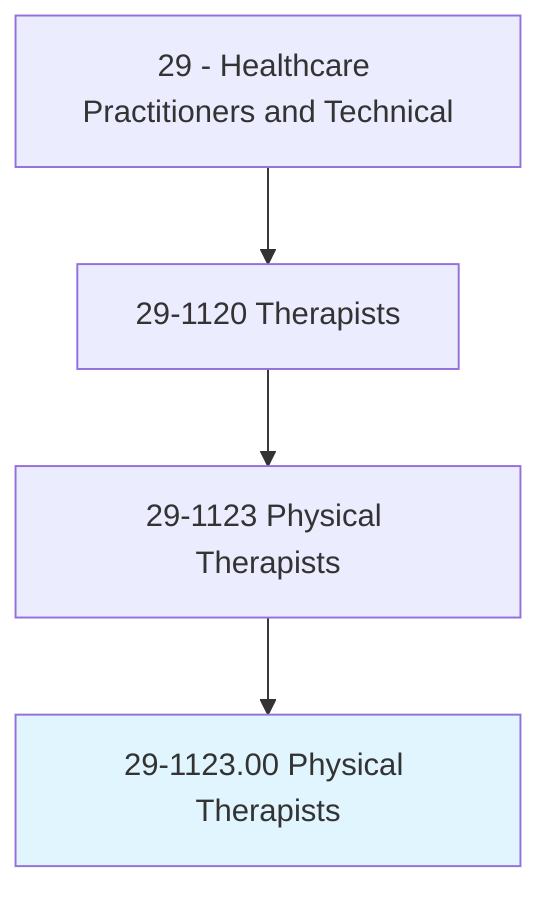
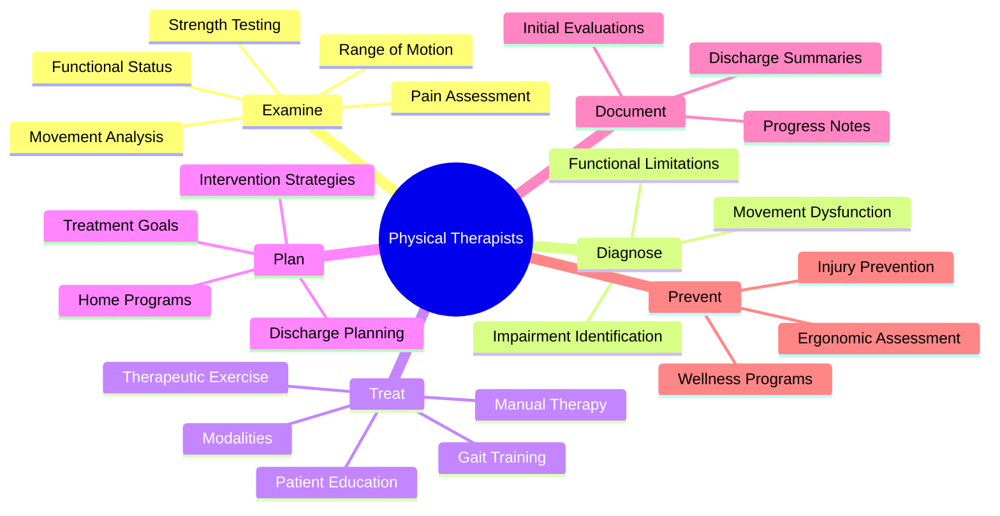
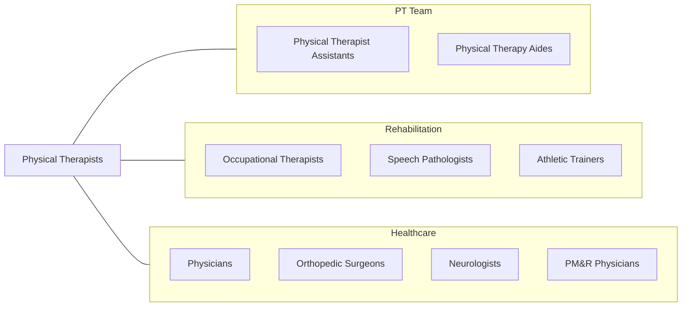
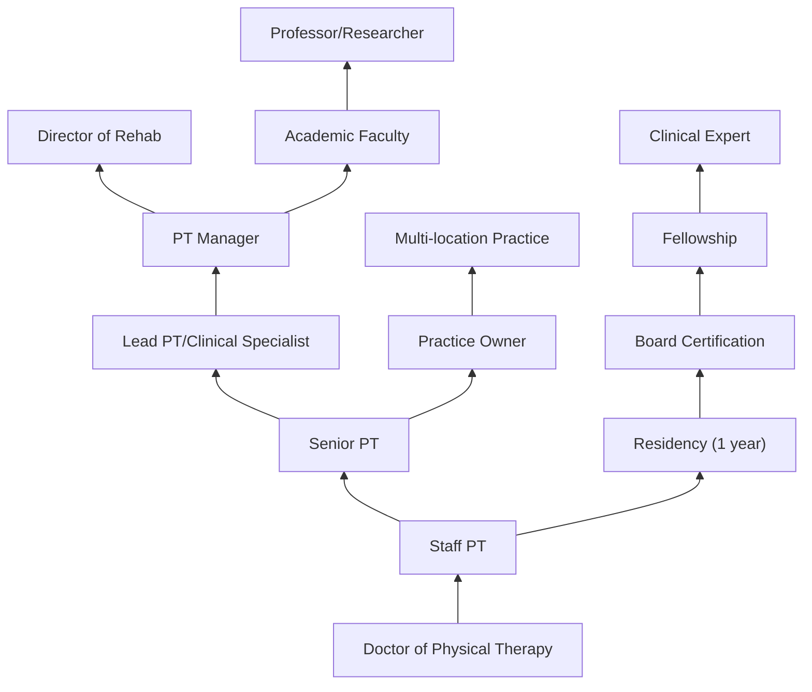

# Physical Therapists

> Assess, plan, organize, and participate in rehabilitative programs that improve mobility, relieve pain, increase strength, and improve or correct disabling conditions resulting from disease or injury.

## Overview

Physical Therapists (PTs) are movement experts who diagnose and treat individuals with health conditions that limit their ability to move and perform functional activities. They examine patients, develop treatment plans, and use therapeutic exercises, manual therapy, and modalities to help patients recover from injuries, manage chronic conditions, and prevent future problems. PTs work with patients across the lifespan, from premature infants to the elderly.

## Classification Hierarchy

## Key Statistics

| Metric | Value |
|--------|-------|
| SOC Code | 29-1123.00 |
| Job Zone | 5 (Extensive Preparation) |
| Category | [Healthcare Practitioners](/occupations/HealthcarePractitioners) |
| Core Tasks | 25+ |
| Source | O*NET |

## Core Tasks

### examine.MovementSystem

PTs conduct comprehensive physical assessments.

**Actions:**
- `examine.MovementPatterns` - Analyze motion quality
- `test.MuscleStrength` - Measure force production
- `measure.RangeOfMotion` - Assess joint mobility
- `assess.FunctionalAbilities` - Evaluate activity performance
- `evaluate.GaitPatterns` - Analyze walking mechanics

### diagnose.MovementDysfunction

PTs identify physical impairments and limitations.

**Actions:**
- `diagnose.MovementDysfunction` - Identify movement problems
- `classify.ImpairmentPatterns` - Categorize deficits
- `determine.FunctionalLimitations` - Assess activity restrictions
- `identify.ContributingFactors` - Find underlying causes

### treat.Patients

PTs provide therapeutic interventions.

**Actions:**
- `provide.TherapeuticExercise` - Prescribe exercises
- `perform.ManualTherapy` - Hands-on treatment
- `apply.PhysicalModalities` - Use heat, cold, electrical stimulation
- `instruct.GaitTraining` - Teach walking techniques
- `educate.Patients` - Provide self-management skills

### develop.TreatmentPlans

PTs create individualized care programs.

**Actions:**
- `establish.TreatmentGoals` - Set measurable objectives
- `design.ExercisePrograms` - Create exercise plans
- `plan.ProgressionSchedule` - Advance treatment appropriately
- `develop.HomeExerciseProgram` - Prescribe home activities

## Specialty Areas

| Specialty | Focus | Board Certification |
|-----------|-------|---------------------|
| Orthopedic | Musculoskeletal | OCS |
| Neurologic | Brain/Spinal Cord | NCS |
| Cardiovascular & Pulmonary | Heart/Lung | CCS |
| Geriatric | Older Adults | GCS |
| Pediatric | Children | PCS |
| Sports | Athletes | SCS |
| Women's Health | Pelvic Floor | WCS |
| Clinical Electrophysiology | EMG/Nerve | ECS |
| Oncologic | Cancer Rehabilitation | CLT |

## Skills & Competencies

### Technical Skills
- **Movement Analysis** - Expert
- **Manual Therapy** - Expert
- **Therapeutic Exercise** - Expert
- **Modalities** - Advanced
- **Gait Training** - Expert
- **Functional Assessment** - Expert
- **Documentation** - Expert

### Soft Skills
- **Patient Communication** - Critical
- **Clinical Reasoning** - Critical
- **Empathy** - Essential
- **Teaching** - Essential
- **Collaboration** - Essential
- **Problem Solving** - Critical

## Related Occupations

## Industries

- [Hospitals](/industries/Healthcare/Hospitals/index) - Acute Care, Inpatient Rehab
- [Outpatient Centers](/industries/OutpatientCare) - Ambulatory Care
- [Nursing Care Facilities](/industries/NursingCare) - Skilled Nursing
- [Home Health](/industries/HomeHealth) - Home-based Care
- [Schools](/industries/Schools) - Pediatric Settings
- [Sports Teams](/industries/Sports) - Athletic Settings
- [Private Practice](/industries/PrivatePractice) - Independent Practice

## Career Progression

## Education & Training

| Requirement | Details |
|-------------|---------|
| Typical Education | Doctor of Physical Therapy (DPT) - 3 years post-bachelor's |
| Prerequisites | Bachelor's degree with prerequisite courses |
| Clinical Education | Required clinical internships |
| Licensure | State license required; pass NPTE exam |
| Residency | Optional 1-year clinical residency |
| Fellowship | Optional 1-year advanced fellowship |
| Continuing Education | State-mandated requirements |

## Certifications

| Certification | Description |
|---------------|-------------|
| ABPTS Specialization | 9 specialty areas available |
| OCS | Orthopedic Clinical Specialist |
| NCS | Neurologic Clinical Specialist |
| SCS | Sports Clinical Specialist |
| GCS | Geriatric Clinical Specialist |
| PCS | Pediatric Clinical Specialist |
| CCS | Cardiovascular & Pulmonary Specialist |
| WCS | Women's Health Clinical Specialist |
| ECS | Clinical Electrophysiology Specialist |
| Dry Needling | State-specific certification |
| Manual Therapy | Various certifications (COMT, etc.) |

## Practice Models

| Model | Description |
|-------|-------------|
| Direct Access | Patients can see PT without physician referral |
| Referral-Based | Physician referral required |
| Hospital-Based | Employed by health system |
| Private Practice | Independent or group practice |
| Contract/PRN | Flexible staffing arrangements |
| Telehealth | Virtual physical therapy |

## Departments

This occupation typically works in:
- [Physical Therapy](/departments/PhysicalTherapy)
- [Rehabilitation Services](/departments/Rehabilitation)
- [Sports Medicine](/departments/SportsMedicine)
- [Orthopedic Rehab](/departments/OrthopedicRehab)
- [Neurological Rehab](/departments/NeuroRehab)
- [Outpatient Therapy](/departments/OutpatientTherapy)

---

*Source: O*NET 29-1123.00 - ONETOccupation*
