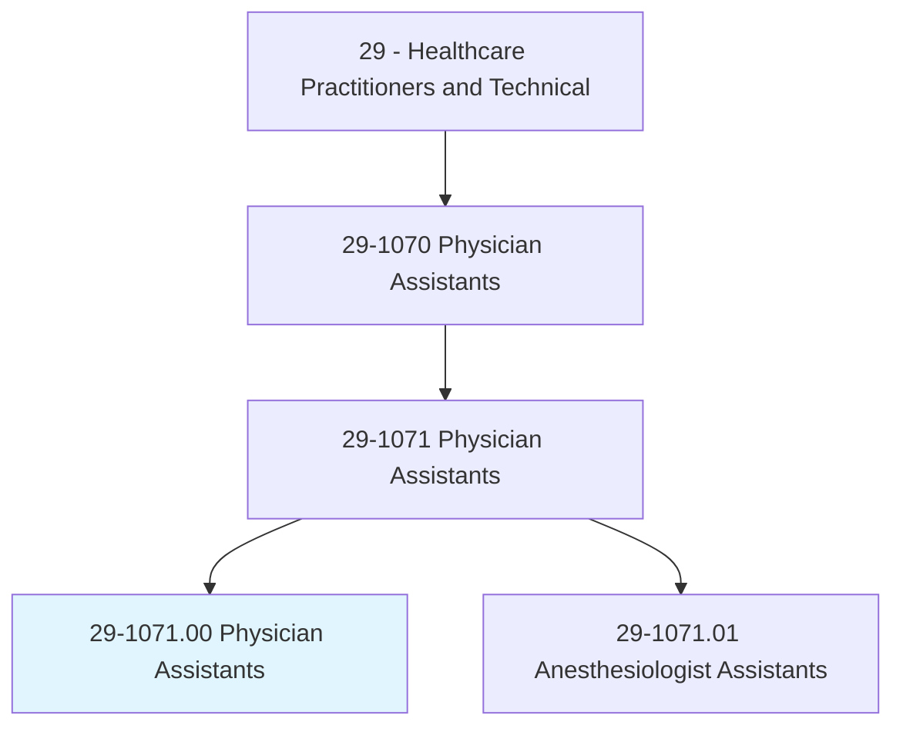
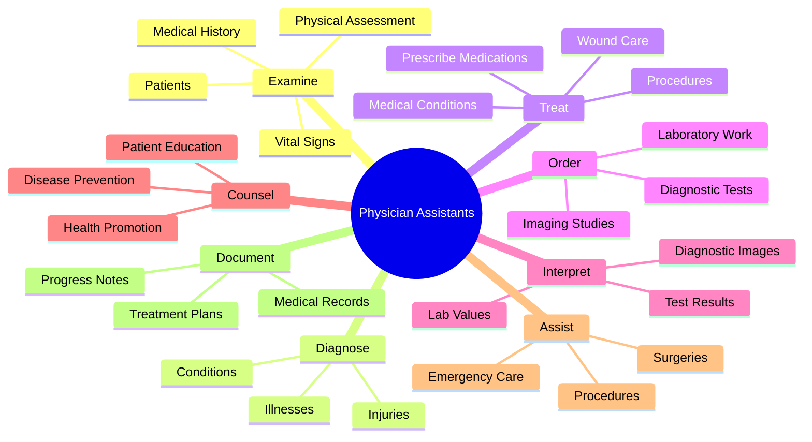
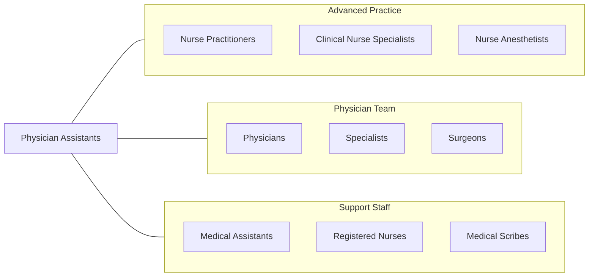
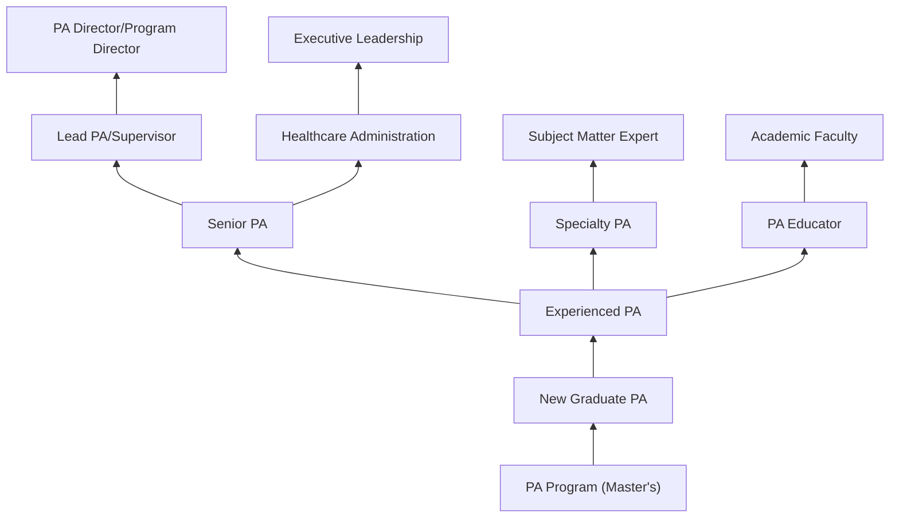

# Physician Assistants

> Provide healthcare services typically performed by a physician, under the supervision of a physician. Conduct complete physicals, provide treatment, and counsel patients. May, in some cases, prescribe medication. Must graduate from an accredited educational program for physician assistants.

## Overview

Physician Assistants (PAs) are licensed healthcare professionals who practice medicine as part of a healthcare team with physicians. They conduct physical exams, diagnose and treat illnesses, order and interpret tests, counsel patients, perform procedures, and in most states prescribe medications. PAs work in all medical specialties and settings, significantly expanding access to healthcare while maintaining high quality care under physician collaboration.

## Classification Hierarchy

## Key Statistics

| Metric | Value |
|--------|-------|
| SOC Code | 29-1071.00 |
| Job Zone | 5 (Extensive Preparation) |
| Category | [Healthcare Practitioners](/occupations/HealthcarePractitioners) |
| Core Tasks | 25+ |
| Source | O*NET |

## Core Tasks

### examine.Patients

PAs conduct comprehensive patient assessments.

**Actions:**
- `examine.Patients.for.DiagnosisAndTreatment` - Perform physical exams
- `obtain.MedicalHistories` - Gather patient information
- `assess.VitalSigns` - Check baseline measurements
- `perform.SystemReview` - Evaluate body systems

### diagnose.Conditions

PAs identify medical conditions and develop treatment plans.

**Actions:**
- `diagnose.Illnesses.based.PhysicalExamination` - Identify diseases
- `diagnose.Injuries.based.Assessment` - Evaluate trauma
- `develop.DifferentialDiagnosis` - Consider possibilities
- `formulate.TreatmentPlans` - Plan care approach

### treat.Patients

PAs provide medical treatment and interventions.

**Actions:**
- `treat.Patients.with.Medications` - Prescribe drugs
- `perform.MinorProcedures` - Conduct interventions
- `suture.Wounds` - Repair lacerations
- `manage.ChronicConditions` - Ongoing care

### order.DiagnosticTests

PAs arrange appropriate testing.

**Actions:**
- `order.LaboratoryTests` - Request bloodwork
- `order.ImagingStudies` - Arrange X-rays, CT, MRI
- `order.DiagnosticProcedures` - Schedule tests

## Specialty Areas

| Specialty | Percentage | Description |
|-----------|------------|-------------|
| Primary Care/Family Medicine | 22% | General medicine |
| Surgical Subspecialties | 21% | Surgical care |
| Emergency Medicine | 12% | Acute care |
| Internal Medicine Subspecialties | 11% | Specialty medicine |
| Pediatrics | 4% | Child health |
| Orthopedics | 10% | Musculoskeletal |
| Dermatology | 4% | Skin conditions |
| Psychiatry | 3% | Mental health |
| Other | 13% | Various specialties |

## Skills & Competencies

### Technical Skills
- **Physical Examination** - Expert
- **Diagnostic Reasoning** - Expert
- **Medical Procedures** - Advanced
- **Prescription Management** - Expert
- **Electronic Health Records** - Expert
- **Surgical Assistance** - Advanced

### Soft Skills
- **Patient Communication** - Critical
- **Clinical Judgment** - Critical
- **Team Collaboration** - Essential
- **Adaptability** - Essential
- **Empathy** - Essential
- **Problem Solving** - Critical

## Related Occupations

## Industries

- [Physician Offices](/industries/PhysicianOffices) - Primary Employment
- [Hospitals](/industries/Hospitals) - Inpatient Care
- [Outpatient Care Centers](/industries/OutpatientCare) - Ambulatory Settings
- [Emergency Departments](/industries/EmergencyMedicine) - Acute Care
- [Specialty Practices](/industries/SpecialtyPractices) - Focused Care
- [Urgent Care](/industries/UrgentCare) - Walk-in Clinics
- [Correctional Facilities](/industries/Corrections) - Institutional Care

## Career Progression

## Education & Training

| Requirement | Details |
|-------------|---------|
| Typical Education | Master's degree from accredited PA program |
| Prerequisites | Bachelor's degree + healthcare experience |
| Program Length | Typically 27 months (3 years) |
| Clinical Rotations | Required in multiple specialties |
| Certification | PANCE (Physician Assistant National Certifying Exam) |
| Licensure | State license required |
| Recertification | PANRE every 10 years + CME requirements |

## Certification & Licensure

| Credential | Description |
|------------|-------------|
| PA-C | Physician Assistant - Certified (NCCPA) |
| State License | Required to practice in each state |
| DEA Registration | Required to prescribe controlled substances |
| CAQ | Certificate of Added Qualifications (optional specialty) |

## Practice Authority by State

PAs practice under varying levels of supervision depending on state law:
- **Optimal Practice Authority** - Full practice with collaborative agreement
- **Reduced Practice** - Career-long supervision requirements
- **Restricted Practice** - Direct physician supervision required

## Departments

This occupation typically works in:
- [Primary Care](/departments/PrimaryCare)
- [Emergency Medicine](/departments/EmergencyMedicine)
- [Surgery](/departments/Surgery)
- [Specialty Clinics](/departments/SpecialtyClinics)
- [Hospitalist Medicine](/departments/HospitalistMedicine)
- [Urgent Care](/departments/UrgentCare)

---

*Source: O*NET 29-1071.00 - ONETOccupation*
