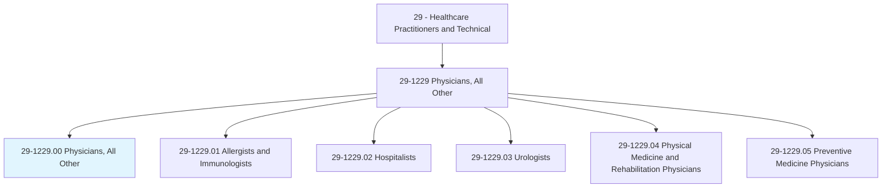
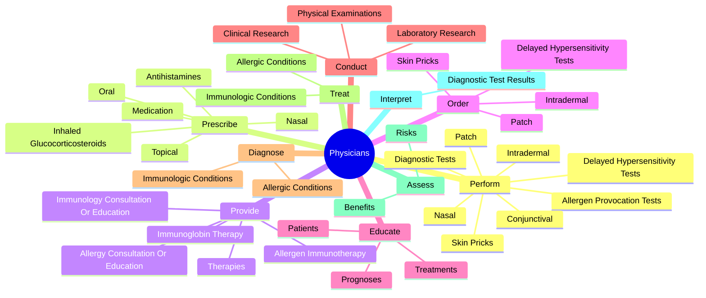
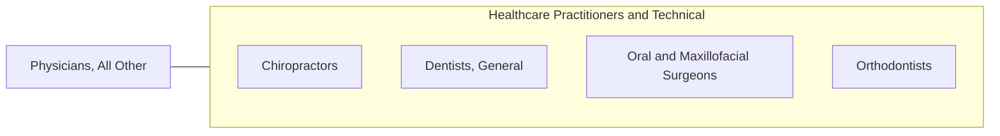

# Physicians, All Other

> All physicians not listed separately.

## Overview

Physicians, All Other is classified under Healthcare Practitioners and Technical (SOC 29). All physicians not listed separately.

## Classification Hierarchy

## Key Statistics

| Metric | Value |
|--------|-------|
| SOC Code | 29-1229.00 |
| Category | [Healthcare Practitioners and Technical](/occupations/HealthcarePractitioners) |
| Task Count | 56 |
| Source | O*NET |

## Core Tasks

### perform.DiagnosticTests

Physicians, All Other perform diagnostic tests as part of their core responsibilities.

**Actions:**
- `perform.DiagnosticTests`
- `perform.SkinPricks`
- `perform.Intradermal`
- `perform.Patch`

### prescribe.Medication

Physicians, All Other prescribe medication as part of their core responsibilities.

**Actions:**
- `prescribe.Medication`
- `prescribe.Antihistamines`
- `prescribe.Nasal`
- `prescribe.Oral`

### provide.Therapies

Physicians, All Other provide therapies as part of their core responsibilities.

**Actions:**
- `provide.Therapies.to.TreatImmuneConditions`
- `provide.AllergenImmunotherapy.to.TreatImmuneConditions`
- `provide.ImmunoglobinTherapy.to.TreatImmuneConditions`
- `provide.AllergyConsultationOrEducation.to.PhysiciansHealthCareProviders`

## Skills & Competencies

### Technical Skills
- **Clinical Skills** - Advanced
- **Diagnostic Procedures** - Advanced
- **Patient Care** - Advanced

### Soft Skills
- **Communication** - Essential
- **Problem Solving** - Essential
- **Critical Thinking** - Important
- **Teamwork** - Important
- **Adaptability** - Important

## Related Occupations

## Industries

This occupation is found across multiple industries. See [Industries](/industries) for sector-specific employment data.

## Career Progression

---

*Source: O*NET 29-1229.00 - ONETOccupation*
