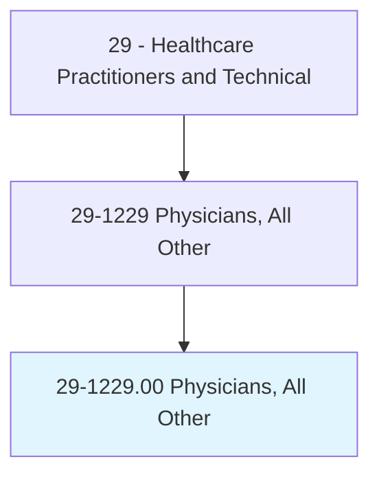
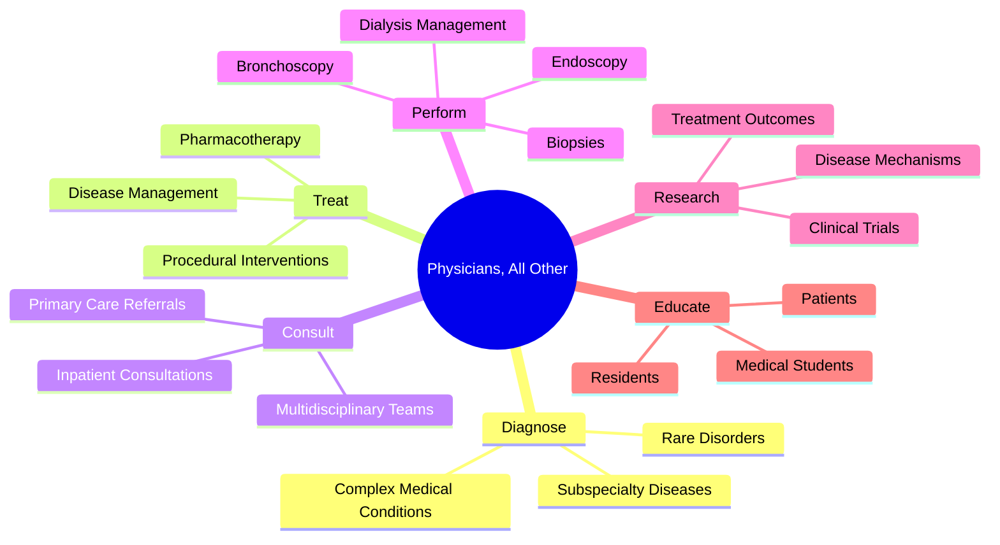
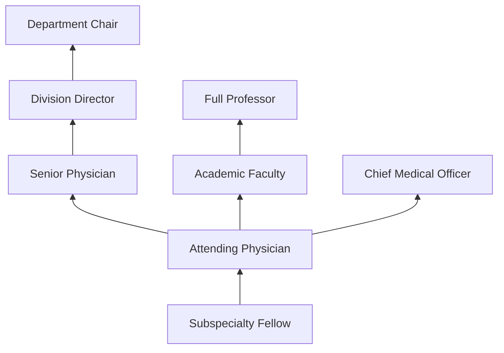
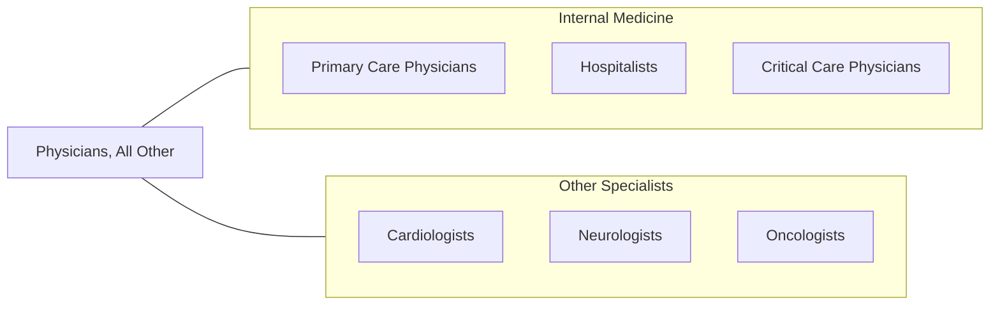

# Physicians, All Other

> All physicians not listed separately, including specialists in fields such as infectious disease, nephrology, pulmonology, endocrinology, gastroenterology, hematology, rheumatology, and other internal medicine subspecialties.

## Overview

Physicians, All Other encompasses medical doctors and doctors of osteopathy who practice in specialties and subspecialties not separately classified, including infectious disease specialists, nephrologists, pulmonologists, endocrinologists, gastroenterologists, hematologists, rheumatologists, geriatricians, and other internal medicine and medical subspecialists. These physicians diagnose and treat complex medical conditions within their areas of expertise through clinical evaluation, diagnostic testing, pharmacotherapy, and procedural interventions.

Each subspecialty requires fellowship training following internal medicine or other primary specialty residency. Infectious disease specialists manage complex infections, antimicrobial stewardship, and HIV/AIDS. Nephrologists treat kidney disease and manage dialysis. Pulmonologists manage respiratory diseases and perform bronchoscopy. Endocrinologists treat hormonal disorders including diabetes and thyroid disease. Gastroenterologists diagnose and treat digestive disorders and perform endoscopic procedures.

Modern medical subspecialty practice has advanced with precision medicine, targeted therapies, advanced diagnostics (genomics, proteomics), minimally invasive procedures, telemedicine, and multidisciplinary care models. These physicians serve as consultants to primary care providers and other specialists, managing the most complex cases within their domains.

## Classification Hierarchy

## Key Statistics

| Metric | Value |
|--------|-------|
| SOC Code | 29-1229.00 |
| Median Annual Salary | $229,300 |
| Employment | ~75,000 |
| Projected Growth | 3% (2022-2032) |
| Job Zone | 5 (Extensive Preparation) |
| Category | [Healthcare Practitioners](/occupations/HealthcarePractitioners) |
| Core Tasks | 50+ |
| Source | O*NET |

## Core Tasks

### diagnose.SubspecialtyConditions

Subspecialist physicians evaluate complex medical problems.

**Actions:**
- `diagnose.ComplexInfections.using.MicrobiologicData` - ID evaluation
- `diagnose.KidneyDisease.using.RenalFunctionTesting` - Nephrology
- `diagnose.EndocrineDisorders.using.HormoneAssays` - Endocrinology
- `diagnose.GastrointestinalDisease.using.Endoscopy` - GI evaluation

### treat.ChronicAndAcuteConditions

Subspecialists manage complex medical therapy.

**Actions:**
- `manage.ChronicKidneyDisease.including.DialysisInitiation` - CKD management
- `manage.DiabetesMellitus.using.InsulinAndOralAgents` - Diabetes care
- `manage.AutoimmuneDisease.using.ImmunosuppressiveTherapy` - Rheumatology
- `perform.AntimicrobialStewardship.for.InfectionManagement` - ID stewardship

## Practice Settings

| Setting | Description |
|---------|-------------|
| Hospital-Based Practice | Inpatient consultation and procedures |
| Outpatient Subspecialty Clinics | Ambulatory subspecialty care |
| Academic Medical Centers | Teaching and research |
| Group Practices | Multi-specialty groups |
| VA Medical Centers | Veterans specialty care |
| Telemedicine | Remote subspecialty consultation |

## Skills & Competencies

### Technical Skills
- **Clinical Diagnosis** - Expert
- **Subspecialty Procedures** - Expert
- **Pharmacotherapy** - Expert
- **Diagnostic Interpretation** - Expert
- **Research Methods** - Advanced
- **Evidence-Based Medicine** - Expert

### Soft Skills
- **Clinical Reasoning** - Critical
- **Communication** - Essential
- **Empathy** - Essential
- **Leadership** - Important
- **Teaching** - Important

## Education & Training

| Requirement | Details |
|-------------|---------|
| Medical School | 4-year MD or DO |
| Residency | 3 years internal medicine (or primary specialty) |
| Fellowship | 1-3 years subspecialty |
| Board Certification | ABIM subspecialty boards |
| Total Training | 11-14 years post-high school |

## Certifications

| Certification | Description |
|---------------|-------------|
| ABIM Subspecialty Boards | Various (ID, Nephrology, Pulmonology, etc.) |
| State Medical License | Required in all states |
| DEA Registration | Controlled substance authority |

## Career Progression

## Specializations

| Subspecialty | Focus Area |
|-------------|-------------|
| Infectious Disease | Complex infections, HIV, antimicrobial stewardship |
| Nephrology | Kidney disease, dialysis, transplant |
| Pulmonology | Lung disease, critical care, sleep |
| Endocrinology | Diabetes, thyroid, hormonal disorders |
| Gastroenterology | Digestive disorders, endoscopy |
| Hematology | Blood disorders |
| Rheumatology | Autoimmune and musculoskeletal disease |
| Geriatric Medicine | Elderly care |

## Technology & Tools

| Technology | Purpose |
|------------|---------|
| Endoscopy Systems | GI and pulmonary procedures |
| Dialysis Equipment | Renal replacement therapy |
| EHR Systems | Patient documentation |
| Point-of-Care Ultrasound | Bedside diagnosis |
| Continuous Glucose Monitors | Diabetes management |
| Telemedicine Platforms | Remote consultation |

## Related Occupations

## Industries

- [Hospitals](/industries/Healthcare/Hospitals/index) - Inpatient Subspecialty
- [Physician Offices](/industries/Healthcare/PhysicianOffices) - Outpatient Practice
- [Academic](/industries/Education) - Teaching and Research
- [Government](/industries/PublicAdministration) - VA and Public Health

## Departments

This occupation typically works in:
- Internal Medicine Subspecialties
- Inpatient Consultation
- Outpatient Subspecialty Clinics

---

*Source: O*NET 29-1229.00 - ONETOccupation*
