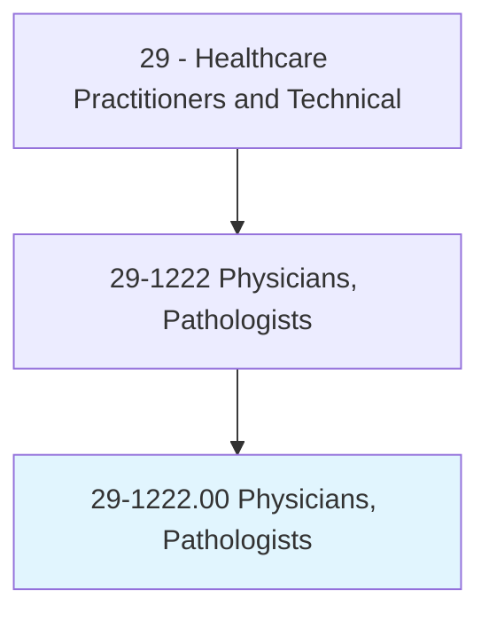
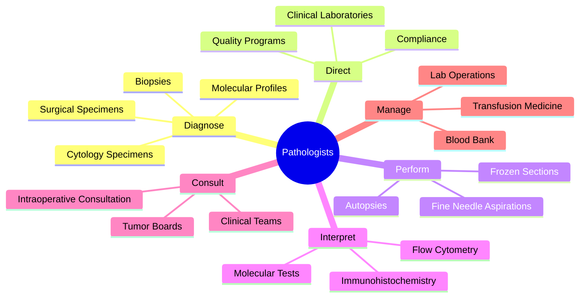
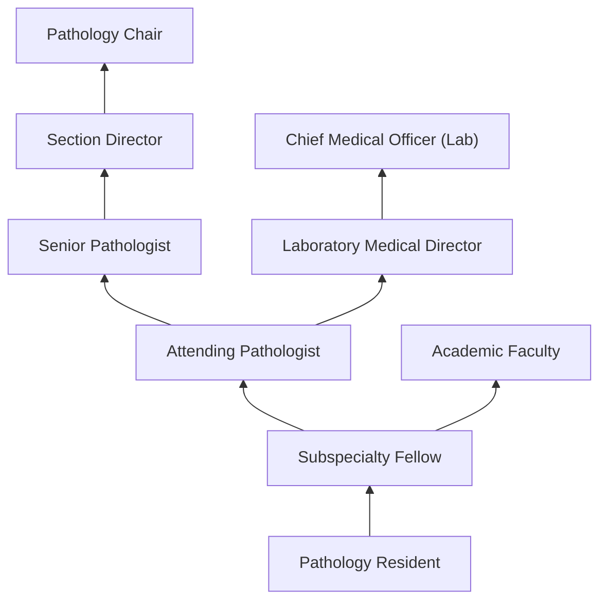
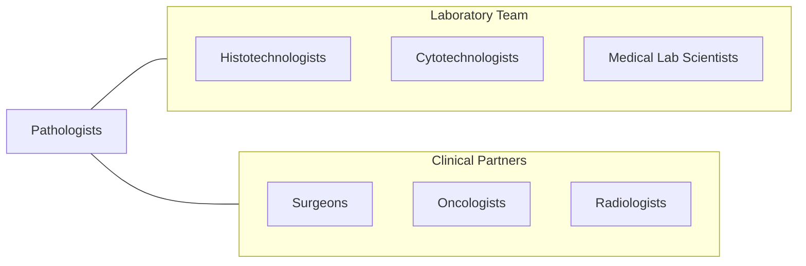

# Physicians, Pathologists

> Diagnose diseases and conditions using laboratory techniques. Examine tissues, cells, and body fluids to render diagnoses used in treatment and prevention of disease.

## Overview

Pathologists are physician specialists who diagnose diseases through the examination of tissues, cells, and body fluids. They serve as the "doctor's doctor," providing definitive diagnoses that guide treatment for cancer, infections, autoimmune diseases, and genetic conditions. The specialty encompasses anatomic pathology (surgical pathology, cytopathology, autopsy, neuropathology, dermatopathology) and clinical pathology (clinical chemistry, hematopathology, microbiology, blood banking, molecular diagnostics).

Pathologists examine surgical specimens and biopsies under the microscope, render cancer diagnoses including tumor type, grade, stage, and margin status, interpret laboratory tests, direct clinical laboratories, perform autopsies, and consult with clinical teams on diagnostic workups. They are responsible for accurate and timely diagnoses that directly impact patient treatment decisions including chemotherapy selection, surgical management, and prognosis.

Modern pathology has been transformed by molecular pathology (next-generation sequencing, gene expression profiling), digital pathology (whole-slide imaging), computational pathology (AI-assisted diagnosis), companion diagnostics for targeted therapies, liquid biopsy, and precision medicine. Pathologists are central to tumor boards, transplant programs, and clinical research, interpreting increasingly complex molecular and genomic data for personalized treatment.

## Classification Hierarchy

## Key Statistics

| Metric | Value |
|--------|-------|
| SOC Code | 29-1222.00 |
| Median Annual Salary | $244,480 |
| Employment | ~13,000 |
| Projected Growth | 3% (2022-2032) |
| Job Zone | 5 (Extensive Preparation) |
| Category | [Healthcare Practitioners](/occupations/HealthcarePractitioners) |
| Core Tasks | 40+ |
| Source | O*NET |

## Core Tasks

### diagnose.DiseaseFromTissue

Pathologists render definitive diagnoses.

**Actions:**
- `diagnose.Cancer.using.HistopathologicExamination` - Cancer diagnosis
- `perform.FrozenSections.for.IntraoperativeConsultation` - Intraoperative diagnosis
- `interpret.MolecularPathology.for.TargetedTherapySelection` - Molecular diagnosis
- `perform.Autopsies.for.CauseOfDeathDetermination` - Autopsy pathology

### direct.ClinicalLaboratories

Pathologists oversee laboratory operations.

**Actions:**
- `direct.ClinicalLaboratory.for.QualityAndCompliance` - Lab direction
- `manage.BloodBankOperations.for.TransfusionSafety` - Transfusion medicine
- `oversee.QualityManagement.per.CAPAccreditation` - Quality oversight
- `interpret.ComplexLabResults.for.ClinicalConsultation` - Lab consultation

## Practice Settings

| Setting | Description |
|---------|-------------|
| Hospital Pathology Labs | Full-service pathology |
| Academic Medical Centers | Teaching and subspecialty pathology |
| Reference Laboratories | Subspecialty consultation |
| Community Hospitals | General pathology services |
| Medical Examiner Offices | Forensic pathology |
| Molecular Diagnostics Labs | Genomic medicine |

## Skills & Competencies

### Technical Skills
- **Histopathologic Diagnosis** - Expert
- **Molecular Pathology** - Expert
- **Laboratory Management** - Expert
- **Cytopathology** - Advanced
- **Hematopathology** - Advanced
- **Clinical Chemistry** - Advanced
- **Digital Pathology** - Advanced

### Soft Skills
- **Diagnostic Reasoning** - Critical
- **Communication** - Essential
- **Attention to Detail** - Critical
- **Leadership** - Important
- **Teaching** - Important

## Education & Training

| Requirement | Details |
|-------------|---------|
| Medical School | 4-year MD or DO |
| Residency | 3-4 years anatomic and/or clinical pathology |
| Fellowship | 1-2 years subspecialty (optional) |
| Board Certification | American Board of Pathology |
| Total Training | 11-14 years post-high school |

## Certifications

| Certification | Description |
|---------------|-------------|
| ABP - Anatomic Pathology | Anatomic pathology board certification |
| ABP - Clinical Pathology | Clinical pathology board certification |
| ABP - AP/CP Combined | Combined board certification |
| Subspecialty Boards | Dermatopathology, hematopathology, molecular, etc. |

## Career Progression

## Specializations

| Subspecialty | Focus Area |
|-------------|-------------|
| Surgical Pathology | Tissue diagnosis of disease |
| Cytopathology | Cell-based diagnosis |
| Hematopathology | Blood cancer and disorders |
| Dermatopathology | Skin disease diagnosis |
| Neuropathology | Brain and nerve pathology |
| Molecular Pathology | Genomic and molecular diagnosis |
| Forensic Pathology | Medicolegal death investigation |
| Transfusion Medicine | Blood banking and transfusion |

## Technology & Tools

| Technology | Purpose |
|------------|---------|
| Light and Digital Microscopes | Tissue examination |
| Whole-Slide Imaging Scanners | Digital pathology |
| Immunohistochemistry Stainers (Ventana, Leica) | Protein marker detection |
| NGS Platforms (Illumina, Ion Torrent) | Molecular diagnostics |
| Flow Cytometers | Cell population analysis |
| LIMS/LIS Systems | Lab information management |
| AI Pathology Tools (Paige, PathAI) | Computer-assisted diagnosis |

## Related Occupations

## Industries

- [Hospitals](/industries/Healthcare/Hospitals/index) - Hospital Pathology
- [Reference Laboratories](/industries/Healthcare/MedicalLaboratories) - Subspecialty Pathology
- [Academic Medical Centers](/industries/Education) - Teaching and Research
- [Medical Examiner](/industries/PublicAdministration) - Forensic Pathology
- [Pharmaceutical](/industries/Manufacturing/ChemicalManufacturing/Pharmaceutical) - Drug Development

## Departments

This occupation typically works in:
- Pathology
- Anatomic Pathology
- Clinical Laboratory
- Molecular Diagnostics
- Blood Bank

---

*Source: O*NET 29-1222.00 - ONETOccupation*
