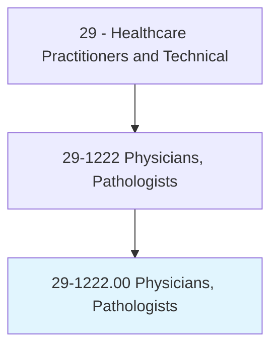
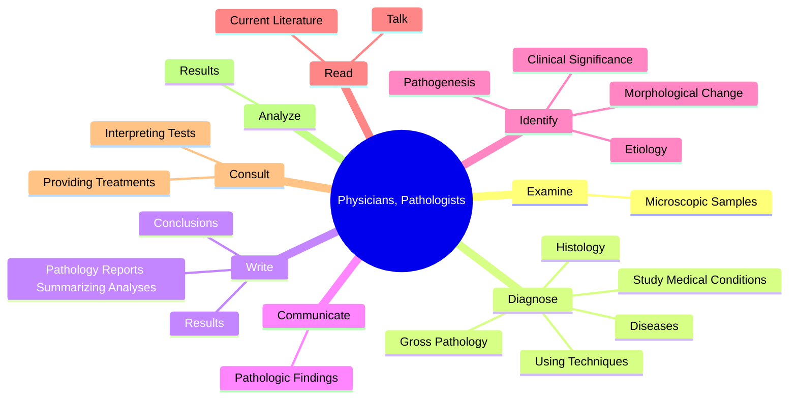
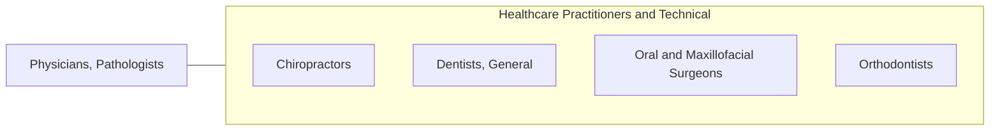

# Physicians, Pathologists

> Diagnose diseases and conduct lab tests using organs, body tissues, and fluids. Includes medical examiners.

## Overview

Physicians, Pathologists is an occupation within the Healthcare Practitioners and Technical category. Diagnose diseases and conduct lab tests using organs, body tissues, and fluids. 

## Classification Hierarchy

## Key Statistics

| Metric | Value |
|--------|-------|
| SOC Code | 29-1222.00 |
| Category | [Healthcare Practitioners and Technical](/occupations/HealthcarePractitioners) |
| Task Count | 77 |
| Source | O*NET |

## Core Tasks

### examine.MicroscopicSamples

Physicians, Pathologists examine microscopic samples as part of their core responsibilities.

**Actions:**
- `examine.MicroscopicSamples.to.identify.DiseasesAbnormalities`
- `examine.MicroscopicSamples.to.OtherAbnormalities`

### diagnose.Diseases

Physicians, Pathologists diagnose diseases as part of their core responsibilities.

**Actions:**
- `diagnose.Diseases`
- `diagnose.StudyMedicalConditions`
- `diagnose.UsingTechniques`
- `diagnose.GrossPathology`

### write.PathologyReportsSummarizingAnalyses

Physicians, Pathologists write pathology reports summarizing analyses as part of their core responsibilities.

**Actions:**
- `write.PathologyReportsSummarizingAnalyses`
- `write.Results`
- `write.Conclusions`

## Skills & Competencies

### Technical Skills
- **Clinical Skills** - Advanced
- **Diagnostic Procedures** - Advanced
- **Patient Care** - Advanced

### Soft Skills
- **Communication** - Essential
- **Problem Solving** - Essential
- **Critical Thinking** - Important
- **Teamwork** - Important
- **Adaptability** - Important

## Related Occupations

## Industries

This occupation is found across multiple industries. See [Industries](/industries) for sector-specific employment data.

## Career Progression

---

*Source: O*NET 29-1222.00 - ONETOccupation*
