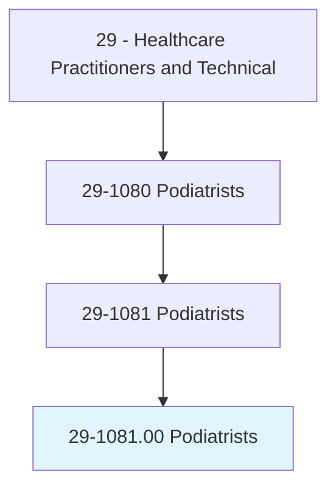
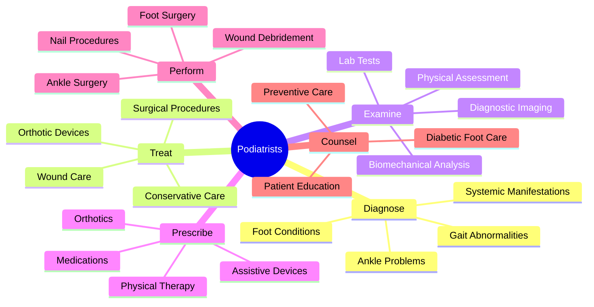
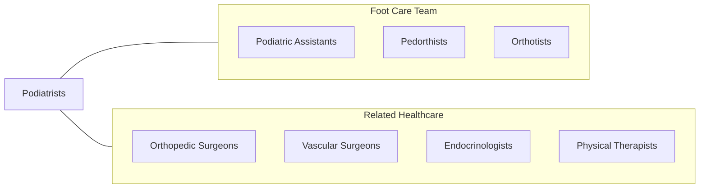
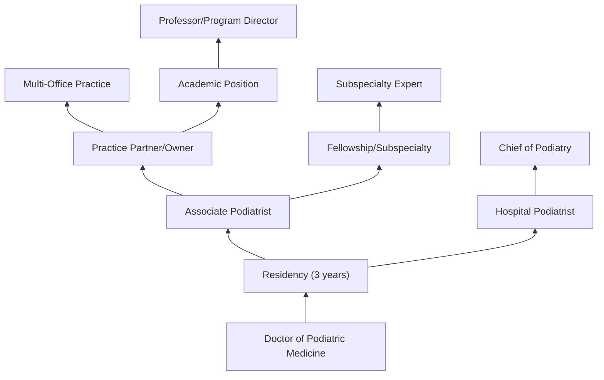

# Podiatrists

> Diagnose and treat diseases and deformities of the human foot.

## Overview

Podiatrists are medical specialists who diagnose and treat conditions affecting the foot, ankle, and related structures of the leg. Also known as Doctors of Podiatric Medicine (DPM), they treat a wide range of conditions including bunions, heel pain, diabetic foot problems, sports injuries, and nail disorders. Podiatrists can prescribe medications, set fractures, order physical therapy, and perform surgery on the foot and ankle.

## Classification Hierarchy

## Key Statistics

| Metric | Value |
|--------|-------|
| SOC Code | 29-1081.00 |
| Job Zone | 5 (Extensive Preparation) |
| Category | [Healthcare Practitioners](/occupations/HealthcarePractitioners) |
| Core Tasks | 15+ |
| Source | O*NET |

## Core Tasks

### diagnose.FootConditions

Podiatrists identify diseases and deformities of the foot.

**Actions:**
- `diagnose.FootDeformities` - Identify structural abnormalities
- `diagnose.FootDiseases` - Detect pathological conditions
- `diagnose.AnkleConditions` - Evaluate ankle problems
- `assess.GaitAbnormalities` - Analyze walking patterns

### perform.FootSurgery

Podiatrists conduct surgical interventions.

**Actions:**
- `perform.BunionSurgery` - Correct hallux valgus
- `perform.HammerToeCorrection` - Repair toe deformities
- `perform.FractureFixation` - Stabilize broken bones
- `perform.WoundDebridement` - Clean chronic wounds
- `perform.NailSurgery` - Treat ingrown nails

### prescribe.TreatmentDevices

Podiatrists order therapeutic interventions.

**Actions:**
- `prescribe.Orthotics` - Custom foot supports
- `prescribe.Medications` - Drug therapy
- `prescribe.PhysicalTherapy` - Rehabilitation
- `prescribe.ProtectiveFootwear` - Therapeutic shoes

## Common Conditions Treated

| Category | Conditions |
|----------|------------|
| Structural | Bunions, hammertoes, flat feet, high arches |
| Skin/Nail | Ingrown nails, fungal infections, warts, corns |
| Pain | Plantar fasciitis, neuromas, arthritis, heel spurs |
| Diabetic | Ulcers, neuropathy, Charcot foot |
| Sports | Stress fractures, ankle sprains, tendonitis |
| Systemic | Gout, peripheral vascular disease |

## Skills & Competencies

### Technical Skills
- **Foot/Ankle Surgery** - Expert
- **Diagnostic Imaging Interpretation** - Expert
- **Biomechanical Assessment** - Expert
- **Wound Care** - Expert
- **Orthotic Prescription** - Expert
- **Physical Examination** - Expert

### Soft Skills
- **Patient Communication** - Critical
- **Manual Dexterity** - Critical
- **Clinical Judgment** - Essential
- **Attention to Detail** - Critical
- **Empathy** - Essential

## Related Occupations

## Industries

- [Podiatry Offices](/industries/PodiatryOffices) - Primary Employment
- [Hospitals](/industries/Hospitals) - Hospital-based Practice
- [Outpatient Care Centers](/industries/OutpatientCare) - Surgical Centers
- [Nursing Care Facilities](/industries/NursingCare) - Long-term Care
- [Sports Medicine Clinics](/industries/SportsMedicine) - Athletic Care

## Career Progression

## Education & Training

| Requirement | Details |
|-------------|---------|
| Typical Education | Doctor of Podiatric Medicine (DPM) - 4 years |
| Prerequisites | Bachelor's degree + MCAT |
| Residency | 3-year surgical residency required |
| Licensure | State podiatric license required |
| Board Certification | ABFAS or ABPM optional but valued |
| Continuing Education | State-mandated CE requirements |

## Subspecialties

| Subspecialty | Focus |
|--------------|-------|
| Podiatric Surgery | Advanced surgical procedures |
| Sports Medicine | Athletic injuries |
| Diabetic Foot Care | Diabetes-related conditions |
| Pediatric Podiatry | Children's foot problems |
| Wound Care | Chronic wound management |
| Reconstructive Surgery | Complex deformity correction |

## Certifications

| Certification | Issuing Body |
|---------------|--------------|
| ABFAS | American Board of Foot and Ankle Surgery |
| ABPM | American Board of Podiatric Medicine |

## Departments

This occupation typically works in:
- [Podiatry Services](/departments/Podiatry)
- [Foot and Ankle Surgery](/departments/FootAnkleSurgery)
- [Wound Care Center](/departments/WoundCare)
- [Diabetic Foot Clinic](/departments/DiabeticFootClinic)

---

*Source: O*NET 29-1081.00 - ONETOccupation*
