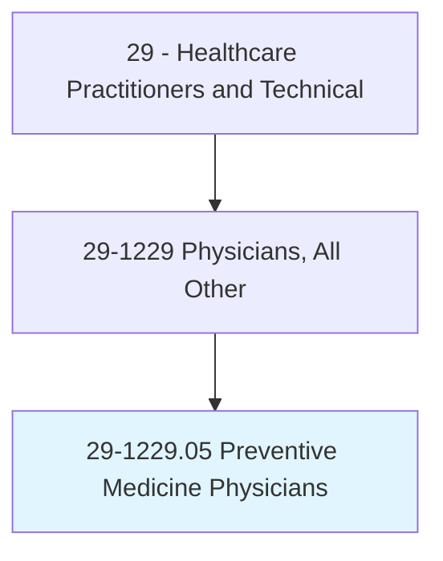
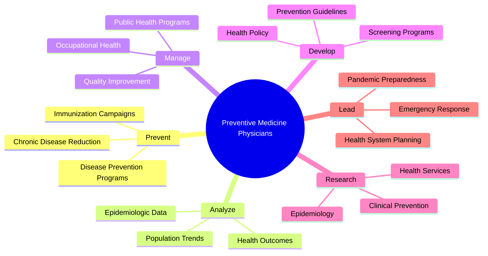
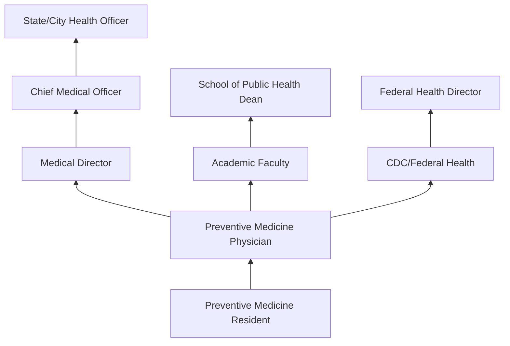
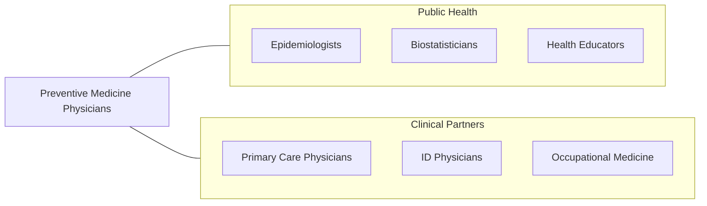

# Preventive Medicine Physicians

> Apply knowledge of general preventive medicine and public health issues to promote health care to groups or individuals. May practice population-based medicine, conduct research, or manage health care services.

## Overview

Preventive Medicine Physicians are medical doctors who specialize in disease prevention, health promotion, and population health management. They apply epidemiological, biostatistical, and environmental health principles to reduce disease burden at individual and population levels. The specialty encompasses three recognized subspecialties: public health and general preventive medicine, occupational and environmental medicine, and aerospace medicine.

These physicians design and evaluate disease prevention programs, analyze health data for epidemiologic patterns, develop public health policy, manage occupational health programs, conduct clinical preventive services research, and lead healthcare quality improvement initiatives. They address health disparities, immunization programs, chronic disease prevention, infectious disease control, environmental health hazards, and workplace health and safety.

The COVID-19 pandemic highlighted the essential role of preventive medicine physicians in epidemic preparedness, vaccine program development, contact tracing, public health communication, and health system response coordination. The field continues to expand with precision prevention, social determinants of health interventions, value-based care models, and digital health tools for population health management.

## Classification Hierarchy

## Key Statistics

| Metric | Value |
|--------|-------|
| SOC Code | 29-1229.05 |
| Median Annual Salary | $218,900 |
| Employment | ~6,000 |
| Projected Growth | 5% (2022-2032) |
| Job Zone | 5 (Extensive Preparation) |
| Category | [Healthcare Practitioners](/occupations/HealthcarePractitioners) |
| Core Tasks | 30+ |
| Source | O*NET |

## Core Tasks

### prevent.PopulationDisease

Preventive Medicine Physicians design prevention programs.

**Actions:**
- `develop.DiseasePrevention.programs.for.PopulationHealth` - Prevention programs
- `analyze.EpidemiologicData.for.DiseaseSurveillance` - Epidemiology
- `evaluate.ScreeningPrograms.for.EarlyDetection` - Screening evaluation
- `manage.ImmunizationCampaigns.for.CommunityProtection` - Vaccination programs

### manage.PublicHealthOperations

Preventive Medicine Physicians lead health systems.

**Actions:**
- `manage.OccupationalHealthPrograms.for.WorkplaceSafety` - Occupational medicine
- `lead.PandemicResponse.for.PublicHealthProtection` - Emergency response
- `develop.HealthPolicy.for.PopulationHealthImprovement` - Policy development
- `implement.QualityImprovement.for.HealthcareOutcomes` - Quality management

## Practice Settings

| Setting | Description |
|---------|-------------|
| Public Health Departments | Government public health |
| Hospitals/Health Systems | Population health and quality |
| Occupational Health Clinics | Workplace medicine |
| Military/Federal Government | Armed forces and federal health |
| Academic Medical Centers | Teaching and research |
| Insurance/Managed Care | Health plan medical direction |

## Skills & Competencies

### Technical Skills
- **Epidemiology** - Expert
- **Biostatistics** - Advanced
- **Program Evaluation** - Expert
- **Health Policy** - Advanced
- **Occupational Medicine** - Advanced
- **Clinical Preventive Services** - Expert
- **Quality Improvement** - Advanced

### Soft Skills
- **Leadership** - Critical
- **Communication** - Essential
- **Systems Thinking** - Essential
- **Collaboration** - Essential
- **Advocacy** - Important

## Education & Training

| Requirement | Details |
|-------------|---------|
| Medical School | 4-year MD or DO |
| Residency | 2-year preventive medicine residency (includes MPH) |
| MPH | Master of Public Health (part of residency) |
| Board Certification | ABPM board examination |
| Total Training | 10-12 years post-high school |

## Certifications

| Certification | Description |
|---------------|-------------|
| ABPM - GPM | General Preventive Medicine/Public Health |
| ABPM - OEM | Occupational and Environmental Medicine |
| ABPM - Aerospace | Aerospace Medicine |
| State Medical License | Required |

## Career Progression

## Technology & Tools

| Technology | Purpose |
|------------|---------|
| Epidemiologic Software (SAS, R, Stata) | Data analysis |
| Disease Surveillance Systems | Outbreak detection |
| EHR Population Health Modules | Population management |
| GIS Mapping Tools | Geographic health analysis |
| Quality Measurement Platforms | Healthcare quality |

## Related Occupations

## Industries

- [Government](/industries/PublicAdministration) - Public Health Departments
- [Hospitals](/industries/Healthcare/Hospitals/index) - Health System Leadership
- [Insurance](/industries/Insurance) - Managed Care
- [Military](/industries/PublicAdministration) - Armed Forces Health
- [Academic](/industries/Education) - Schools of Public Health

## Departments

This occupation typically works in:
- Preventive Medicine
- Public Health
- Occupational Health
- Quality Improvement
- Population Health

---

*Source: O*NET 29-1229.05 - ONETOccupation*
