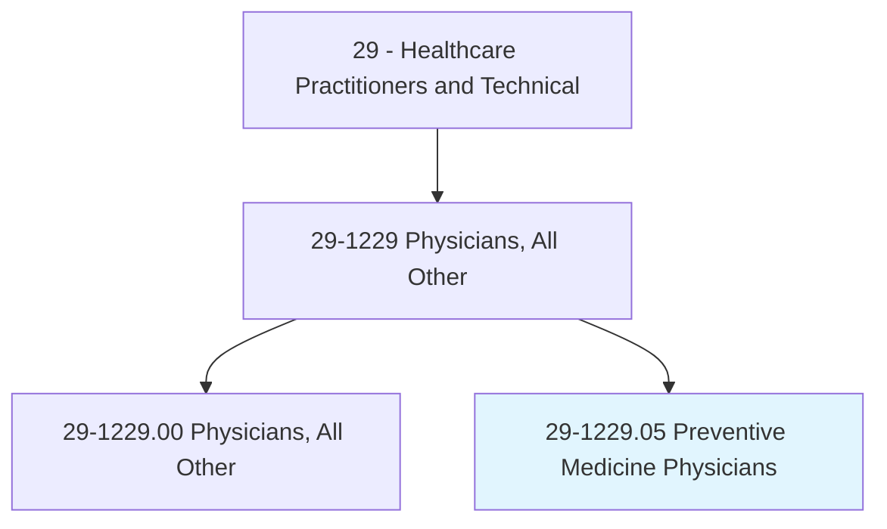
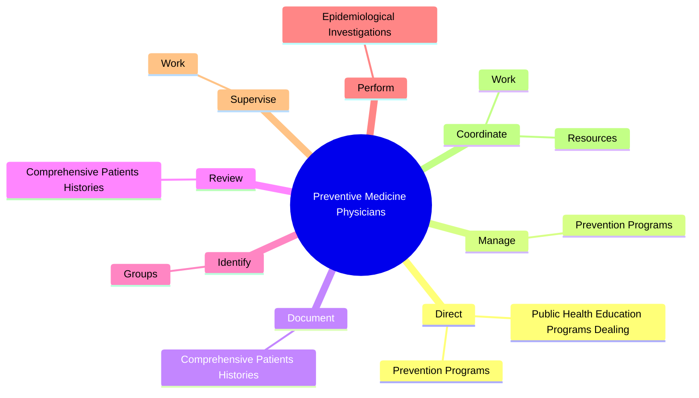

# Preventive Medicine Physicians

> Apply knowledge of general preventive medicine and public health issues to promote health care to groups or individuals, and aid in the prevention or reduction of risk of disease, injury, disability, or death. May practice population-based medicine or diagnose and treat patients in the context of clinical health promotion and disease prevention.

## Overview

Preventive Medicine Physicians is a specialized variant within the Healthcare Practitioners and Technical category. Apply knowledge of general preventive medicine and public health issues to promote health care to groups or individuals, and aid in the prevention or reduction of risk of disease, injury, disability, or death. 

## Classification Hierarchy

## Key Statistics

| Metric | Value |
|--------|-------|
| SOC Code | 29-1229.05 |
| Category | [Healthcare Practitioners and Technical](/occupations/HealthcarePractitioners) |
| Task Count | 79 |
| Source | O*NET |

## Core Tasks

### direct.PreventionPrograms

Preventive Medicine Physicians direct prevention programs as part of their core responsibilities.

**Actions:**
- `direct.PreventionPrograms.in.SpecialtyAreas`
- `direct.PreventionPrograms.in.Aerospace`
- `direct.PreventionPrograms.in.Occupational`
- `direct.PreventionPrograms.in.InfectiousDisease`

### manage.PreventionPrograms

Preventive Medicine Physicians manage prevention programs as part of their core responsibilities.

**Actions:**
- `manage.PreventionPrograms.in.SpecialtyAreas`
- `manage.PreventionPrograms.in.Aerospace`
- `manage.PreventionPrograms.in.Occupational`
- `manage.PreventionPrograms.in.InfectiousDisease`

### document.ComprehensivePatientsHistories

Preventive Medicine Physicians document comprehensive patients histories as part of their core responsibilities.

**Actions:**
- `document.ComprehensivePatientsHistories.with.Emphasis.on.OccupationRisks`
- `document.ComprehensivePatientsHistories.with.EnvironmentalRisks`

## Skills & Competencies

### Technical Skills
- **Clinical Skills** - Advanced
- **Diagnostic Procedures** - Advanced
- **Patient Care** - Advanced

### Soft Skills
- **Communication** - Essential
- **Problem Solving** - Essential
- **Critical Thinking** - Important
- **Teamwork** - Important
- **Adaptability** - Important

## Related Occupations

## Industries

This occupation is found across multiple industries. See [Industries](/industries) for sector-specific employment data.

## Career Progression

---

*Source: O*NET 29-1229.05 - ONETOccupation*
