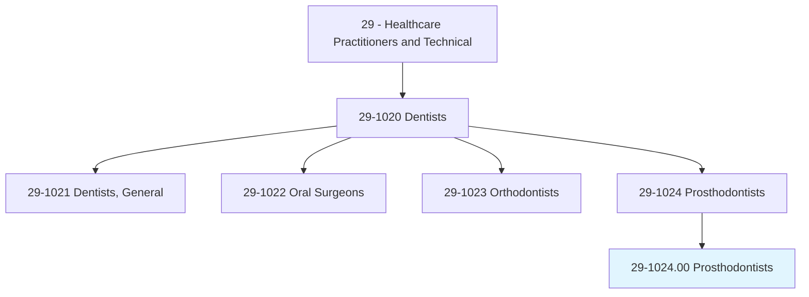
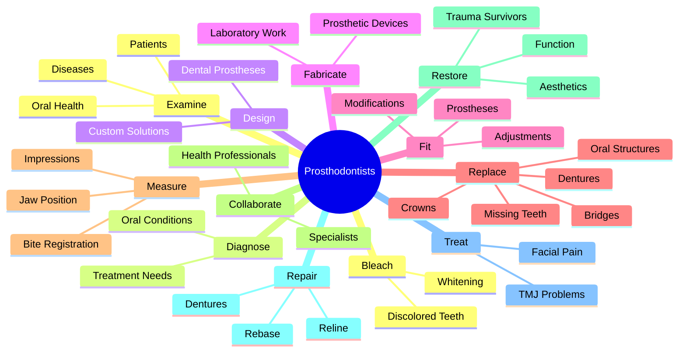
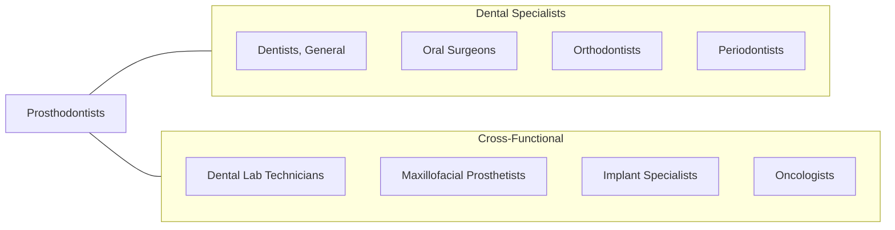
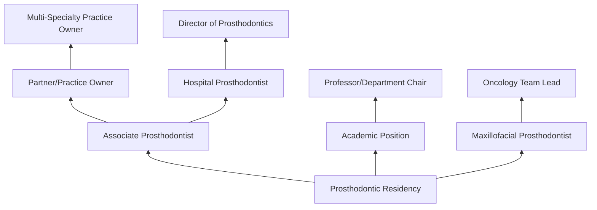

# Prosthodontists

> Diagnose, treat, rehabilitate, design, and fit prostheses that maintain oral function, health, and appearance for patients with clinical conditions associated with teeth, oral and maxillofacial tissues, or the jaw.

## Overview

Prosthodontists are dental specialists who focus on restoring and replacing teeth and oral structures. They design, manufacture, and fit dental prostheses such as crowns, bridges, dentures, and dental implants to restore function, comfort, and aesthetics for patients who have lost teeth or oral tissue due to disease, injury, or congenital conditions. Prosthodontists are experts in complex dental restorations and often work with patients who have had cancer treatment, trauma, or developmental defects affecting the oral and facial regions.

## Classification Hierarchy

## Key Statistics

| Metric | Value |
|--------|-------|
| SOC Code | 29-1024.00 |
| Job Zone | 5 (Extensive Preparation) |
| Category | [Healthcare Practitioners](/occupations/HealthcarePractitioners) |
| Core Tasks | 15+ |
| Source | O*NET |

## Core Tasks

### examine.Patients

Prosthodontists conduct comprehensive oral evaluations.

**Actions:**
- `examine.Patients.to.diagnose.OralHealthConditions` - Assess oral health status
- `examine.Patients.to.Diseases` - Identify pathological conditions

### replace.MissingTeeth

Prosthodontists restore missing dental structures with prosthetic devices.

**Actions:**
- `replace.MissingTeethOralStructures.with.PermanentFixtures` - Install fixed prostheses
- `replace.MissingTeethOralStructures.with.ImplantSupportedProstheses` - Place implant restorations
- `replace.MissingTeethOralStructures.with.Crowns` - Fabricate dental crowns
- `replace.MissingTeethOralStructures.with.Bridges` - Create bridge restorations
- `replace.MissingTeethOralStructures.with.RemovableFixtures` - Design removable prostheses
- `replace.MissingTeethOralStructures.with.SuchAsDentures` - Construct dentures
- `replace.AssociatedOralStructures.with.PermanentFixtures` - Restore oral anatomy

### fit.Prostheses

Prosthodontists install and adjust prosthetic devices.

**Actions:**
- `fit.Prostheses.to.Patients` - Install prosthetic devices
- `fit.Prostheses.to.MakingNecessaryAdjustments` - Fine-tune fit
- `fit.Prostheses.to.Modifications` - Modify for optimal function

### measure.Impressions

Prosthodontists gather precise measurements for prosthesis fabrication.

**Actions:**
- `measure.Impressions.of.PatientsJaws.to.determine.ShapeSizeOfDentalProstheses` - Record jaw dimensions
- `measure.Impressions.of.Teeth.to.determine.ShapeSizeOfDentalProstheses` - Capture tooth anatomy
- `take.Impressions.of.PatientsJaws.to.determine.ShapeSizeOfDentalProstheses` - Create jaw molds
- `measure.Impressions.of.UsingFaceBows` - Use face bow for measurements
- `measure.Impressions.of.DentalArticulators` - Apply articulator techniques

### design.DentalProstheses

Prosthodontists create custom prosthetic solutions.

**Actions:**
- `design.DentalProstheses` - Develop prosthetic designs
- `design.SuperviseDentalTechnicians` - Direct laboratory work
- `fabricate.DentalProstheses` - Construct prosthetic devices
- `fabricate.LaboratoryBenchWorkersWhoConstructDevices` - Oversee fabrication

### collaborate.Specialists

Prosthodontists work with other healthcare providers.

**Actions:**
- `collaborate.Specialists.to.develop.SolutionsToDentalHealthConcerns` - Coordinate specialist care
- `collaborate.OtherHealthProfessionals.to.develop.SolutionsToDentalHealthConcerns` - Integrate medical treatment
- `collaborate.Specialists.to.OralHealthConcerns` - Address complex cases

### restore.Function

Prosthodontists rehabilitate patients with significant oral health challenges.

**Actions:**
- `restore.Function.to.TraumaticInjurySurvivors` - Treat trauma patients
- `restore.Function.to.ToIndividualsWithDiseases` - Help disease-affected patients
- `restore.Function.to.CongenitalDisabilities` - Treat birth defects
- `restore.Aesthetics.to.TraumaticInjurySurvivors` - Improve appearance post-trauma
- `restore.Aesthetics.to.CongenitalDisabilities` - Enhance aesthetics

### repair.Dentures

Prosthodontists maintain and repair prosthetic devices.

**Actions:**
- `repair.Dentures` - Fix damaged dentures
- `reline.Dentures` - Refit denture base

### treat.FacialPain

Prosthodontists manage jaw-related disorders.

**Actions:**
- `treat.FacialPainJointProblems` - Address facial pain
- `treat.JawJointProblems` - Manage TMJ disorders

### use.BondingTechnology

Prosthodontists apply advanced dental techniques.

**Actions:**
- `use.BondingTechnology.on.SurfaceOfTeeth.to.change.ToothShapeCloseGaps` - Apply bonding
- `place.Veneers.onto.Teeth.to.conceal.Defects` - Install dental veneers
- `bleach.DiscoloredTeeth.to.Brighten` - Whiten teeth
- `bleach.DiscoloredTeeth.to.whiten.Them` - Perform bleaching procedures

## Skills & Competencies

### Technical Skills
- **Prosthetic Design** - Expert
- **Implant Restorations** - Expert
- **Crown and Bridge Work** - Expert
- **Denture Fabrication** - Expert
- **CAD/CAM Dentistry** - Advanced
- **Occlusion Analysis** - Expert
- **Maxillofacial Prosthetics** - Advanced

### Soft Skills
- **Artistic Ability** - Critical
- **Manual Dexterity** - Critical
- **Patient Communication** - Essential
- **Attention to Detail** - Critical
- **Problem Solving** - Essential
- **Empathy** - Important

## Related Occupations

## Industries

- [Dental Offices](/industries/DentalOffices) - Specialty Practice
- [Hospitals](/industries/Hospitals) - Oncology and Trauma Units
- [Academic Medical Centers](/industries/AcademicMedical) - Teaching Hospitals
- [Dental Laboratories](/industries/DentalLaboratories) - Prosthetics Manufacturing
- [VA Healthcare](/industries/VAHealthcare) - Veterans Services

## Career Progression

## Education & Training

| Requirement | Details |
|-------------|---------|
| Typical Education | DDS/DMD plus 3-4 year Prosthodontic Residency |
| Work Experience | Extensive clinical training during residency |
| On-the-Job Training | Advanced cases in implants and maxillofacial prosthetics |
| Licensure | State dental license with specialty recognition |
| Board Certification | American Board of Prosthodontics |

## Departments

This occupation typically works in:
- [Prosthodontic Services](/departments/ProsthodonticServices)
- [Implant Dentistry](/departments/ImplantDentistry)
- [Maxillofacial Prosthetics](/departments/MaxillofacialProsthetics)
- [Oncology Rehabilitation](/departments/OncologyRehabilitation)
- [Dental Specialties](/departments/DentalSpecialties)

---

*Source: O*NET 29-1024.00 - ONETOccupation*
