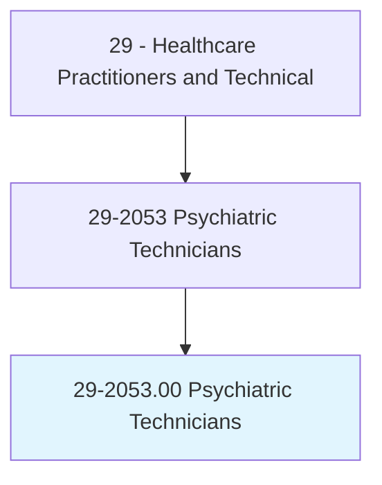
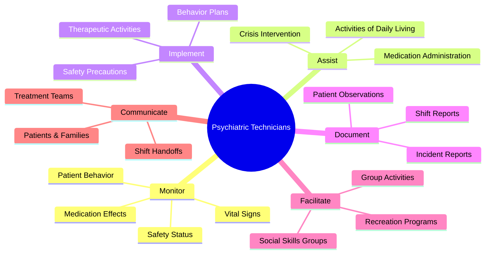
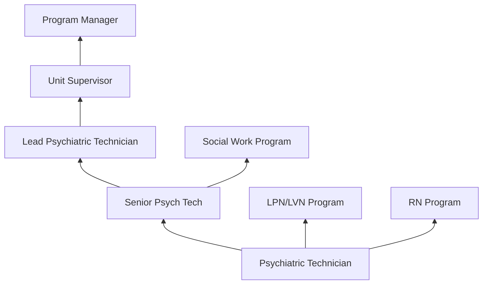
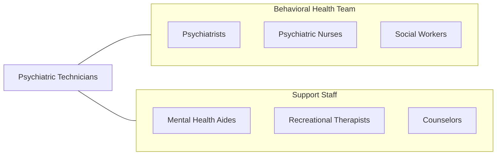

# Psychiatric Technicians

> Care for individuals with mental or emotional conditions or disabilities, following the instructions of physicians or other health practitioners. Monitor patients' physical and emotional well-being and report to medical staff. May participate in rehabilitation and treatment programs.

## Overview

Psychiatric Technicians provide direct care to individuals with mental illness, emotional disorders, developmental disabilities, and substance use disorders in inpatient psychiatric facilities, state hospitals, residential treatment centers, and community mental health settings. They monitor patient behavior and safety, assist with activities of daily living, implement behavior management plans, lead therapeutic group activities, administer medications under supervision, and document patient observations for the treatment team.

The role requires understanding of mental health conditions, crisis intervention techniques, de-escalation strategies, therapeutic communication, and safety protocols. Psychiatric technicians observe and report changes in patient behavior, mood, and mental status; implement suicide precautions and safety watches; assist with admission and discharge processes; facilitate recreational and therapeutic activities; and maintain a safe therapeutic environment on psychiatric units.

The profession has evolved with trauma-informed care approaches, recovery-oriented practice, medication-assisted treatment for substance use, restraint reduction initiatives, and integration of behavioral health with primary care. Psychiatric technicians serve as frontline caregivers who spend the most direct time with psychiatric patients, making their observations and interactions critical to patient safety and treatment outcomes.

## Classification Hierarchy

## Key Statistics

| Metric | Value |
|--------|-------|
| SOC Code | 29-2053.00 |
| Median Annual Salary | $37,380 |
| Employment | ~62,000 |
| Projected Growth | 6% (2022-2032) |
| Job Zone | 3 (Medium Preparation) |
| Category | [Healthcare Practitioners](/occupations/HealthcarePractitioners) |
| Core Tasks | 25+ |
| Source | O*NET |

## Core Tasks

### monitor.PatientBehavior

Psychiatric Technicians observe and report patient status.

**Actions:**
- `monitor.PatientBehavior.for.SafetyAndWellbeing` - Behavioral observation
- `implement.SuicidePrecautions.per.SafetyProtocol` - Safety monitoring
- `observe.MedicationEffects.for.TreatmentResponse` - Medication monitoring
- `report.BehavioralChanges.to.TreatmentTeam` - Clinical reporting

### facilitate.TherapeuticActivities

Psychiatric Technicians support patient recovery.

**Actions:**
- `facilitate.GroupActivities.for.SocialSkillsDevelopment` - Group facilitation
- `implement.BehaviorManagementPlans.per.TreatmentGoals` - Behavioral interventions
- `assist.Patients.with.ActivitiesOfDailyLiving` - ADL support
- `apply.DeEscalationTechniques.for.CrisisIntervention` - Crisis management

## Practice Settings

| Setting | Description |
|---------|-------------|
| State Psychiatric Hospitals | Long-term inpatient care |
| General Hospital Psych Units | Acute psychiatric care |
| Residential Treatment Centers | Residential behavioral health |
| Community Mental Health | Outpatient support |
| Substance Abuse Facilities | Addiction treatment |
| Developmental Disability Centers | DD residential care |
| Forensic Psychiatric Facilities | Criminal justice behavioral health |

## Skills & Competencies

### Technical Skills
- **Behavioral Observation** - Expert
- **Crisis Intervention** - Advanced
- **De-Escalation Techniques** - Expert
- **Medication Administration** - Advanced
- **Vital Signs Monitoring** - Advanced
- **Safety Protocols** - Expert
- **Documentation** - Advanced

### Soft Skills
- **Empathy** - Critical
- **Patience** - Essential
- **Communication** - Essential
- **Composure** - Essential
- **Teamwork** - Essential
- **Emotional Resilience** - Essential

## Education & Training

| Requirement | Details |
|-------------|---------|
| Education | Certificate or associate degree in psychiatric technology |
| State Certification | Required in some states (e.g., California) |
| Training | CPI/crisis intervention, CPR/BLS |
| Continuing Education | Per state and facility requirements |

## Certifications

| Certification | Description |
|---------------|-------------|
| State Psychiatric Technician License | State-specific (e.g., California BVNPT) |
| CPI | Crisis Prevention Institute certification |
| CPR/BLS | Basic Life Support |
| First Aid | Emergency first aid |

## Career Progression

## Technology & Tools

| Technology | Purpose |
|------------|---------|
| Electronic Health Records | Patient documentation |
| Behavioral Monitoring Systems | Patient observation tracking |
| eMAR Systems | Medication administration records |
| Safety Equipment | Restraint and safety devices |
| Vital Sign Monitors | Physical health monitoring |
| Activity Therapy Supplies | Therapeutic recreation |

## Related Occupations

## Industries

- [Psychiatric Hospitals](/industries/Healthcare/Hospitals/index) - Inpatient Psychiatry
- [General Hospitals](/industries/Healthcare/Hospitals/index) - Hospital Psych Units
- [Residential Treatment](/industries/Healthcare/NursingCare) - Behavioral Health Residential
- [Government](/industries/PublicAdministration) - State Hospital Systems

## Departments

This occupation typically works in:
- Psychiatry / Behavioral Health
- Inpatient Psychiatry
- Residential Treatment
- Crisis Services

---

*Source: O*NET 29-2053.00 - ONETOccupation*
