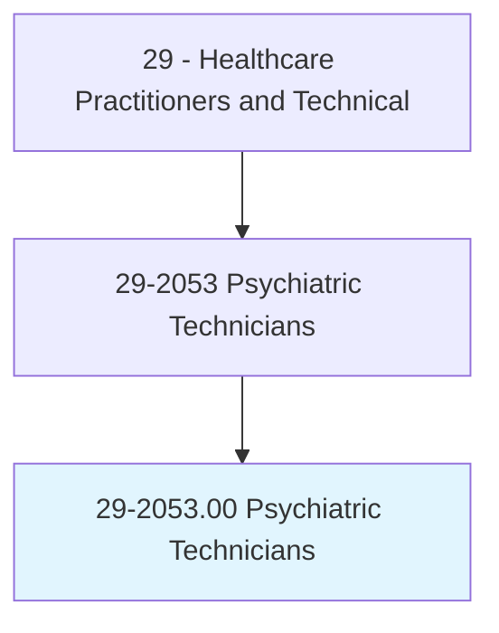
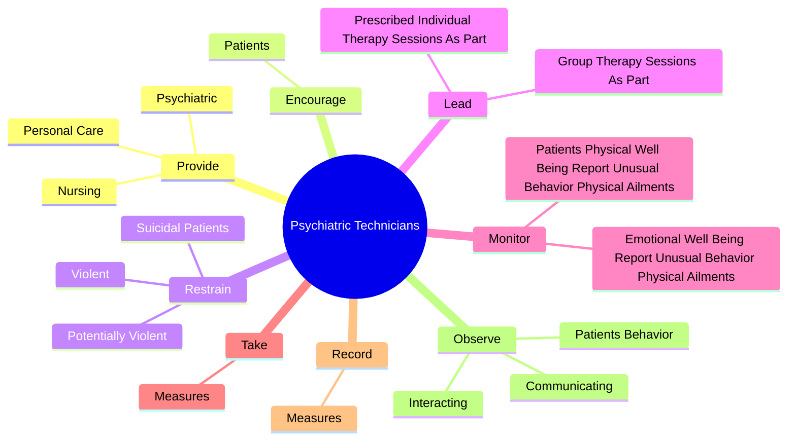

# Psychiatric Technicians

> Care for individuals with mental or emotional conditions or disabilities, following the instructions of physicians or other health practitioners. Monitor patients' physical and emotional well-being and report to medical staff. May participate in rehabilitation and treatment programs, help with personal hygiene, and administer oral or injectable medications.

## Overview

Psychiatric Technicians is an occupation within the Healthcare Practitioners and Technical category. Care for individuals with mental or emotional conditions or disabilities, following the instructions of physicians or other health practitioners. Monitor patients' physical and emotional well-being and report to medical staff.

## Classification Hierarchy

## Key Statistics

| Metric | Value |
|--------|-------|
| SOC Code | 29-2053.00 |
| Category | [Healthcare Practitioners and Technical](/occupations/HealthcarePractitioners) |
| Task Count | 94 |
| Source | O*NET |

## Core Tasks

### provide.Nursing

Psychiatric Technicians provide nursing as part of their core responsibilities.

**Actions:**
- `provide.Nursing.to.PatientsWithCognitive`
- `provide.Nursing.to.Intellectual`
- `provide.Nursing.to.DevelopmentalDisabilities`
- `provide.Psychiatric.to.PatientsWithCognitive`

### encourage.Patients

Psychiatric Technicians encourage patients as part of their core responsibilities.

**Actions:**
- `encourage.Patients.to.develop.WorkSkillsParticipateInSocial`
- `encourage.Patients.to.ToParticipateInSocial`
- `encourage.Patients.to.Recreational`
- `encourage.Patients.to.OtherTherapeuticActivitiesEnhanceInterpersonalSkills`

### restrain.Violent

Psychiatric Technicians restrain violent as part of their core responsibilities.

**Actions:**
- `restrain.Violent.by.VerbalMeansAsRequired`
- `restrain.Violent.by.PhysicalMeansAsRequired`
- `restrain.PotentiallyViolent.by.VerbalMeansAsRequired`
- `restrain.PotentiallyViolent.by.PhysicalMeansAsRequired`

## Skills & Competencies

### Technical Skills
- **Clinical Skills** - Advanced
- **Diagnostic Procedures** - Advanced
- **Patient Care** - Advanced

### Soft Skills
- **Communication** - Essential
- **Problem Solving** - Essential
- **Critical Thinking** - Important
- **Teamwork** - Important
- **Adaptability** - Important

## Related Occupations

## Industries

This occupation is found across multiple industries. See [Industries](/industries) for sector-specific employment data.

## Career Progression

---

*Source: O*NET 29-2053.00 - ONETOccupation*
