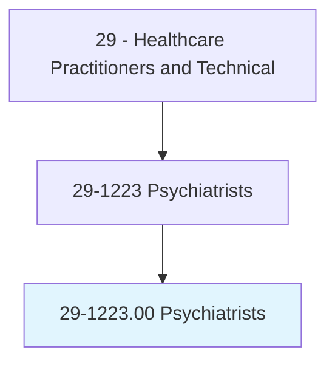
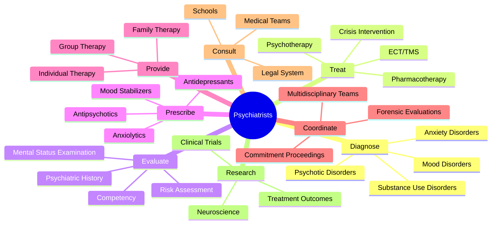
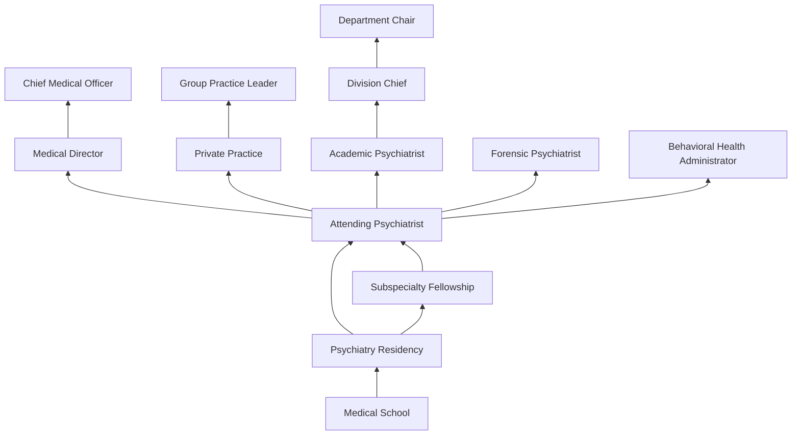
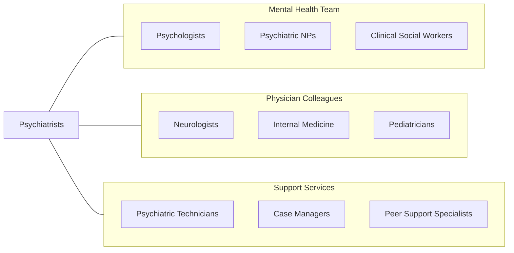

# Psychiatrists

> Diagnose, treat, and help prevent mental disorders.

## Overview

Psychiatrists are physicians who specialize in the diagnosis, treatment, and prevention of mental, emotional, and behavioral disorders. As medical doctors with extensive training in both the biological and psychological aspects of mental illness, psychiatrists are uniquely qualified to evaluate the interplay between physical health and mental health, prescribe medications, provide psychotherapy, and order diagnostic tests. They treat conditions ranging from depression, anxiety, and bipolar disorder to schizophrenia, substance use disorders, and personality disorders.

The psychiatric evaluation integrates medical history, mental status examination, psychological testing, neuroimaging, and laboratory studies to develop comprehensive diagnostic formulations. Psychiatrists use the biopsychosocial model to understand each patient's condition within the context of biological vulnerability, psychological factors, and social circumstances, creating individualized treatment plans that may combine pharmacotherapy, psychotherapy, neuromodulation, and social interventions.

Modern psychiatry has been transformed by advances in psychopharmacology, neuroimaging, and brain stimulation therapies. Psychiatrists now have access to pharmacogenomic testing to guide medication selection, transcranial magnetic stimulation (TMS) for treatment-resistant depression, electroconvulsive therapy (ECT) refinements, and emerging psychedelic-assisted therapies. The mental health crisis has increased demand dramatically, with telepsychiatry expanding access to underserved populations.

## Classification Hierarchy

## Key Statistics

| Metric | Value |
|--------|-------|
| SOC Code | 29-1223.00 |
| Median Annual Salary | $247,350 |
| Employment | ~27,000 |
| Projected Growth | 7% (2022-2032) |
| Job Zone | 5 (Extensive Preparation) |
| Category | [Healthcare Practitioners](/occupations/HealthcarePractitioners) |
| Core Tasks | 50+ |
| Source | O*NET |

## Core Tasks

### diagnose.PsychiatricDisorders

Psychiatrists conduct comprehensive psychiatric evaluations.

**Actions:**
- `diagnose.MoodDisorders.using.ClinicalInterviewAndDSM` - Mood assessment
- `diagnose.PsychoticDisorders.using.MentalStatusExam` - Psychosis evaluation
- `diagnose.SubstanceUseDisorders.using.StructuredScreening` - Addiction diagnosis
- `evaluate.SuicideRisk.using.ComprehensiveAssessment` - Safety evaluation

### treat.MentalDisorders

Psychiatrists deliver multimodal psychiatric treatment.

**Actions:**
- `prescribe.Antidepressants.for.MoodDisorders` - Pharmacotherapy
- `provide.CognitiveBehavioralTherapy.for.Anxiety` - Evidence-based therapy
- `administer.ECT.for.TreatmentResistantDepression` - Neuromodulation
- `treat.AcutePsychosis.using.InpatientStabilization` - Crisis management

### consult.HealthcareTeams

Psychiatrists provide expert consultation across settings.

**Actions:**
- `consult.MedicalTeams.regarding.PsychiatricComorbidity` - C-L psychiatry
- `consult.LegalSystem.regarding.Competency` - Forensic evaluation
- `coordinate.CommitmentProceedings.for.DangerousPatients` - Involuntary treatment
- `collaborate.MultidisciplinaryTeams.for.ComprehensiveCare` - Team-based care

## Practice Settings

| Setting | Description |
|---------|-------------|
| Outpatient Psychiatric Clinics | Ambulatory psychiatric care |
| Inpatient Psychiatric Units | Acute psychiatric stabilization |
| Private Practice | Independent psychiatric practice |
| Consultation-Liaison | Hospital-based medical psychiatry |
| Community Mental Health | Public mental health services |
| Forensic Settings | Correctional and legal psychiatry |
| Addiction Treatment Centers | Substance use specialty |
| Telepsychiatry | Remote psychiatric services |

## Skills & Competencies

### Technical Skills
- **Psychiatric Diagnosis (DSM-5-TR)** - Expert
- **Psychopharmacology** - Expert
- **Psychotherapy (CBT, DBT, Psychodynamic)** - Expert
- **Risk Assessment** - Expert
- **ECT Administration** - Advanced
- **TMS** - Advanced
- **Forensic Evaluation** - Advanced
- **Neuropsychiatric Assessment** - Advanced

### Soft Skills
- **Therapeutic Alliance Building** - Critical
- **Empathy** - Critical
- **Clinical Judgment** - Critical
- **Communication** - Essential
- **Cultural Competency** - Essential
- **Ethical Decision Making** - Essential
- **Emotional Resilience** - Essential

## Education & Training

| Requirement | Details |
|-------------|---------|
| Undergraduate | 4-year bachelor's degree (pre-med) |
| Medical School | 4-year MD or DO program |
| Psychiatry Residency | 4 years |
| Fellowship | 1-2 years for subspecialization |
| Total Training | 12-14 years post-high school |
| Licensure | State medical license + DEA registration |
| Board Certification | ABPN (American Board of Psychiatry & Neurology) |
| MOC | Continuous certification requirements |

## Certifications

| Certification | Description |
|---------------|-------------|
| ABPN Psychiatry | Primary psychiatry board certification |
| ABPN Child & Adolescent Psychiatry | Pediatric subspecialty |
| ABPN Addiction Psychiatry | Substance use subspecialty |
| ABPN Forensic Psychiatry | Legal/forensic subspecialty |
| ABPN Geriatric Psychiatry | Elderly care subspecialty |
| ABPN Consultation-Liaison Psychiatry | Medical psychiatry |
| ABPM Sleep Medicine | Sleep disorders |
| FAPA | Fellow of the APA |

## Career Progression

## Specializations

| Subspecialty | Focus Area |
|-------------|------------|
| Child & Adolescent Psychiatry | Youth mental health |
| Addiction Psychiatry | Substance use disorders |
| Forensic Psychiatry | Legal system interface |
| Geriatric Psychiatry | Elderly mental health |
| Consultation-Liaison | Medical-psychiatric interface |
| Psychosomatic Medicine | Mind-body disorders |
| Neuropsychiatry | Brain-behavior relationships |
| Community Psychiatry | Public mental health systems |

## Technology & Tools

| Technology | Purpose |
|------------|---------|
| ECT Devices | Electroconvulsive therapy |
| TMS Systems (NeuroStar, BrainsWay) | Transcranial magnetic stimulation |
| Pharmacogenomic Testing (GeneSight) | Medication response prediction |
| Telepsychiatry Platforms | Remote psychiatric care |
| Electronic Health Records | Documentation and e-prescribing |
| Standardized Rating Scales (PHQ-9, PANSS) | Symptom measurement |
| PDMP Systems | Controlled substance monitoring |
| Neuroimaging (MRI, PET) | Brain structure/function assessment |

## Related Occupations

## Industries

- [Physician Offices](/industries/Healthcare/PhysicianOffices) - Private Practice
- [Hospitals](/industries/Healthcare/Hospitals/index) - Inpatient Psychiatry
- [Mental Health Centers](/industries/Healthcare/MentalHealth) - Community Mental Health
- [Government](/industries/Government) - VA and State Hospitals
- [Substance Abuse Centers](/industries/Healthcare/SubstanceAbuse) - Addiction Treatment
- [Telehealth](/industries/Healthcare/Telehealth) - Virtual Psychiatry
- [Forensic/Correctional](/industries/Government/Corrections) - Forensic Psychiatry

## Departments

This occupation typically works in:
- [Psychiatry](/departments/Psychiatry)
- [Behavioral Health](/departments/BehavioralHealth)
- [Consultation-Liaison Psychiatry](/departments/CLPsychiatry)
- [Addiction Medicine](/departments/AddictionMedicine)
- [Child & Adolescent Psychiatry](/departments/ChildPsychiatry)

---

*Source: O*NET 29-1223.00 - ONETOccupation*
