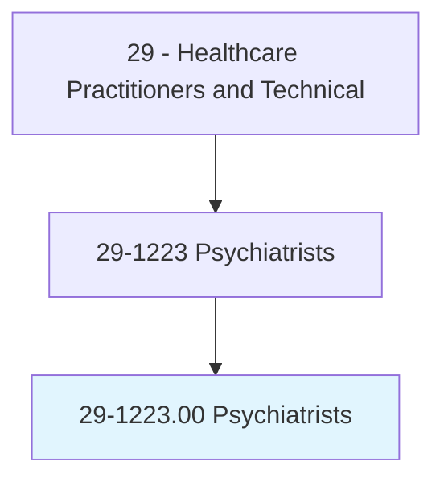
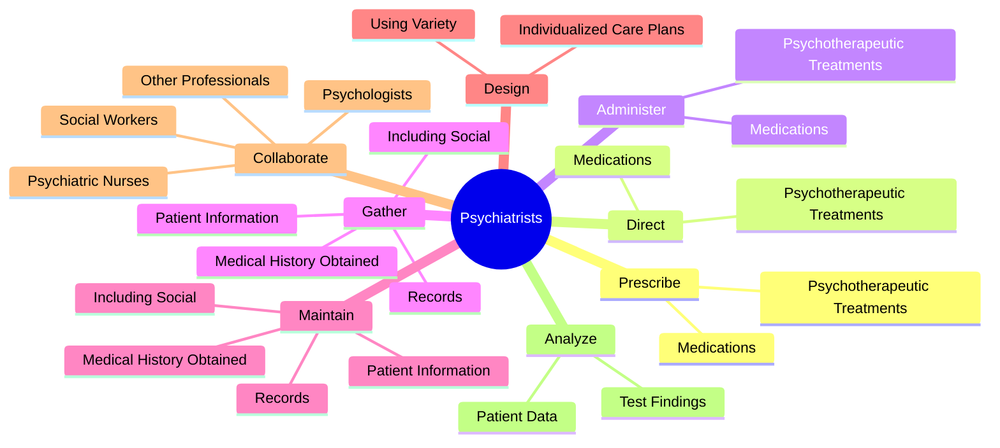
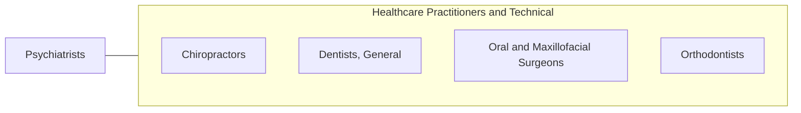

# Psychiatrists

> Diagnose, treat, and help prevent mental disorders.

## Overview

Psychiatrists is classified under Healthcare Practitioners and Technical (SOC 29). Diagnose, treat, and help prevent mental disorders.

## Classification Hierarchy

## Key Statistics

| Metric | Value |
|--------|-------|
| SOC Code | 29-1223.00 |
| Category | [Healthcare Practitioners and Technical](/occupations/HealthcarePractitioners) |
| Task Count | 99 |
| Source | O*NET |

## Core Tasks

### prescribe.PsychotherapeuticTreatments

Psychiatrists prescribe psychotherapeutic treatments as part of their core responsibilities.

**Actions:**
- `prescribe.PsychotherapeuticTreatments.to.treat.Mental`
- `prescribe.PsychotherapeuticTreatments.to.Emotional`
- `prescribe.PsychotherapeuticTreatments.to.BehavioralDisorders`
- `prescribe.Medications.to.treat.Mental`

### direct.PsychotherapeuticTreatments

Psychiatrists direct psychotherapeutic treatments as part of their core responsibilities.

**Actions:**
- `direct.PsychotherapeuticTreatments.to.treat.Mental`
- `direct.PsychotherapeuticTreatments.to.Emotional`
- `direct.PsychotherapeuticTreatments.to.BehavioralDisorders`
- `direct.Medications.to.treat.Mental`

### administer.PsychotherapeuticTreatments

Psychiatrists administer psychotherapeutic treatments as part of their core responsibilities.

**Actions:**
- `administer.PsychotherapeuticTreatments.to.treat.Mental`
- `administer.PsychotherapeuticTreatments.to.Emotional`
- `administer.PsychotherapeuticTreatments.to.BehavioralDisorders`
- `administer.Medications.to.treat.Mental`

## Skills & Competencies

### Technical Skills
- **Clinical Skills** - Advanced
- **Diagnostic Procedures** - Advanced
- **Patient Care** - Advanced

### Soft Skills
- **Communication** - Essential
- **Problem Solving** - Essential
- **Critical Thinking** - Important
- **Teamwork** - Important
- **Adaptability** - Important

## Related Occupations

## Industries

This occupation is found across multiple industries. See [Industries](/industries) for sector-specific employment data.

## Career Progression

---

*Source: O*NET 29-1223.00 - ONETOccupation*
