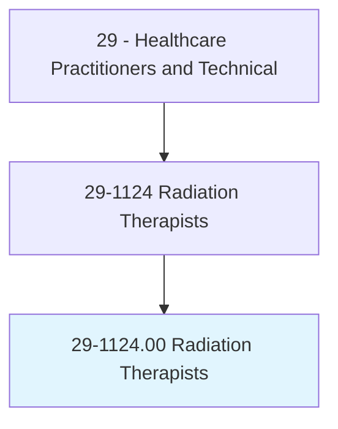
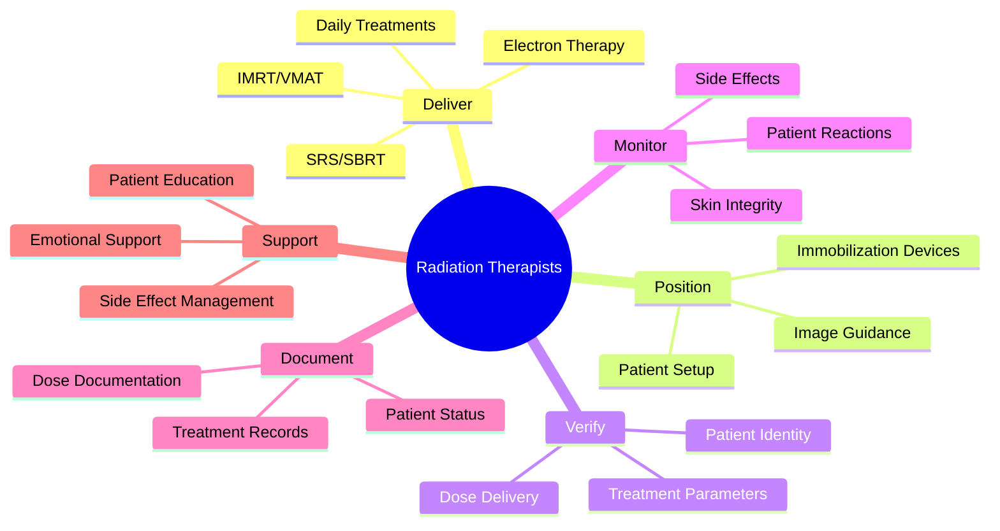
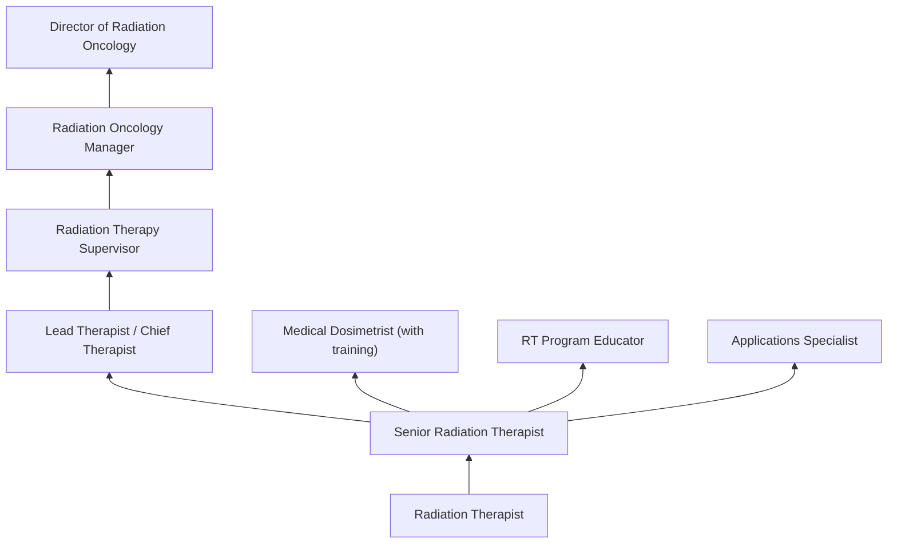
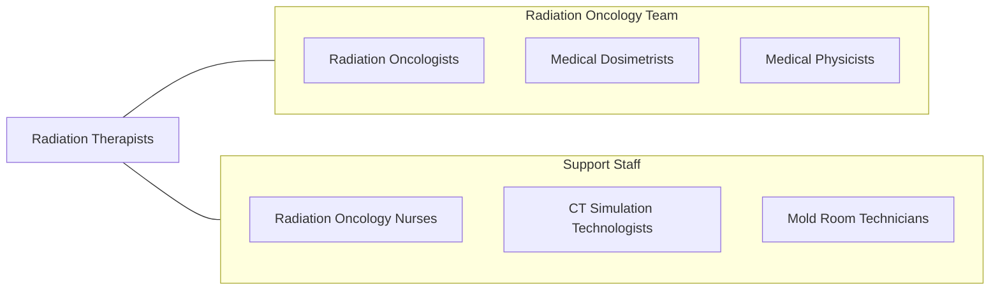

# Radiation Therapists

> Provide radiation therapy to patients as prescribed by a radiation oncologist according to established practices and standards. Duties may include reviewing prescription and diagnosis; acting as liaison with physician and supportive care personnel; preparing equipment; operating treatment equipment; and monitoring patients for unusual reactions.

## Overview

Radiation Therapists are healthcare professionals who administer radiation treatments to cancer patients as prescribed by radiation oncologists. They operate complex linear accelerators and other radiation delivery systems to precisely target tumors while minimizing exposure to healthy tissue. Radiation therapists position patients, verify treatment parameters, deliver daily treatments, monitor patients during treatment, and document each session.

The role requires expertise in radiation physics, anatomy, patient positioning, treatment verification, radiation safety, and patient care. Radiation therapists perform daily treatment setup using image guidance (cone beam CT, surface monitoring), verify patient identity and treatment parameters, administer treatments using 3D conformal, IMRT, VMAT, SRS/SBRT, and electron beam techniques, monitor patients for acute side effects, and provide emotional support throughout multi-week treatment courses.

Modern radiation therapy has advanced with stereotactic radiosurgery, adaptive radiation therapy, MR-guided radiation therapy (MR-Linac), proton beam therapy, respiratory gating, and surface-guided radiation therapy. Radiation therapists work at the intersection of advanced technology and compassionate patient care, delivering highly precise treatments to patients battling cancer.

## Classification Hierarchy

## Key Statistics

| Metric | Value |
|--------|-------|
| SOC Code | 29-1124.00 |
| Median Annual Salary | $89,530 |
| Employment | ~17,000 |
| Projected Growth | 3% (2022-2032) |
| Job Zone | 3 (Medium Preparation) |
| Category | [Healthcare Practitioners](/occupations/HealthcarePractitioners) |
| Core Tasks | 30+ |
| Source | O*NET |

## Core Tasks

### deliver.RadiationTreatments

Radiation Therapists administer prescribed radiation.

**Actions:**
- `deliver.DailyRadiationTreatments.using.LinearAccelerator` - Treatment delivery
- `perform.ImageGuidedSetup.using.ConeBeamCT` - IGRT verification
- `deliver.StereotacticRadiosurgery.for.PreciseTumorTargeting` - SRS/SBRT
- `administer.ElectronTherapy.for.SuperficialTumors` - Electron treatments

### position.PatientsForTreatment

Radiation Therapists ensure accurate patient positioning.

**Actions:**
- `position.Patients.using.ImmobilizationDevices` - Patient setup
- `verify.TreatmentFields.using.ImageGuidance` - Position verification
- `apply.SurfaceGuidedPositioning.for.RealTimeTracking` - Surface monitoring
- `manage.RespiratoryGating.for.MovingTargets` - Motion management

## Practice Settings

| Setting | Description |
|---------|-------------|
| Hospital Radiation Oncology | Comprehensive cancer centers |
| Freestanding Cancer Centers | Outpatient radiation |
| Academic Medical Centers | Teaching and research |
| Proton Therapy Centers | Particle beam therapy |
| Mobile Radiation Units | Portable treatment services |

## Skills & Competencies

### Technical Skills
- **Linear Accelerator Operation** - Expert
- **Patient Positioning** - Expert
- **Image-Guided Radiation Therapy** - Expert
- **Radiation Safety** - Expert
- **Treatment Verification** - Expert
- **Immobilization Techniques** - Expert
- **Patient Monitoring** - Advanced

### Soft Skills
- **Patient Communication** - Critical
- **Empathy** - Essential
- **Attention to Detail** - Critical
- **Teamwork** - Essential
- **Composure** - Essential

## Education & Training

| Requirement | Details |
|-------------|---------|
| Education | Associate or bachelor's degree in radiation therapy |
| Clinical Training | JRCERT-accredited program |
| Certification | ARRT RT(T) credential |
| State License | Required in most states |
| Continuing Education | 24 CE credits per 2-year cycle |

## Certifications

| Certification | Description |
|---------------|-------------|
| RT(T)(ARRT) | Registered Radiation Therapist |
| State License | State-specific radiation therapy license |
| BLS/CPR | Basic Life Support |
| CT Certification | CT imaging for setup (optional) |

## Career Progression

## Specializations

| Focus Area | Description |
|------------|-------------|
| Stereotactic Radiosurgery | SRS/SBRT treatments |
| Proton Therapy | Particle beam delivery |
| Brachytherapy | Internal radiation |
| Pediatric Radiation | Children's cancer treatment |
| MR-Guided RT | MR-Linac treatments |
| Total Body Irradiation | Pre-transplant radiation |

## Technology & Tools

| Technology | Purpose |
|------------|---------|
| Linear Accelerators (Varian, Elekta) | Radiation delivery |
| CT Simulators | Treatment planning imaging |
| CBCT/kV Imaging | Image guidance |
| Surface Monitoring (AlignRT, C-RAD) | Surface-guided positioning |
| Oncology Information Systems (ARIA, MOSAIQ) | Treatment management |
| Immobilization Devices | Patient positioning |
| Proton Therapy Systems (IBA, Varian) | Particle therapy |

## Related Occupations

## Industries

- [Hospitals](/industries/Healthcare/Hospitals/index) - Radiation Oncology
- [Cancer Centers](/industries/Healthcare/AmbulatoryHealthCare) - Freestanding Treatment
- [Academic Medical Centers](/industries/Education) - Teaching Programs
- [Proton Centers](/industries/Healthcare/AmbulatoryHealthCare) - Particle Therapy

## Departments

This occupation typically works in:
- [Radiation Oncology](/departments/RadiationOncology)
- [Cancer Center](/departments/CancerCenter)
- [Proton Therapy Center](/departments/ProtonTherapy)

---

*Source: O*NET 29-1124.00 - ONETOccupation*
