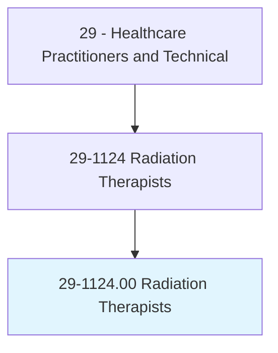
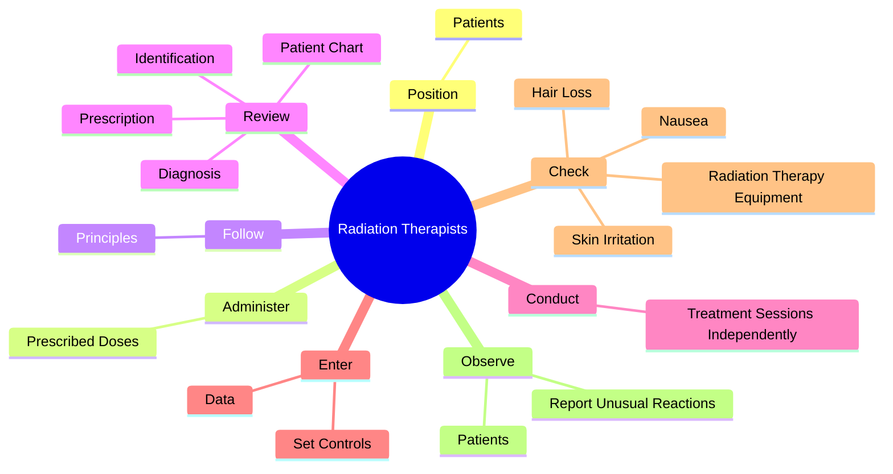
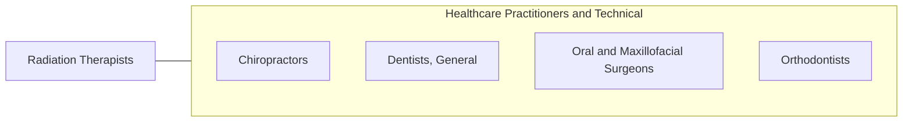

# Radiation Therapists

> Provide radiation therapy to patients as prescribed by a radiation oncologist according to established practices and standards. Duties may include reviewing prescription and diagnosis; acting as liaison with physician and supportive care personnel; preparing equipment, such as immobilization, treatment, and protection devices; and maintaining records, reports, and files. May assist in dosimetry procedures and tumor localization.

## Overview

Radiation Therapists is an occupation within the Healthcare Practitioners and Technical category. Provide radiation therapy to patients as prescribed by a radiation oncologist according to established practices and standards. Duties may include reviewing prescription and diagnosis; acting as liaison with physician and supportive care personnel; preparing equipment, such as immobilization, treatment, and protection devices; and maintaining records, reports, and files.

## Classification Hierarchy

## Key Statistics

| Metric | Value |
|--------|-------|
| SOC Code | 29-1124.00 |
| Category | [Healthcare Practitioners and Technical](/occupations/HealthcarePractitioners) |
| Task Count | 93 |
| Source | O*NET |

## Core Tasks

### position.Patients

Radiation Therapists position patients as part of their core responsibilities.

**Actions:**
- `position.Patients.for.Treatment.with.Accuracy`
- `position.Patients.for.According.to.Prescription`

### administer.PrescribedDoses

Radiation Therapists administer prescribed doses as part of their core responsibilities.

**Actions:**
- `administer.PrescribedDoses.of.RadiationToSpecificBodyParts`
- `administer.PrescribedDoses.of.UsingRadiationTherapyEquipmentAccording.to.established.Practices`
- `administer.PrescribedDoses.of.Standards`

### follow.Principles

Radiation Therapists follow principles as part of their core responsibilities.

**Actions:**
- `follow.Principles.of.RadiationProtection.for.Patient`
- `follow.Principles.of.Self`
- `follow.Principles.of.Others`

## Skills & Competencies

### Technical Skills
- **Clinical Skills** - Advanced
- **Diagnostic Procedures** - Advanced
- **Patient Care** - Advanced

### Soft Skills
- **Communication** - Essential
- **Problem Solving** - Essential
- **Critical Thinking** - Important
- **Teamwork** - Important
- **Adaptability** - Important

## Related Occupations

## Industries

This occupation is found across multiple industries. See [Industries](/industries) for sector-specific employment data.

## Career Progression

---

*Source: O*NET 29-1124.00 - ONETOccupation*
