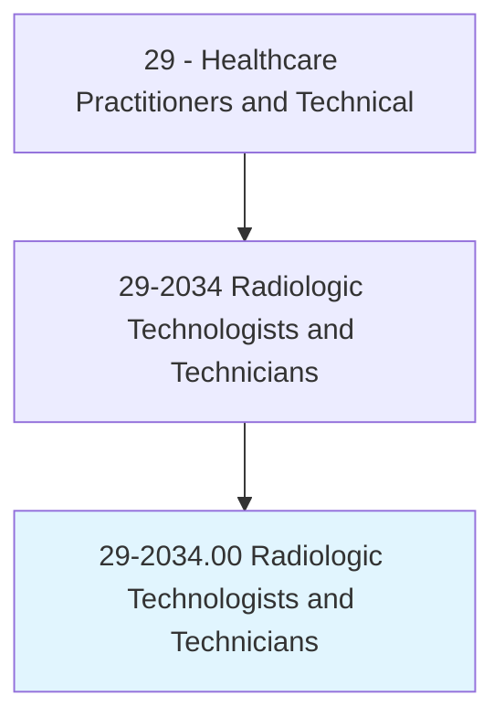
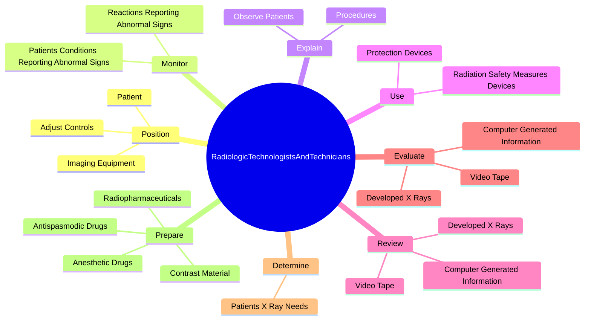
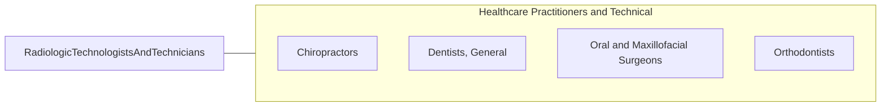

# Radiologic Technologists and Technicians

> Take x-rays and CAT scans or administer nonradioactive materials into patient's bloodstream for diagnostic or research purposes. Includes radiologic technologists and technicians who specialize in other scanning modalities.

## Overview

Radiologic Technologists and Technicians is an occupation within the Healthcare Practitioners and Technical category. Take x-rays and CAT scans or administer nonradioactive materials into patient's bloodstream for diagnostic or research purposes. 

## Classification Hierarchy

## Key Statistics

| Metric | Value |
|--------|-------|
| SOC Code | 29-2034.00 |
| Category | [Healthcare Practitioners and Technical](/occupations/HealthcarePractitioners) |
| Task Count | 125 |
| Source | O*NET |

## Core Tasks

### position.ImagingEquipment

Radiologic Technologists and Technicians position imaging equipment as part of their core responsibilities.

**Actions:**
- `position.ImagingEquipment.to.set.ExposureTimeAccordingToSpecificationOfExamination`
- `position.ImagingEquipment.to.DistanceAccordingToSpecificationOfExamination`
- `position.AdjustControls.to.set.ExposureTimeAccordingToSpecificationOfExamination`
- `position.AdjustControls.to.DistanceAccordingToSpecificationOfExamination`

### monitor.PatientsConditionsReportingAbnormalSigns

Radiologic Technologists and Technicians monitor patients conditions reporting abnormal signs as part of their core responsibilities.

**Actions:**
- `monitor.PatientsConditionsReportingAbnormalSigns.to.Physician`
- `monitor.ReactionsReportingAbnormalSigns.to.Physician`

### explain.Procedures

Radiologic Technologists and Technicians explain procedures as part of their core responsibilities.

**Actions:**
- `explain.Procedures.to.ensure.Safety`
- `explain.Procedures.to.comfort.DuringScan`
- `explain.ObservePatients.to.ensure.Safety`
- `explain.ObservePatients.to.comfort.DuringScan`

## Skills & Competencies

### Technical Skills
- **Clinical Skills** - Advanced
- **Diagnostic Procedures** - Advanced
- **Patient Care** - Advanced

### Soft Skills
- **Communication** - Essential
- **Problem Solving** - Essential
- **Critical Thinking** - Important
- **Teamwork** - Important
- **Adaptability** - Important

## Related Occupations

## Industries

This occupation is found across multiple industries. See [Industries](/industries) for sector-specific employment data.

## Career Progression

---

*Source: O*NET 29-2034.00 - ONETOccupation*
