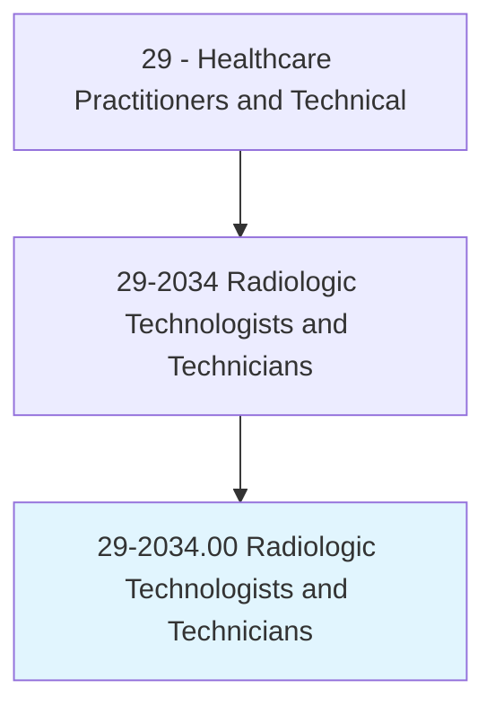
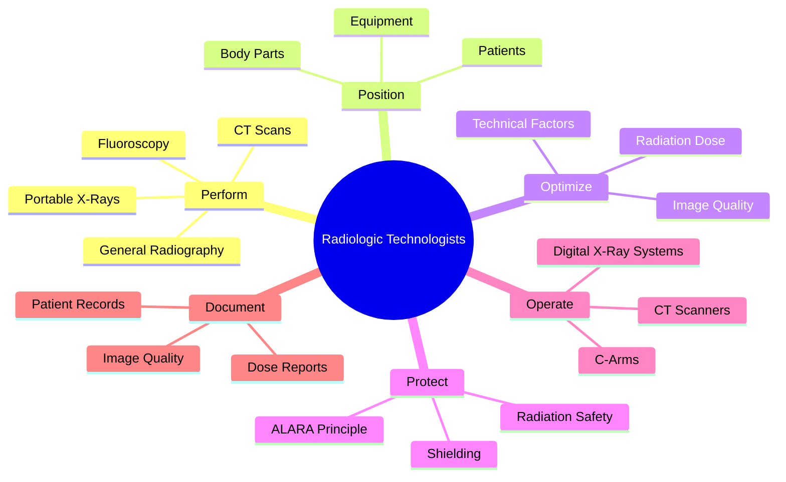
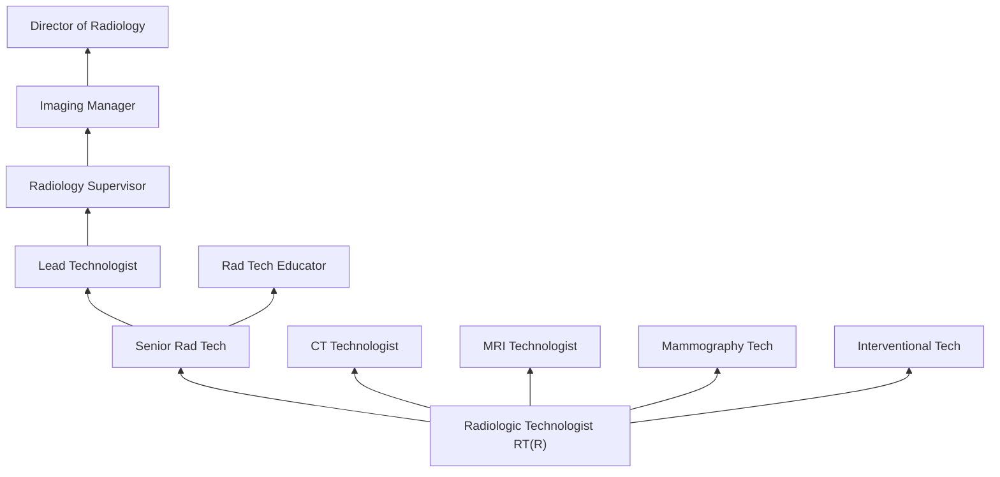
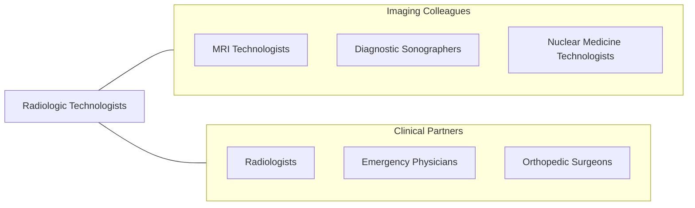

# Radiologic Technologists and Technicians

> Take X-rays and CAT scans or administer nonradioactive materials into patient's bloodstream for diagnostic or research purposes. Includes radiologic technologists and technicians who specialize in other scanning modalities.

## Overview

Radiologic Technologists (also called Radiographers or X-ray Technologists) are medical imaging professionals who produce diagnostic X-ray images, operate CT scanners, and perform fluoroscopic procedures to help physicians diagnose injuries, diseases, and medical conditions. They are responsible for patient positioning, radiation dose optimization, image quality assessment, and radiation safety while producing diagnostic images of bones, chest, abdomen, and other body structures.

The role encompasses general radiography (X-rays), computed tomography (CT), fluoroscopy, portable/bedside imaging, surgical C-arm operation, and dual-energy X-ray absorptiometry (DEXA). Radiologic technologists select appropriate technical factors (kVp, mAs), position patients and equipment, apply radiation protection measures (ALARA principle), evaluate image quality, and communicate with radiologists regarding urgent findings.

Modern radiologic technology has advanced with digital radiography (DR), low-dose CT protocols, spectral/dual-energy CT, CT angiography, CT-guided interventional procedures, and artificial intelligence-assisted image acquisition and quality optimization. Radiologic technologists serve as the foundation of the medical imaging profession, with their credential serving as the gateway to advanced modalities including CT, MRI, mammography, and interventional radiography.

## Classification Hierarchy

## Key Statistics

| Metric | Value |
|--------|-------|
| SOC Code | 29-2034.00 |
| Median Annual Salary | $65,140 |
| Employment | ~222,000 |
| Projected Growth | 6% (2022-2032) |
| Job Zone | 3 (Medium Preparation) |
| Category | [Healthcare Practitioners](/occupations/HealthcarePractitioners) |
| Core Tasks | 35+ |
| Source | O*NET |

## Core Tasks

### perform.DiagnosticImaging

Radiologic Technologists produce diagnostic images.

**Actions:**
- `perform.GeneralRadiography.for.DiagnosticEvaluation` - X-ray imaging
- `perform.CTScans.for.CrossSectionalImaging` - CT scanning
- `perform.Fluoroscopy.for.RealTimeImaging` - Fluoroscopic procedures
- `operate.PortableEquipment.for.BedsideImaging` - Mobile imaging

### optimize.RadiationSafety

Radiologic Technologists minimize radiation exposure.

**Actions:**
- `optimize.TechnicalFactors.for.DoseReduction` - Dose optimization
- `apply.RadiationProtection.per.ALARAPrinciple` - Safety measures
- `evaluate.ImageQuality.for.DiagnosticAdequacy` - Quality assessment
- `document.RadiationDose.per.RegulatoryRequirements` - Dose tracking

## Practice Settings

| Setting | Description |
|---------|-------------|
| Hospital Radiology | Inpatient and outpatient imaging |
| Outpatient Imaging Centers | Ambulatory diagnostic imaging |
| Urgent Care/Emergency | Acute imaging services |
| Physician Offices | Office-based X-ray |
| Ambulatory Surgery Centers | Surgical imaging support |
| Mobile Imaging | Portable X-ray and CT services |

## Skills & Competencies

### Technical Skills
- **Radiographic Positioning** - Expert
- **CT Scanning** - Advanced
- **Radiation Safety/ALARA** - Expert
- **Digital Imaging Systems** - Expert
- **Fluoroscopy** - Advanced
- **Image Quality Assessment** - Expert
- **Patient Care** - Advanced

### Soft Skills
- **Patient Communication** - Essential
- **Attention to Detail** - Critical
- **Physical Stamina** - Essential
- **Teamwork** - Essential
- **Adaptability** - Important

## Education & Training

| Requirement | Details |
|-------------|---------|
| Education | Associate degree in radiologic technology (minimum) |
| Clinical Training | JRCERT-accredited program |
| Certification | ARRT RT(R) credential |
| State License | Required in most states |
| Continuing Education | 24 CE credits per 2-year cycle |

## Certifications

| Certification | Description |
|---------------|-------------|
| RT(R)(ARRT) | Registered Radiologic Technologist |
| RT(CT)(ARRT) | CT Technologist (post-primary) |
| RT(M)(ARRT) | Mammography Technologist |
| RT(CV)(ARRT) | Cardiovascular Interventional |
| State License | State-specific radiography license |

## Career Progression

## Specializations

| Focus Area | Description |
|------------|-------------|
| Computed Tomography | CT scanning specialist |
| Mammography | Breast imaging |
| Interventional Radiology | Minimally invasive procedures |
| Fluoroscopy | Real-time imaging specialist |
| Pediatric Radiography | Children's imaging |
| Trauma Radiography | Emergency imaging |

## Technology & Tools

| Technology | Purpose |
|------------|---------|
| Digital Radiography Systems | X-ray imaging |
| CT Scanners (GE, Siemens, Philips) | Cross-sectional imaging |
| Fluoroscopy Units | Real-time imaging |
| C-Arms (Surgical) | Intraoperative imaging |
| PACS Systems | Image storage and retrieval |
| Dose Monitoring Software | Radiation dose tracking |
| CR/DR Cassettes | Digital image receptors |

## Related Occupations

## Industries

- [Hospitals](/industries/Healthcare/Hospitals/index) - Primary Employment
- [Outpatient Imaging](/industries/Healthcare/AmbulatoryHealthCare) - Imaging Centers
- [Physician Offices](/industries/Healthcare/PhysicianOffices) - Office-Based X-Ray
- [Urgent Care](/industries/Healthcare/AmbulatoryHealthCare) - Walk-In Clinics

## Departments

This occupation typically works in:
- Diagnostic Imaging / Radiology
- Emergency Department
- Operating Room
- Outpatient Imaging

---

*Source: O*NET 29-2034.00 - ONETOccupation*
